# Clase N°1: Introducción

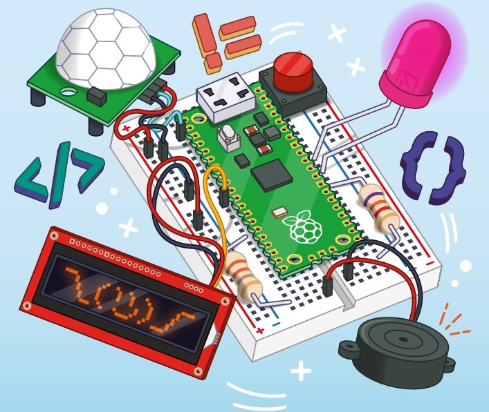  
*Figura 01 - Presentación*

Hola! Bienvenidos! Este curso ha sido preparado para todos aquellos que deseen realizar su primer acercamiento al mundo de los *Sistemas Embebidos*, utilizando para ello la ***Raspberry Pi Pico*** cómo placa de desarrollo y ***MicroPython*** como lenguaje de programación.

Está orientado para los alumnos que realizaron el curso *"Introducción a Python"* o que poseen los conocimientos básicos de programación en *Python*.  

No se requieren conocimientos básicos de electrónica, ya que se introducen los conceptos necesarios a medida que se desarrolla el curso, de tal manera que puedan ser comprendidos por todos.

A largo del curso, aprenderán a instalar, utilizar y programar la ***Raspberry Pi Pico***, desde la puesta en marcha hasta la construcción de sus propios proyectos.

Empecemos!

## 1.1 ¿Qué es Raspberry Pi Pico?

Sin dudas, han escuchado hablar de *Raspberry Pi*. Junto con *Arduino*, constituyen las dos plataformas de desarrollo de proyectos electrónicos más conocidas del mercado. Si bien el objetivo del curso no es ahondar en las diferencias, similitudes, ventajas y desventajas de ambas plataformas, si es necesario mencionar que ambas se benefician de la importante comunidad de desarrolladores que publican sus proyectos.

*Raspberry Pi* es ampliamente conocida por sus *Computadoras de Placa Única* (o *SBC*, por sus siglas en inglés, *Single-Board Computer*). A lo largo de los años, han lanzado varios modelos de su equipo inicial *Raspberry Pi* (A, B, 2B, 3B+, 4B, Zero, entre otros). Todos ellos basados en distintos modelos de un *SOC* (*System On a Chip*, *sistema en un chip*) desarrollado por la firma *Broadcom*.

La lista de los productos disponibles se encuentra detallada en el siguiente link [Raspberry Pi Foundations Products](https://www.raspberrypi.com/products/). Donde se destaca su *SBC* más potente (y cara por supuesto...): *Raspberry Pi 4B* que utiliza como *SOC* el *Broadcom BCM2711B0*, cuyo CPU es un *ARM Cortex-A72* de 64 bits con cuatro núcleos a 1,5[GHz].

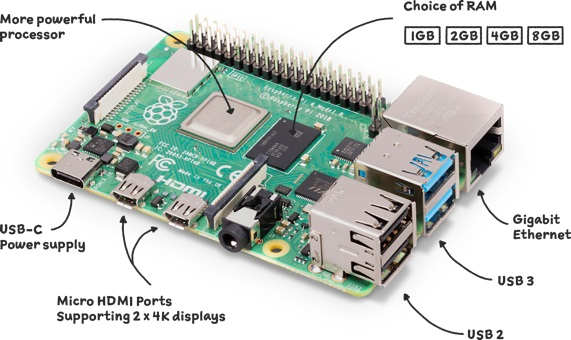  
*Figura 02 - Raspberry Pi 4B*
 
Pero recientemente, *Raspberry Pi* ha sorprendido al mercado por lanzar su placa más pequeña; la ***Raspberry Pi Pico***. Con la particularidad adicional que está basado en un *SOC* desarrollado por ellos; el *RP2040*.
 
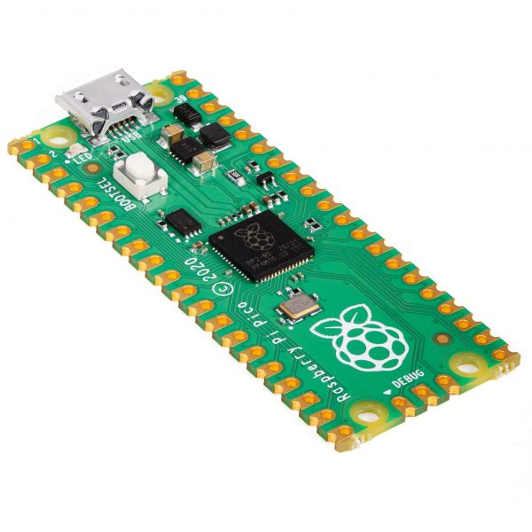  
*Figura 03 - Raspberry Pi Pico*
 
La ***Raspberry Pi Pico*** es un cambio radical con respecto a las *Pi* anteriores, porque no es un mini ordenador que ejecuta un sistema operativo basado en Linux, sino que es una *Placa de Desarrollo Basada en Microcontrolador* (*Microcontroller Based Development Board*), por lo cual carece de cualquier tipo de puerto de conexión (Ethernet, HDMI, etc.) y de conectividad inalámbrica (WiFi o Bluetooth). En lugar de ello, incluye un conjunto de pines que nos permitirá trabajar sobre el *RP2040*, y solo cuenta con un puerto micro-USB que nos permitirá conectarla a nuestra PC para programarla.

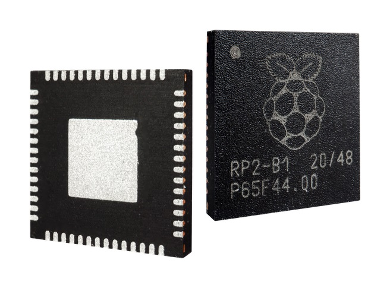  
*Figura 04 - RP2040*
 
Las placas de *Raspberry Pi* siempre se han destacado por su facilidad de uso, lo que les ha ganado un lugar importante en el mercado. La misma filosofía se extiende a la *Pico*, que cuenta con herramientas de programación muy sencillas, y tiene soporte oficial para ***Micropython***, la versión optimizada para poder ejecutarse en microcontroladores del lenguaje de programación *Python*.

  
*Figura 05 - Logo MicroPython*

Estas características, sumado a su muy bajo costo (U$S 4), la convierten en una excelente opción para aquellos que deseen adentrarse en el mundo de la *Informática Física*, ya que permite un sinfín de aplicaciones que integren sensores, actuadores, displays y otros módulos; ya sean para desarrollo de proyectos maker, recreativos y hasta profesionales.

## 1.2 ¿Qué puedo hacer con Raspberry Pi Pico?

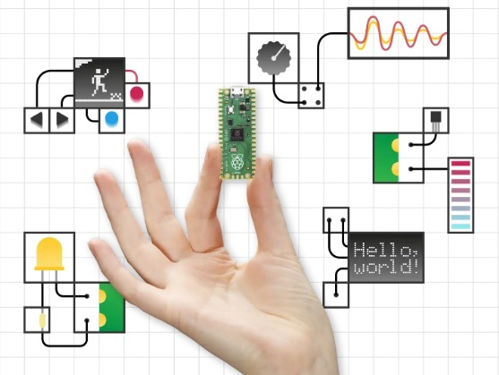  
*Figura 06 - Ilustración RPico*

La ***Raspberry Pi Pico***, además de abrir las puertas a muchos principiantes al mundo de la electrónica y los sistemas embebidos, debido a que se trata de una  plataforma de desarrollo amigable e intuitiva, es de gran utilidad también para los profesionales experimentados. 

Es importante aclarar que la ***Raspberry Pi Pico*** no está diseñada para reemplazar a las versiones mencionadas de *Raspberry Pi*, que es una clase diferente de dispositivo como ya fue especificado. La mayor diferencia de la *Pico* con respecto a todas las demás es que no estamos ante una "mini PC", sino ante un microcontrolador. Esta pequeña placa no cuenta con un sistema operativo que la gobierne: simplemente ejecuta los programas que pidamos que ejecute, y que residen en un ordenador desde el cual los lanzamos (como una PC u otra *Raspberry Pi*).

Con esas especificaciones, queda claro que las prestaciones son mucho más limitadas que las de las modernas *Raspberry Pi 4B*, y es que de hecho su orientación es también muy distinta: la idea es aprovecharla para proyectos vinculados al control de operaciones domésticas e industriales, como así también a aquellas relacionadas a IoT.

En este curso, haremos un recorrido por las principales características de la ***Raspberry Pi Pico***, realizando la conexión de distintos dispositivos, con el objetivo de exponer su potencialidad. Además, existen muchos proyectos para la ***Raspberry Pi Pico*** en internet, ya que considerando su precio, su desempeño y velocidad, es sin duda una opción muy interesante para todo tipo de aplicaciones.

## 1.3 Conociendo nuestra Raspberry Pi Pico (RPico)

  
*Figura 07 - Conociendo la RPico*

### 1.3.1 Especificaciones

Los diversos componentes y las características de una placa electrónica conforman lo que se conoce como *Especificaciones*, las cuales nos proporcionan información útil a la hora de comenzar a trabajar con nuestra placa. Estas especificaciones pueden parecer confusas al principio y son de carácter muy técnico, pero no es necesario que las comprendas por completo para utilizar la *RPico*.

Como ya fue mencionado, *RPico* está basado en un *SOC* desarrollado por *Raspberry Pi Foundations*; el *RP2040*. Este cuenta con un CPU denominado *ARM Cortex M0+* de 32 bits con doble núcleo a 133[MHz] con una SRAM de 264[kB] integrada. La información completa y detallada de este microcontrolador se encuentra publicada aqui: [RP2040 Datasheet](https://datasheets.raspberrypi.com/rp2040/rp2040-datasheet.pdf)

Un resumen de las especificaciones que más nos interesan para este curso es el siguiente:

1. Microcontrolador RP2040
2. SRAM de 264[kB]
3. Memoria FLASH externa de 2[MB]
4. Puerto micro-USB 1.1 (que sirve de alimentación y para cargar nuestros programas)
5. Pinout de 40 pines:  
    5.1. 26 Pines GPIO (*General Purpose Input/Output*)  
    5.2. 2 Pines SPI (*Serial Peripheral Interface *)  
    5.3. 2 Pines I2C (*Inter-Integrated Circuit*)  
    5.4. 2 Pines UART (*Universal Asynchronous Receiver-Transmitter*)  
    5.5. 3 Pines ADC de 12 bits (*Analogue-to-Digital Converter*)  
    5.6. 16 Pines PWM (*Pulse-Width Modulation*)  
    5.7. 8 Pines PIO (*Programmable Input/Output*)  
    
Para mayor detalles, la documentación completa de la *RPico* se encuentra en el siguiente link: [Raspberry Pi Pico Datasheet](https://datasheets.raspberrypi.com/pico/pico-datasheet.pdf)

### 1.3.2 Partes

En la Figura 08 se muestra la *RPico* como se ve desde arriba (o "Top Layer"). Veremos a los laterales unas secciones de color dorado, que llamamos *pines*, y son los encargados de proporcionar la conexión de nuestro microcontrolador *RP2040* al mundo exterior.

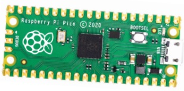  
*Figura 08 - Top Layer RPico*

Estos pines, que se muestran con detalle en la Figura 09, son muy similares a los pines que encontramos en cualquier *Raspberry Pi* tradicional, con la diferencia que estos ya cuentan con unos pines metálicos soldados. En la *RPico* esto no ocurre y tiene su porqué. Si miramos los bordes de los pines, veremos unos pequeños cortes circulares, que conforman lo que se conoce como "*castellated circuit board*".  El objetivo es permitir que la *RPico* se pueda colocar encima de otras placas de circuito impreso mediante soldadura, sin necesidad de colocar pines metálicos físicos, lo que ayuda a mantener baja la altura y hace que el proyecto terminado sea más pequeño. Si compramos un dispositivo u otra placa lista para usar con *RPico*, es muy probable que utilicemos estos cortes.

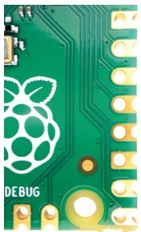  
*Figura 09 - Castellated RPico*

En la Figura 10 se muestra a modo de ejemplo, y con otra placa que no es la *RPico*, como se realiza este proceso.

*Figura 10 - How To Solder Castellated Holes*

Pero en este curso, usaremos los orificios que se encuentran justo hacia adentro de esos cortes circulares para soldar unos pines macho de 2,54[mm] (el mismo que utilizan las *Raspberry Pi* tradicionales). Al soldarlos hacia abajo, podemos colocar nuestra *RPico* en una protoboard, haciendo que podamos conectarla y desconectarla, facilitandonos los distintos proyectos que llevemos a cabo.

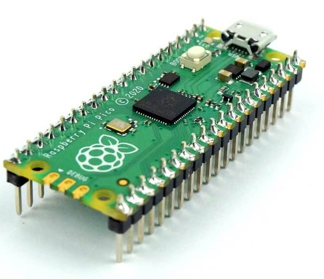  
*Figura 11 - RPico Con Pines Soldados*

Si continuamos recorriendo nuestra placa, encontraremos el *RP2040* en el centro (Figura 12), el puerto micro-USB en la parte superior con un led a su izquierda, y levemente abajo encontraremos un pulsador denominado BOOTSEL (abreviatura de *BOOT SELECTION*, *selección de arranque*). Este permite cambiar nuestra *RPico* entre dos modos de inicio cuando se enciende por primera vez. Usaremos el *BOOTSEL* más adelante, cuando preparemos nuestra placa para programar con MicroPython (Figura 13).

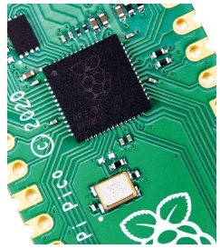  
*Figura 12 - RP2040 en RPico*

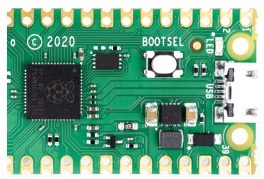  
*Figura 13 - Parte Superior RPico*

En la parte inferior de la *RPico* hay tres agujeros acompañados de la palabra "DEBUG" encima (Figura 14). Estos están diseñados para depurar, o encontrar errores, en programas que se ejecutan en la *RPico*, usando una herramienta especial llamada "Depurador". No abordaremos este tema en el curso, pero pueden encontrarlo útil a medida que escriban programas más complejos.

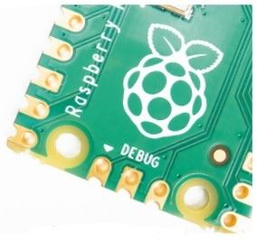  
*Figura 14 - Parte Inferior RPico*

Si giramos nuestra *RPico*, veremos que está escrita (Figura 15). Esto se conoce como *Capa de serigrafía* (*Silk-screen Layer*) y etiqueta cada uno de los pines con su función principal. Verás cosas como *GP0*, *GND*, etc., que se utilizan como referencia. Pero no podremos verla cuando la *RPico* se inserte en la protoboard, por lo que nos guiaremos con el pinout que veremos en la sección siguiente.

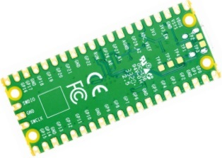  
*Figura 15 - Bottom Layer RPico*

Por último, notarás que hay cuatro agujeros más grandes que no componen el pinout de la *RPico*, son en realidad orificios de montaje. Están diseñados para conectar nuestra placa de forma permanente usando tornillos, pernos y/o hasta incluso carcazas plásticas.

### 1.3.3 Pinout

Ya mencionamos que la *RPico* se comunica con el hardware que le conectemos (sensores, actuadores, displays, etc.) a través de una serie de pines (40 en total) que denominamos *pinout*.

La mayoría de estos pines funcionan como *Pines de Entrada/Salida de Propósito General* (o *GPIO*, por sus siglas en inglés, *General Purpose Input/Output*), lo que significa que pueden programarse para actuar como entrada o salida (algo que veremos con detalle en la siguiente clase). En la Figura 16 podemos identificar estos pines con la sigla *GP* que contabilizan un total de 26. 
Además, visualizarán pines que son de alimentación como *VBUS*, *VSYS* y *3V3(OUT)*; otros que funcionan como tierra eléctrica para nuestras conexiones denotados como *GND*, y un pin de habilitación (que no utilizaremos en este curso) identificado como *3V3_EN*.

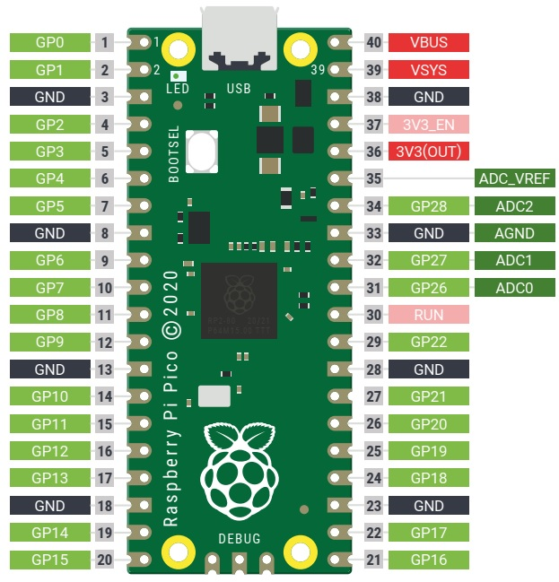  
*Figura 16 - Pinout RPico*

La *RPico* expone 26 de los 30 pines *GPIO* que posee el *RP2040*, enrutándolos a través de los pines que posee en sus laterales. No todos los pines disponibles en el *RP2040* se muestran en los pines de la *RPico*, razón por la cual hay una brecha en la numeración entre el pin *GP22* y el *GP26*. 

Algo a destacar, y que veremos con detalle más adelante, es que los pines *GP0* a *GP22* son sólo digitales, mientras que los pines *GP26*, *GP27* y *GP28* se pueden usar como *GPIO* digitales o como entradas de *Convertidor Analógico a Digital* (o *ADC*, por sus siglas en inglés,*Analogue-to-Digital Converter*).

Los pines *GP23*, *GP24* y *GP29* se utilizan para funciones internas de la placa, mientras que el *GP25* se utiliza para comandar el led que se encuentra a la izquierda del puerto micro-USB.

La mayoría de los pines *GP* también ofrecen una funcionalidad secundaria (seleccionable desde software), para los dispositivos que requieren protocolos de comunicación *SPI*, *I2C* o *UART* para su funcionamiento. La distribución completa de los pines, que incluye estas funciones adicionales, se visualiza en la figura 17.

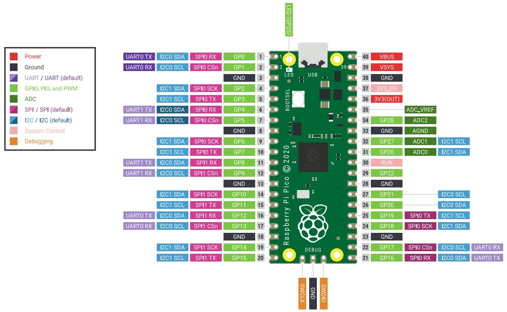  
*Figura 17 - Pinout RPico Completo*

### 1.3.4 Comercialización

La *RPico* se comercializa de forma individual en un empaquetado plástico antiestático proveniente de un reel de 480 unidades.

  
*Figura 18 - RPico Reel*

Actualmente existen tres modelos de la *RPico*, todos ellos con el *RP2040*. El modelo *H* ya está equipado con 40 pines macho pre-soldados y un conector *JTAG* de 3 pines para el "DEBUG".

Por otro lado, el modelo *W*, lanzado en junio de este año 2022 y aún sin el nivel de comercialización de los otros, ofrece conectividad *WiFi* através del chip *CYW4343W* de la firma *Infineon*. A nivel de programación, el funcionamiento es el mismo que los anteriores modelos, pero esta nueva característica amplía el abanico de aplicaciones y proyectos que podemos realizar.

*Figura 19 - RPico Serie*

## 1.4 Descripción de los materiales a utilizar

La *RPico* es solo una de las partes que utilizaremos durante el curso, el resto de ellas son componentes electrónicos que controlaremos desde los pines *GP* de nuestra placa. Existen cientos de componentes disponibles, pero la mayoría de los proyectos que se llevan a cabo con *Sistemas Embebidos* incluyen los que pedimos para este curso. A continuación realizaremos un repaso de ellos:

1. Placa de prueba o Protoboard: Nos facilita considerablemente los proyectos que llevemos a cabo. En lugar de tener un montón de componentes separados que deben conectarse con cables, una protoboard nos permite insertar y retirar componentes fácilmente, y conectarlos a través de pistas de metal que están ocultas debajo de su superficie. A los costados veremos unas secciones que están marcadas con color rojo y celeste, estás se utilizan para la distribución de la energía a lo largo de la protoboard.

  
*Figura 20 - Protoboard*

2. Cable Dupont Macho-Macho(M2M) y Macho-Hembra(M2F): es un cable con un conector en cada punta que se utiliza generalmente para interconectar entre sí los componentes que se encuentran en una protoboard. Están disponibles en tres versiones dependiendo del cabezal que posea en cada extremo: Macho-Macho(M2M), Macho-Hembra(M2F) y Hembra-Hembra(H-H). Dependiendo del tipo de proyecto que estemos realizando, es probable que necesitemos los tres tipos de cables Dupont, pero en este curso solo utilizaremos dos tipos de ellos.

  
*Figura 21 - Cable Dupont*

3. Diodo Emisor de Luz (LED): Es un dispositivo de salida, que enciende una luz de un color determinado cuando lo energicemos desde nuestra *RPico*. Están disponibles en una amplia gama de formas, colores y tamaños, pero no todos son adecuados para usar con nuestra *RPico*; debemos evitar los que están diseñados para fuentes de alimentación de 5[Volts] o 12[Volts]. 

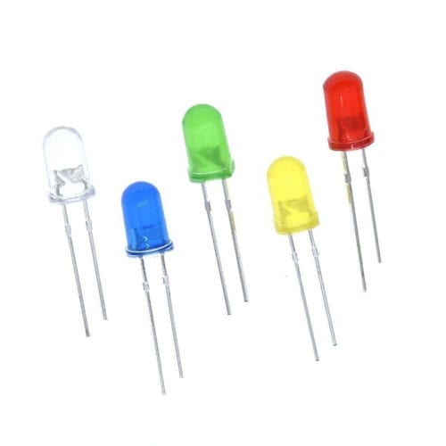  
*Figura 22 - Led 5mm*

4. Resistencia de 330[ohms]: Son componentes que limitan el flujo de corriente eléctrica y están disponibles en diferentes valores usando una unidad de medida llamada *ohmios*. Cuanto mayor sea el número de ohmios, más resistencia proporcionará. En nuestro curso las utilizaremos principalmente para evitar que los LEDs consuman demasiada corriente y se dañen.

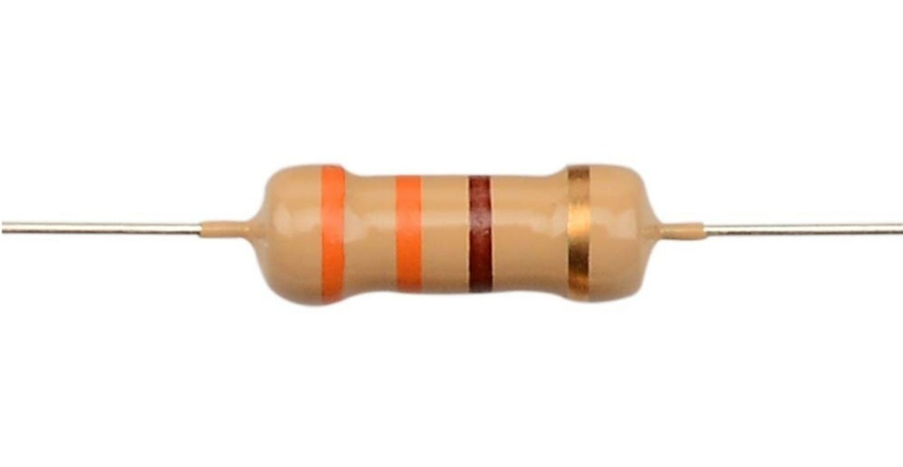  
*Figura 23 - Resistencia 330ohm*

5. Pulsador táctil Normal Abierto: Es un dispositivo de entrada que se utiliza para controlar el flujo de corriente eléctrica. El pulsador solo se abre o se cierra cuando el usuario lo presiona y lo mantiene presionado. Al soltarlo vuelve a su posición inicial.
Dependiendo de su posición inicial o de reposo, los pulsadores se clasifican en Normal Abierto (*NA*) o Normal Cerrado (*NC*). El pulsador *NA* es aquél que sin pulsarlo no deja pasar la corriente, mientras que el pulsador *NC* si permite el paso de corriente en su posición de reposo.
    
    Están disponibles en una amplia gama de modelos y tamaños, pero en este curso trabajaremos con aquellos cuyas dimensiones nos permitan colocarlo en nuestra protoboard.

  
*Figura 24 - Pulsador NA y NC*

  
*Figura 25 - Pulsadores para Protoboard*

6. Buzzer piezoeléctrico activo: O simplemente buzzer, es otro dispositivo de salida que utilizaremos. Sin embargo, mientras que un LED genera luz, un buzzer produce un ruido al ser energizado, puntualmente, un zumbido. Dentro de la carcasa plástica del buzzer hay un par de placas de metal; cuando se encienden, estas placas vibran entre sí para producir el zumbido. 
Hay dos tipos de zumbadores: activos y pasivos. En este curso utilizaremos un zumbador activo.

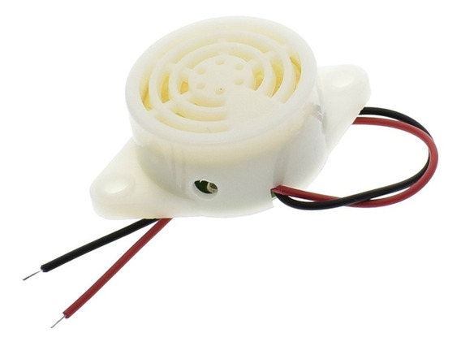  
*Figura 26 - Buzzer PiezoEléctrico Activo*

7. Sensor PIR HC-SR501: Un sensor infrarrojo pasivo o sensor PIR (*PIR*, *Passive InfraRed*), es un tipo de dispositivo de entrada conocido como *sensores*, que están diseñados para informar sobre cambios en la variable que están monitoreando. En el caso de un sensor PIR, monitorea el movimiento; el sensor observa cambios en el área cubierta por su lente de plástico y envía una señal eléctrica a nuestra *RPico* cuando detecta movimiento.

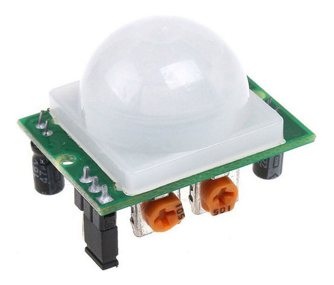  
*Figura 27 - Sensor PIR HC-SR501*

8. Potenciómetro de 10[kOhmios]: Es otro dispositivo de entrada que puede trabajar de dos formas distintas dependiendo de cómo conectemos las tres patas que posee. Con dos de sus tres patas conectadas, actúa como una resistencia variable, un tipo de resistencia que se puede ajustar en cualquier momento girando la perilla que posee. Por otro lado, con las tres patas correctamente cableadas, se convierte en un *divisor de voltaje* y emite desde 0[Voltios] hasta la entrada de voltaje completo que tengamos conectado, según la posición de la perilla.

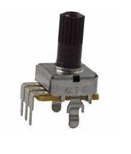  
*Figura 28 - Potenciómetro*

9. Display LCD 1602 con módulo I2C: Es otro dispositivo de salida que se comunica con la *RPico* a través de un protocolo de comunicación denominado *I2C* (*Inter-Integrated Circuit*) utilizando un bus de cuatro cables. Este bus le permite a nuestra *RPico* controlar el panel de visualización, enviando todo tipo de caracteres alfanuméricos. 
Se comercializan en distintos tamaños, colores y formas. Uno de los más utilizados es el modelo *1602*, que permite visualizar 16 caracteres alfanuméricos por renglón (en este caso, en los dos que dispone).

  
*Figura 29 - Display LCD 1602 Con Módulo I2C*

10. Sensor de temperatura y humedad DHT11 o DHT22: Como su nombre indica, es un sensor que puede detectar la temperatura y la humedad en el ambiente. Existen muchos tipos de estos sensores, entre los cuales se destacan aquellos de la serie *DHT* que poseen una salida digital que puede ser interpretada por nuestra *RPico*. Para esta curso, elegimos el sensor *DHT11*, pero si deseamos un rango de medición más amplio y con mayor precisión, podemos optar por el *DHT22*.

  
*Figura 30 - Sensor DHT11 y DHT22*

## 1.5 Fundamentos de MicroPython. Instalación del firmware en nuestra Raspberry Pi Pico.

  
*Figura 31 - MicroPyhton Fundamentos*

Como sabemos, el lenguaje de programación *Python* fue desarrollado para sistemas informáticos como computadoras de escritorio, notebooks y servidores. Sin embargo, las placas de desarrollo basadas en microcontrolador como la *RPico* son más pequeñas y con menos recursos, lo que significa que no pueden ejecutar el mismo lenguaje *Python* que sus contrapartes más grandes. Como resultado de esto nace ***MicroPython***, un lenguaje interpretado basado en *Python*, desarrollado *Damien George* y lanzado por primera vez en 2014. 
***MicroPython*** es una implementación sencilla y eficiente del lenguaje de programación *Python 3* que incluye un pequeño subconjunto de la biblioteca estándar de *Python* y está optimizado para ejecutarse en microcontroladores.
Además de implementar una selección de las principales bibliotecas de *Python*, ***MicroPython*** incluye módulos propios para acceder a hardware de bajo nivel.

[MicroPython](https://micropython.org/) se esfuerza por ser lo más compatible posible con *Python*, de modo que si ya conoces *Python*, ya conoces ***MicroPython***. Por otro lado, cuanto más aprendas sobre ***MicroPython***, mejor te volverás en *Python*.

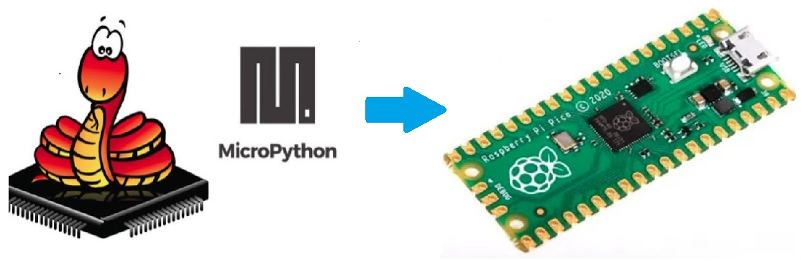  
*Figura 32 - MicroPython En RPico*

Ahora solo nos resta realizar una cosa antes de comenzar a realizar nuestros proyectos: instalar ***MicroPython*** en nuestra ***Raspberry Pi Pico***.

Comenzamos por enchufar el cable micro-USB en el puerto micro-USB de nuestra *RPico*. Luego, mientras mantenés presionado el pulsador *BOOTSEL*, conecta el otro extremo del cable micro-USB a uno de los puertos USB de tu computadora. Cuenta hasta tres y luego suelta el pulsador. Unos instantes después, deberías ver a tu *RPico* aparecer en tu computadora como si se tratase de una unidad extraíble con el nombre *RPI-RP2*.

En el administrador de archivos de nuestro sistema operativo, veremos dos archivos que están alojados en nuestra *RPico* (Figura 33): *INDEX.HTM* e *INFO_UF2.TXT*. El segundo archivo simplemente contiene información sobre nuestra *Pico*, y el primer archivo, *INDEX.HTM*, es el que nos interesa. Nos dirigimos hacia él y hacemos doble clic.

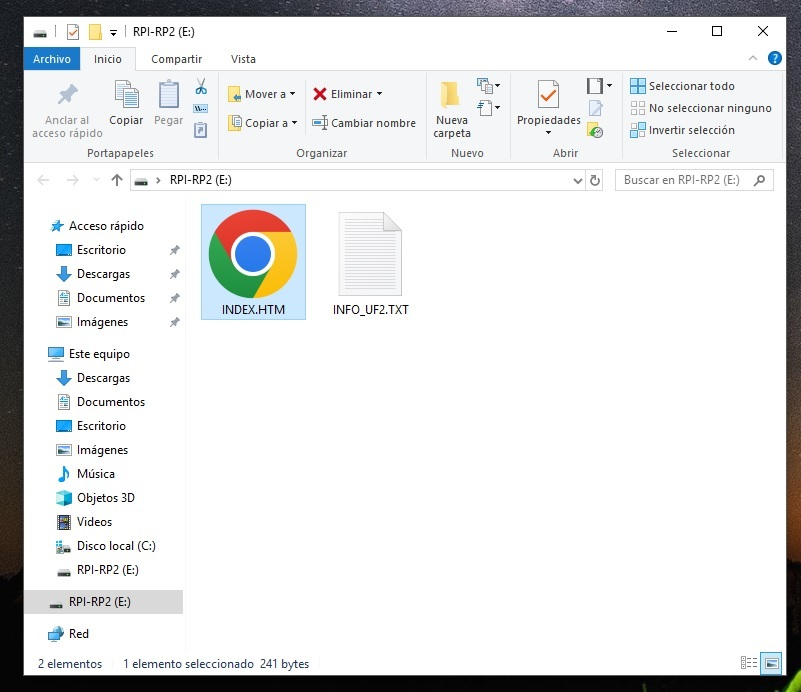  
*Figura 33 - Archivos INDEX.HTM e INFO_UF2.TXT en RPico*

El archivo nos redirige a la sección de la página oficial de *Raspberry Pi* que contiene toda la documentación acerca de los equipos y accesorios que comercializa (Figura 34). A continuación, hacemos clic en la pestaña ***MicroPython*** para abrir esta sección específica en nuestro navegador. 

  
*Figura 34 - Raspberry Pi Official Documentation*

Una vez allí, debemos dirigirnos al texto *"Download the correct MicroPython UF2 file for your board:"* y hacer en click en el link *Raspberry Pi Pico* que se encuentra debajo para descargar el firmware de ***MicroPython*** (Figura 35). Este pequeño archivo permitirá ejecutar ***MicroPython*** en nuestra *RPico*.

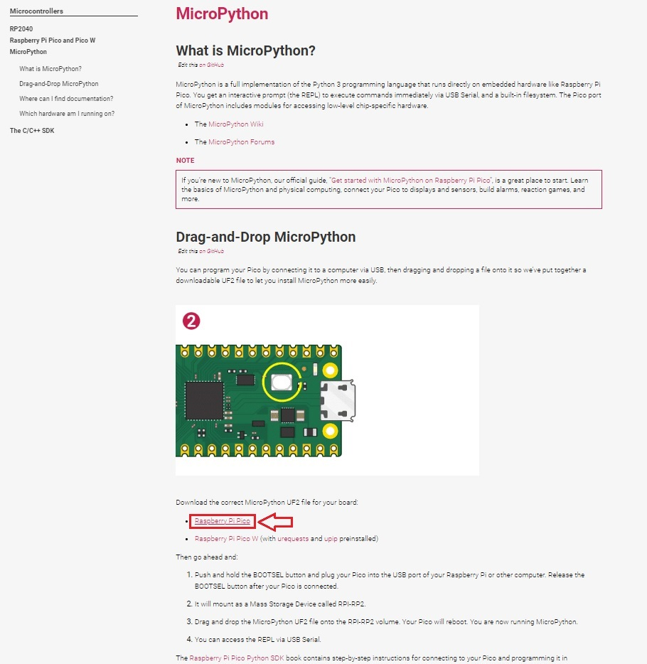  
*Figura 35 - Raspberry Pi Pico Official Firmware*

Luego debemos abrir la carpeta *Descargas* de nuestro sistema operativo y localizar el archivo que acabamos de descargar con la extensión *uf2*. Hacemos clic en él, lo arrastramos y lo soltamos en el administrador de archivos de nuestra *RPico* (Figura 36).

  
*Figura 36 - Arrastre Del Firmware De MicroPython A RPico*

Después de unos segundos, verás que tu *RPico* ha desaparecido de tu administrador de archivos (y también puede aparecer una advertencia de que se eliminó una unidad sin expulsarla): no te preocupes, se supone que eso sucedería!
Cuando arrastraste el archivo *uf2* a tu *RPico*, le dijiste que actualizara el firmware de ***MicroPython*** en su almacenamiento interno. Para hacer eso, tu *RPico* sale del modo especial en el que lo pusiste con el pulsador *BOOTSEL* y carga el nuevo firmware, lo que significa que tu *RPico* ahora está ejecutando ***MicroPython***.

¡Ahora si todo está listo para comenzar con ***MicroPython*** en tu ***Raspberry Pi Pico***!

## 1.6 Thonny IDE Python: instalación, características e interfaz. 

Antes de que puedas comenzar a programar tu *RPico*, debemos instalar y configurar lo que conocemos como *Entorno de Desarrollo Integrado* (*IDE*, *Integrated Development Environment*). Para nuestro curso utilizaremos un *IDE* muy popular para *Python* y ***MicroPython***, divulgado ampliamente por *Raspberry Pi Foundations*: *Thonny*. 

*Thonny* fue desarrollado por la *Universidad de Tartu* en Estonia, y cuenta con las herramientas que los usuarios necesitan para programar. Además, cuenta con una interfaz simple y fácil de entender, lo cual es muy adecuado para principiantes.

La instalación de *Thonny* es muy sencilla. Dado que *Python 3.10* ya está integrado en él, simplemente necesitamos un ejecutable. Para ello, nos dirigimos a la página oficial de [Thonny](https://thonny.org/) y seleccionamos el paquete de instalación de para descargar en la esquina superior derecha de la página según el sistema operativo que utilicemos.
Después de descargar el paquete de instalación, hacer doble clic y seguir las instrucciones en pantalla para instalarlo.

  
*Figura 37 - Instalación De Thonny*

Después de la instalación, abre *Thonny* y te encontrás con una interfaz como la que se muestra en la Figura 38.

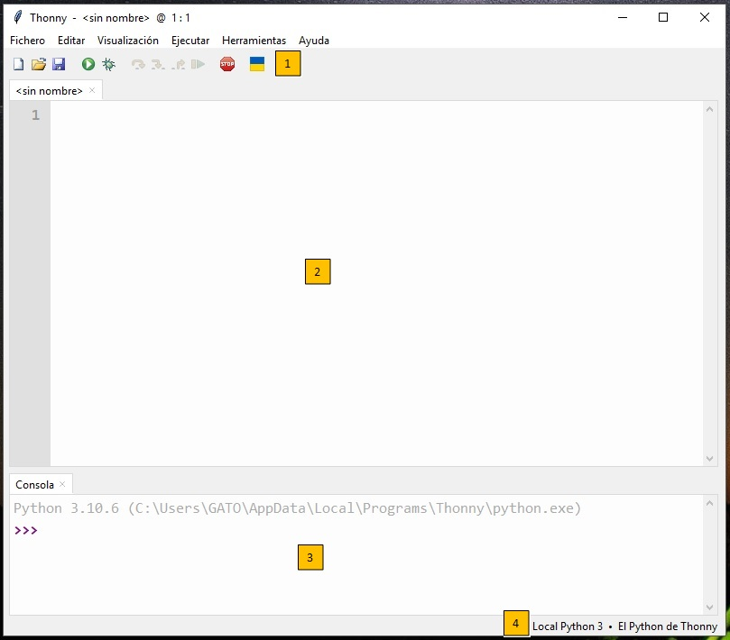  
*Figura 38 - Interfaz De Thonny*

La interfaz principal de *Thonny* es simple y puede dividirse en las siguientes cuatro partes:

1. Barra de herramientas: ofrece acceso rápido a través de íconos a las funciones de programa más utilizadas como *Nuevo Programa*, *Abrir Fichero*, *Guardar*, *Ejecutar el script actual*, etc.

2. Área de Script: donde se escriben los programas en ***MicroPython***. Se divide en un área principal para el código y un pequeño margen lateral para mostrar los números de línea.

3. Shell: permite ejecutar comandos de la consola y también proporciona información sobre la ejecución de los programas.

4. Intérprete: muestra y permite cambiar el intérprete de *Python*, es decir, la versión de *Python* utilizada para ejecutar nuestros programas. Aquí debemos hacer clic, y seleccionar *MicroPython (Raspberry Pi Pico)* (Figura 39). 

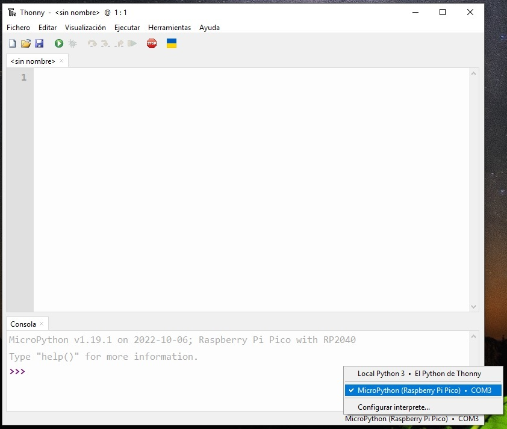  
*Figura 39 - Interprete de Thonny*

¡Ahora si ya tenemos todo preparado para comenzar a realizar nuestros proyectos!