# Clase N°1: Introducción

  
*Figura 01 - Presentación Clase N°1*

¡Hola! ¡Bienvenidos! Este curso está realizado para aquellos que deseen introducirse en el mundo de los **sistemas embebidos** y el **Internet de las cosas** (*IoT*, por sus siglas en inglés, *Internet of Things*), utilizando la **Raspberry Pi Pico W** (abreviada como *RPico W*) como placa de desarrollo y **MicroPython** como lenguaje de programación.

Está orientado a estudiantes que hayan realizado el curso *"Introducción a la programación con Python"* o que tengan conocimientos básicos en dicho lenguaje.

No se requieren conocimientos básicos de electrónica, ya que se introducirán los conceptos necesarios a medida que se desarrolla el curso, de manera que puedan ser comprendidos por todos.

Mediante un enfoque práctico, aprenderán a instalar, utilizar y programar la placa de desarrollo **RPico W**, desde la puesta en marcha hasta la construcción de proyectos propios.

En esta primera clase, nos adentraremos en los conceptos basicos de los **sistemas embebidos** y el **Internet de las cosas**, y la relación entre ellos. Además, descubriremos las características de nuestra **RPico W** y haremos un recorrido por los componentes electrónicos que utilizaremos a lo largo del curso. Por último, aprenderemos a instalar **MicroPython** y **Thonny**, herramientas esenciales para la programación de nuestra placa.

¡Empecemos!

## 1.1 Sistemas embebidos e IoT. Primeras definiciones.

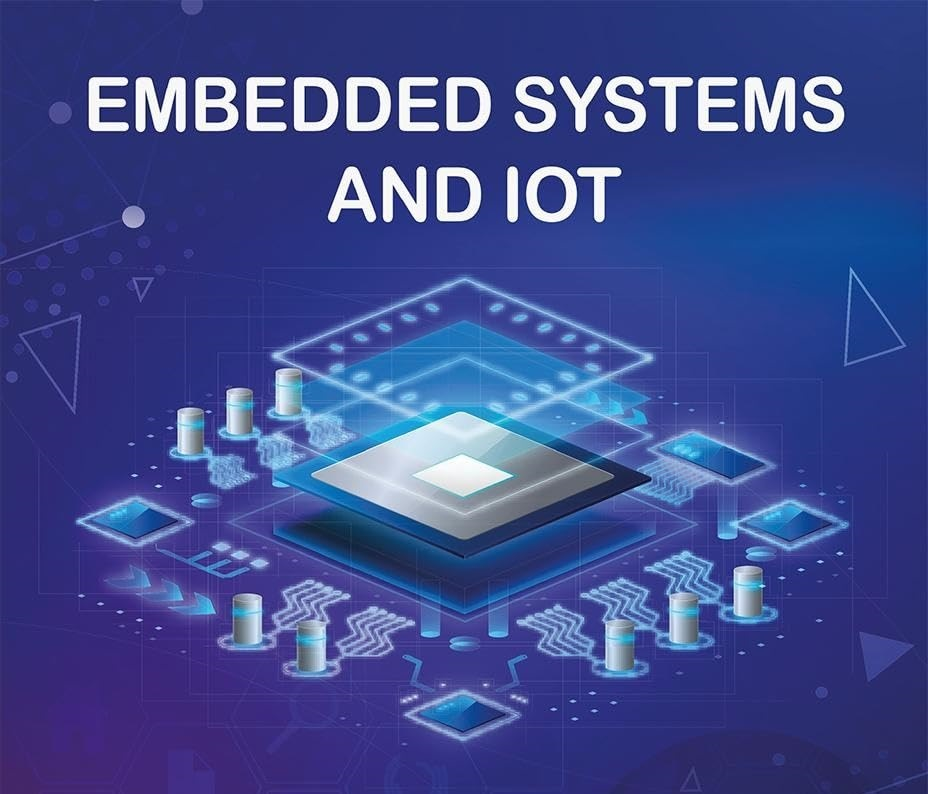  
*Figura 02 - Sistemas Embebidos e IoT*

Iniciaremos este curso explorando dos temas que surgieron de manera independiente, pero que en la actualidad resulta difícil abordar uno sin considerar al otro; estamos hablando de los **sistemas embebidos** y el **Internet de las Cosas**.

Los **sistemas embebidos** son dispositivos electrónicos de tamaño reducido, fabricados con materiales resistentes y diseñados para realizar tareas en tiempo real, como la medición de variables físicas y el seguimiento de objetos, entre otras que veremos durante el curso. A diferencia de las computadoras personales, que están diseñadas para satisfacer una amplia variedad de necesidades, los **sistemas embebidos** se diseñan para cubrir *necesidades específicas* dentro del contexto de un sistema más amplio.

El término **sistema embebido** deriva de su propósito de integrarse o incrustarse en un sistema más grande. Su denominación refleja su naturaleza de estar "embebido" en el entorno en el que operan, formando una parte esencial de la funcionalidad global de ese sistema. 

Los podemos encontrar en una amplia gama de productos electrónicos de uso cotidiano, como auriculares y joysticks, como así también en equipos de mayor complejidad, como los utilizados en la industria automotriz, en dispositivos médicos y en sistemas de comunicaciónes.

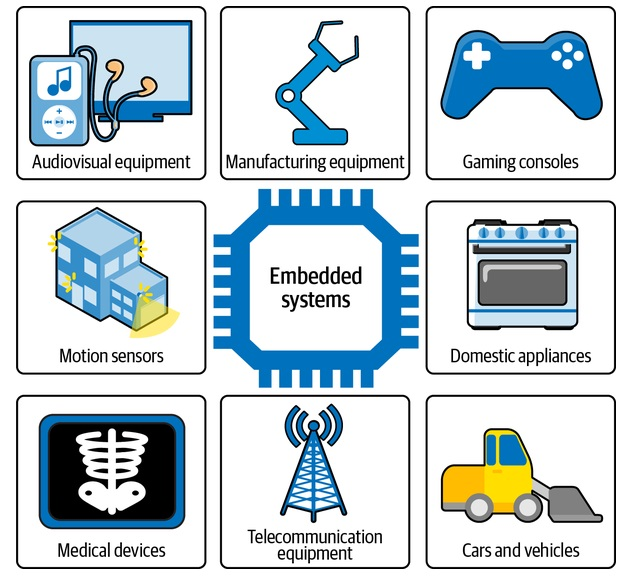  
*Figura 03 - Aplicaciones de los Sistemas Embebidos*

Los **sistemas embebidos** se componen principalmente de una Unidad Central de Procesamiento (CPU) y sus interfaces. La CPU se encarga de comunicarse con una memoria RAM, utilizada como memoria de ejecución, y con una memoria ROM, donde habitualmente se almacena el *firmware*. A diferencia de las computadoras personales, los **sistemas embebidos** suelen contar con CPUs de frecuencias más bajas y una cantidad reducida de memoria. Esto se debe a que están diseñados para ejecutar tareas más específicas y limitadas, como mencionamos anteriormente.

La conexión entre estos componentes se establece a través de buses de cobre, que no solo transmiten información en forma de impulsos eléctricos, sino que también transportan la alimentación necesaria para dichos componentes. Además, estos buses permiten la comunicación del CPU con dispositivos externos mediante puertos de entrada y salida, lo que facilita el intercambio de datos del **sistema embebido** con su entorno.

Por otro lado, los dispositivos electrónicos disponibles comercialmente que integran estos componentes en una *placa de circuito impreso* (*PCB*, por sus siglas en inglés, *Circuit Printed Board*), y son adecuados para la creación de diversos proyectos, se conocen como **placas de desarrollo**. De todas las existentes, nosotros emplearemos la **RPico W**.

Originalmente, los **sistemas embebidos** estaban limitados en sus capacidades de comunicación, lo que restringía su interacción al entorno cercano. Con el transcurso del tiempo, ha sido posible dotar de *comunicación inalámbrica* a los **sistemas embebidos**, y con esto, de conexión a internet. Por lo tanto, los **sistemas embebidos** ahora forman parte de un ecosistema aún mayor, conocido como el **Internet de las cosas**.

El **Internet de las Cosas** es un concepto relativamente nuevo que ha experimentado un rápido crecimiento en los últimos años, y se refiere a *todos los dispositivos electrónicos conectados a Internet y capaces de comunicarse entre sí e intercambiar información*.

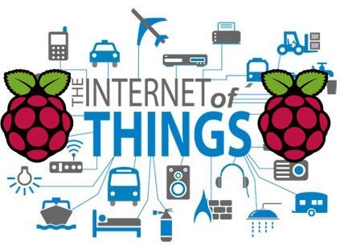  
*Figura 04 - IoT y Raspberry Pi*

Al principio, el **Internet de las Cosas** no se concebía como una red donde los dispositivos se comunicarán entre ellos sin necesidad de la intervención humana. Aunque la comunicación era entre dispositivos, siempre había un ser humano involucrado notificando o instruyendo al dispositivo sobre qué hacer. Hoy en día, la incorporación de los **sistemas embebidos** al **Internet de las Cosas** ha permitido que *los dispositivos sean capaces de compartir e intercambiar información sin la necesidad de un humano*.

Debido a esto, los *protocolos de comunicación* han sufrido una revolución para el **Internet de las Cosas** como así también para los **sistemas embebidos**, ya que estos, además de permitir la comunicación de forma segura entre dispositivos que se encuentran en el ecosistema **IoT**, deben ser ligeros para que puedan ser implementados en **sistemas embebidos**.

En este curso, trabajaremos con la placa de desarrollo **Raspberry Pi Pico W**, y su unión con el **Internet de las Cosas**, y veremos cómo los *protocolos de comunicación* juegan un papel clave en este proceso.

## 1.2 ¿Qué son *Raspberry Pi Pico* y *Raspberry Pi Pico W* ?

Sin duda, muchos de ustedes han escuchado hablar de *Raspberry Pi*. Junto con *Arduino*, son las dos plataformas de desarrollo de proyectos electrónicos más conocidas del mercado. Aunque el objetivo del curso no es profundizar en las diferencias, similitudes, ventajas y desventajas de ambas plataformas, sí es importante mencionar que ambas se benefician de la importante comunidad de desarrolladores que comparten sus proyectos

*Raspberry Pi* es ampliamente reconocida por sus *Computadoras de Placa Única* (*SBC*, por sus siglas en inglés, *Single-Board Computer*). A lo largo de los años, han lanzado varios modelos de su equipo inicial *Raspberry Pi*, incluyendo A, B, 2B, 3B+, 4B, Zero, Zero W, entre otros. La lista completa de los productos disponibles la podemos encontrar en este link [Raspberry Pi Foundations Products](https://www.raspberrypi.com/products/). Allí se destaca su más reciente y potente *SBC*: [Raspberry Pi 5](https://www.raspberrypi.com/products/raspberry-pi-5/).

  
*Figura 05 - Raspberry Pi 5*

Pero a principios de 2021, *Raspberry Pi* sorprendió al mercado al lanzar su placa más pequeña: la **Raspberry Pi Pico**. Esta placa tiene la particularidad adicional de estar basada en un *SoC* (por sus siglas en inglés, *System on a Chip*) desarrollado por ellos, el [RP2040](https://www.raspberrypi.com/products/rp2040/).
 
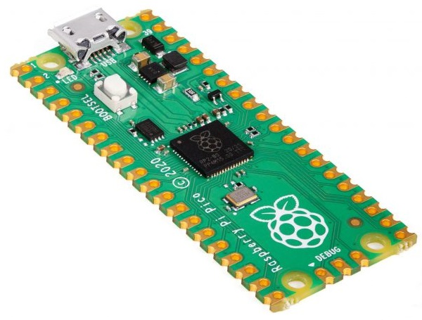  
*Figura 06 - Raspberry Pi Pico*

Un *SoC* es un circuito integrado que integra todos los componentes necesarios para el funcionamiento de un sistema electrónico en un único chip. Esto incluye, entre otros, CPU, GPU, memoria y controladores de periféricos. Los *SoC* son comúnmente utilizados en **sistemas embebidos** y **dispositivos IoT**, debido a su tamaño compacto, eficiencia energética y capacidad de integrar múltiples funciones en un solo chip, lo que reduce costos y espacio físico.
 
La **Raspberry Pi Pico** es un cambio radical con respecto a las *Pi* anteriores, porque no es un miniordenador que ejecuta un sistema operativo basado en Linux, sino que es una *Placa de Desarrollo Basada en Microcontrolador* (*Microcontroller Based Development Board*), por lo cual carece de cualquier tipo de puerto de conexión (Ethernet, HDMI, etc.) y de conectividad inalámbrica (Wi-Fi o Bluetooth). En lugar de ello, incluye un conjunto de pines que nos permite trabajar sobre el *RP2040*, y solo cuenta con un puerto micro-USB que nos permite conectarla a nuestra PC para programarla.

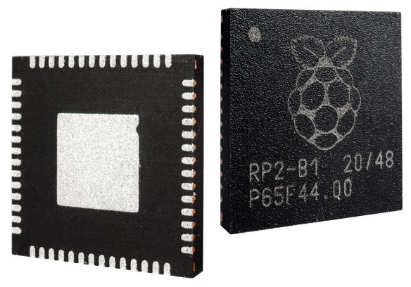  
*Figura 07 - RP2040*
 
Las placas de *Raspberry Pi* siempre se han destacado por su facilidad de uso, lo que les ha ganado un lugar importante en el mercado. La misma filosofía se extiende a la *Pico*, que cuenta con herramientas de programación muy sencillas, y tiene soporte oficial para **MicroPython**, la versión optimizada para poder ejecutarse en microcontroladores del lenguaje de programación *Python*.

  
*Figura 08 - Logo MicroPython*

Estas características, junto con su costo muy bajo (U$S 4), convierten a la **Raspberry Pi Pico** en una excelente opción para quienes deseen adentrarse en el mundo de los **sistemas embebidos**. Esta placa es ideal para una amplia variedad de aplicaciones que involucren sensores, actuadores, displays y otros módulos, ya sea para el desarrollo de proyectos recreativos o profesionales.

Sin embargo, es evidente que presenta una limitación importante al momento de llevar a cabo determinados proyectos: no ofrece conectividad Wi-Fi. Por ello, en junio de 2022, *Raspberry Pi* lanza el modelo **Raspberry Pi Pico W**, que presenta los mismos atributos que el **Raspberry Pi Pico** pero incorpora Wi-Fi a la placa.

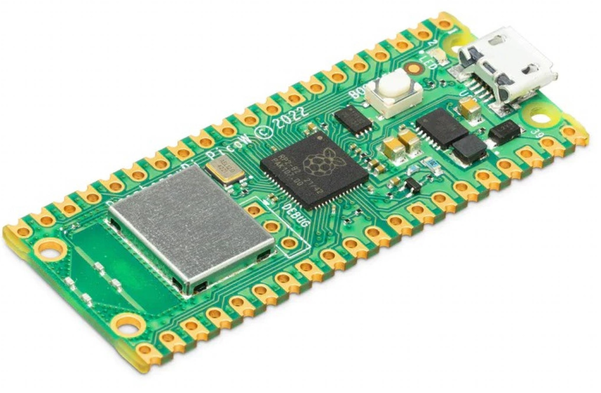  
*Figura 09 - Raspberry Pi Pico W*

La conectividad Wi-Fi es posible gracias a la incorporación del chip *CYW43439* de la firma *Infineon* (el encapsulado gris de la **Figura 09**) y una antena que se encuentra integrada al PCB. A nivel de programación, el funcionamiento es el mismo que la **Raspberry Pi Pico**, pero esta nueva característica amplía el abanico de aplicaciones y desarrollos que podemos realizar, pero fundamentalmente convierte a la **Raspberry Pi Pico W** en una placa ideal para integrarse en proyectos vinculados a **Internet de las Cosas** debido a su tamaño, precio (U$S 6), bajo consumo de energía y compatibilidad con Wi-Fi 4.

## 1.3 ¿Qué puedo hacer con Raspberry Pi Pico W (RPico W)?

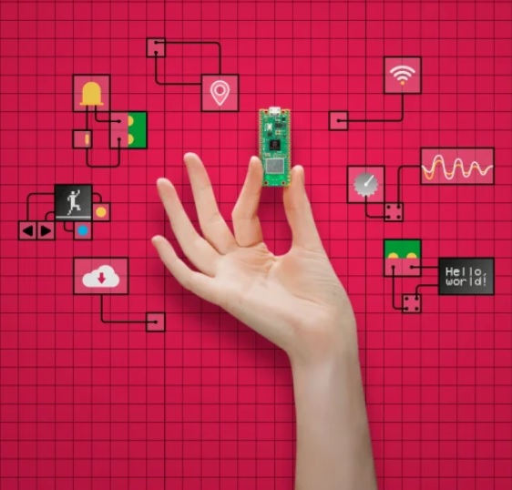  
*Figura 10 - Aplicaciones de la RPico W*

La **Raspberry Pi Pico W**, además de abrirle las puertas a muchos principiantes al mundo de la electrónica y los **sistemas embebidos** , debido a que se trata de una plataforma de desarrollo amigable e intuitiva, también es de gran utilidad para los profesionales experimentados. 

Es importante aclarar que la **RPico W** no está diseñada para reemplazar a las versiones anteriormente mencionadas de *Raspberry Pi*, que es una clase diferente de dispositivo como ya fue especificado. La mayor diferencia de la **RPico W** con respecto a todas las demás es que no estamos ante una "mini PC", sino ante un microcontrolador. Esta pequeña placa no cuenta con un sistema operativo que la gobierne: simplemente ejecuta las instrucciones que le pidamos, que proceden de un ordenador desde el cual las lanzamos (como una PC u otra *Raspberry Pi*) o que residen en la propia memoria de la placa.

Con esto, queda claro que las prestaciones de la **RPico W** son considerablemente más limitadas que las de otros dispositivos de *Raspberry Pi*, como la moderna *Raspberry Pi 5*. Y es que de hecho su campo de aplicación es también distinto: la idea es aprovecharla para proyectos vinculados al control de operaciones domésticas e industriales, como así también para tareas relacionadas al **IoT**.

Deteniéndonos puntualmente en la amplia gama de proyectos relacionados con **Internet de las Cosas**, podemos mencionar la monitorización de variables climáticas, el control de luces y electrodomésticos, el seguimiento de objetos en tiempo real y el desarrollo de sistemas de seguridad para el hogar.

Estos son algunos ejemplos de proyectos que se pueden realizar con la **RPico W**. En este curso, exploraremos las principales características de esta placa, realizando la conexión de distintos dispositivos, con el objetivo de exponer su potencialidad. Además, en internet hay una gran cantidad de proyectos disponibles para la **RPico W**, lo que demuestra que, considerando su precio, rendimiento y velocidad, es indudablemente una opción muy atractiva para una amplia gama de aplicaciones.

## 1.4 Conociendo nuestra Raspberry Pi Pico W

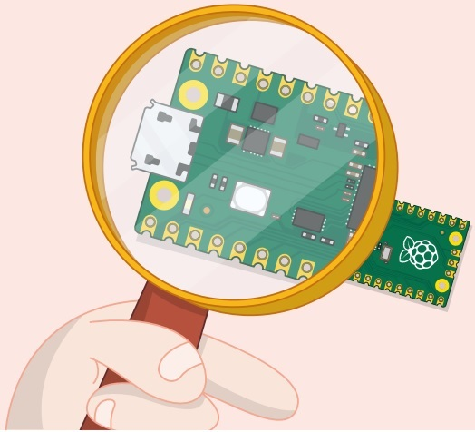  
*Figura 11 - Conociendo la RPico W*

### 1.4.1 Especificaciones

Los diversos componentes y características de una placa electrónica conforman lo que se conoce como *Especificaciones*, y nos proporcionan información útil a la hora de comenzar a trabajar con ella. Estas especificaciones pueden parecer confusas al principio y son de carácter muy técnico, pero no es necesario que las comprendas por completo para utilizar la **RPico W**.

Como mencionamos, la **RPico W** está basada en un *SoC* desarrollado por *Raspberry Pi Foundations*; el *RP2040*. Este chip cuenta con un CPU denominado *ARM Cortex M0+* de 32 bits con doble núcleo a 133[MHz], junto con una SRAM integrada de 264[kB]. La información completa y detallada de este microcontrolador se encuentra publicada en un documento conocido como *hoja de datos* o [Datasheet](https://datasheets.raspberrypi.com/rp2040/rp2040-datasheet.pdf)

Un resumen de las especificaciones que más nos interesan para este curso es el siguiente:

1. CPU *ARM Cortex M0+* de 32 bits con doble núcleo a 133[MHz]
2. SRAM integrada de 264[kB].
3. Memoria FLASH externa de 2[MB].
4. Puerto micro-USB B para alimentación y programación.
5. Pinout de 40 pines:   
    5.1. 26 Pines GPIO (*General Purpose Input/Output*)   
    5.2. 2 Pines SPI (*Serial Peripheral Interface*)  
    5.3. 2 Pines I2C (*Inter-Integrated Circuit*)  
    5.4. 2 Pines UART (*Universal Asynchronous Receiver-Transmitter*)  
    5.5. 3 Pines ADC de 12 bits (*Analogue-to-Digital Converter*)  
    5.6. 16 Pines PWM (*Pulse-Width Modulation*)  
    5.7. 8 Pines PIO (*Programmable Input/Output*)  
6. Chip *Infineon CYW43439* para conectividad inalámbrica Wi-Fi 802.11 b/g/n.
    
Para mayor detalle, la información completa de la **RPico W** se encuentra en su correspondiente [Datasheet](https://datasheets.raspberrypi.com/picow/pico-w-datasheet.pdf). 

Este modelo mantiene la compatibilidad de pines con la **RPico** (modelo sin conectividad inalámbrica), por lo que la asignación externa de pines no cambia, algo que resulta muy importante si deseamos migrar proyectos de una placa a la otra.

### 1.4.2 Partes

En la **Figura 12**, se muestra la **RPico W** vista desde arriba, lo que se denomina *Top Layer*. En los laterales, podemos observar unas secciones de color dorado que llamamos *pines*, que son los encargados de proporcionar la conexión de nuestro microcontrolador *RP2040* con el mundo exterior.

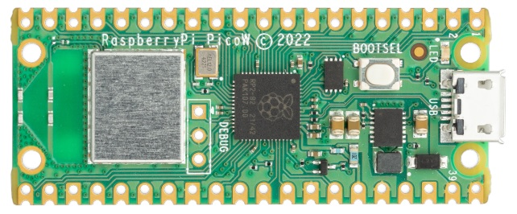  
*Figura 12 - Top Layer RPico W*

Estos pines, que se muestran con detalle en la **Figura 13**, son muy similares a los que encontramos en otros equipos de *Raspberry Pi*, con la diferencia de que estos ya cuentan con unos pines metálicos soldados de fabrica. En la **RPico W** esto no ocurre y responde a una razón específica. 

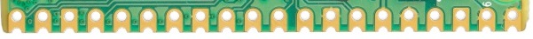  
*Figura 13 - Castellated Holes RPico W*

Si observamos los bordes de los pines, encontraremos unos pequeños cortes circulares o muescas, conocidos como *"castellated holes"* (agujeros almenados), que están diseñados para permitir la soldadura directa de la **RPico W** sobre otras placas de circuito impreso, prescindiendo de la necesidad de utilizar pines metálicos. Esta característica contribuye a mantener una altura reducida y a disminuir el tamaño del proyecto que estemos realizando. Al adquirir un dispositivo u otra placa destinada a ser utilizada junto con la **RPico W**, es muy probable que hagamos uso de estos cortes.

En la **Figura 14**, se ilustra, a modo de ejemplo y con otra placa que no es la **RPico W**, el proceso de soldadura utilizanda estas muescas.

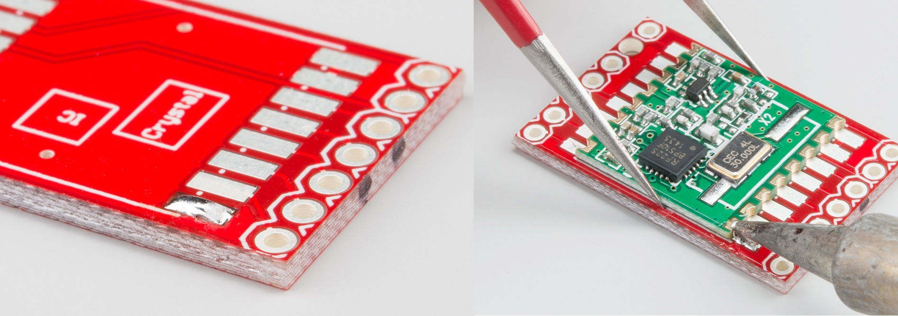
*Figura 14 - How To Solder Castellated Holes*

Pero en este curso, emplearemos los orificios situados justo hacia adentro de esos cortes circulares para soldar unos pines macho de 2,54[mm] (los mismos que utilizan las *Raspberry Pi* tradicionales). Al soldarlos hacia abajo, podemos colocar nuestra **RPico W** en una protoboard, lo que nos permite conectarla y desconectarla, facilitándonos los distintos proyectos que llevemos a cabo.

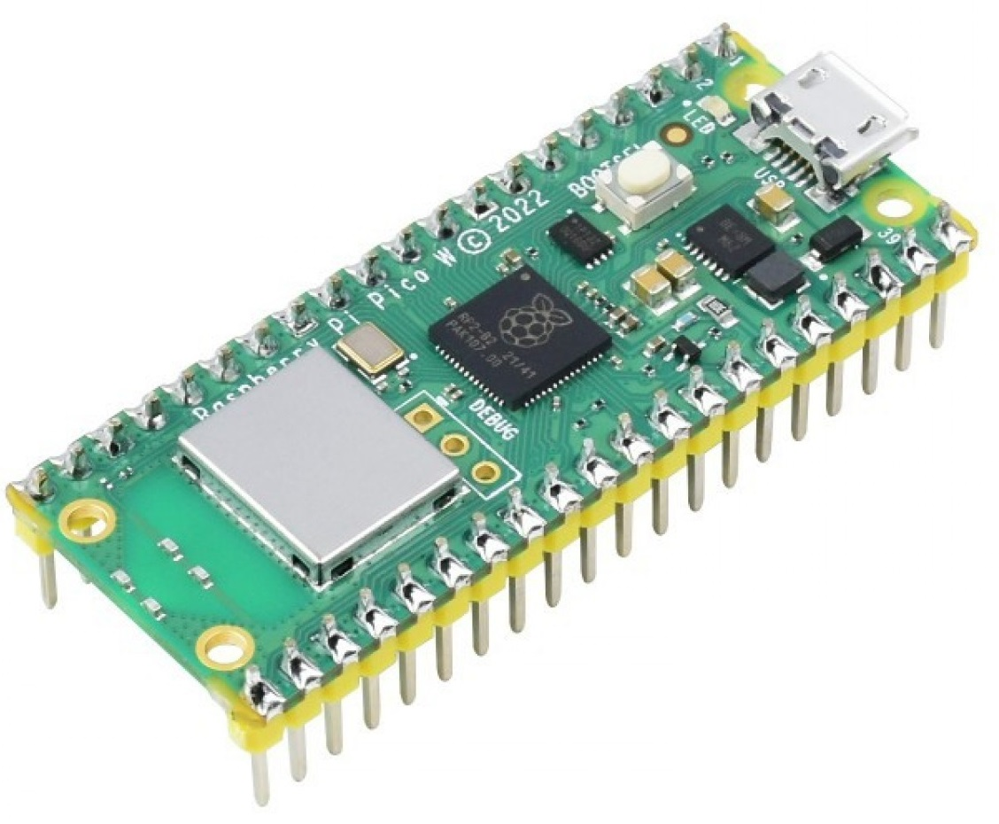  
*Figura 15 - RPico W Con Pines Soldados*

Si continuamos recorriendo nuestra placa, encontraremos el RP2040 ubicado en el centro, tal como se ilustra en la **Figura 16**.

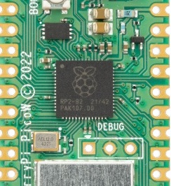  
*Figura 16 - RP2040 en la RPico W*

En la parte superior, encontraremos el puerto micro-USB con un LED a su izquierda, y levemente más abajo, hallaremos un pulsador denominado *BOOTSEL* (abreviatura de *BOOT SELECTION*, *selección de arranque*). Este permite cambiar nuestra **RPico W** entre dos modos de inicio cuando se enciende por primera vez. Utilizaremos el *BOOTSEL* más adelante, cuando preparemos nuestra placa para programarla con **MicroPython**.

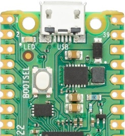  
*Figura 17 - Parte Superior RPico W*

También en la parte media de la **RPico W**, levemente por debajo del *RP2040*, encontraremos tres agujeros acompañados de la palabra "DEBUG", tal como se muestra en la **Figura 18**. Estos están diseñados para depurar, es decir, encontrar errores, en programas que se ejecutan en la **RPico W**, utilizando una herramienta especial llamada "Depurador". Aunque no abordaremos este tema en el curso, podría resultar útil a medida que escriban programas más complejos.

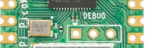  
*Figura 18 - Parte Media de la RPico W*

Y por último, en la parte inferior de la placa, encontraremos el Chip [Infineon CYW43439](https://www.infineon.com/dgdl/Infineon-CYW43439-DataSheet-v05_00-EN.pdf?fileId=8ac78c8c8929aa4d01893ee30e391f7a&redirId=260879) para conectividad Wi-Fi y la antena necesaria para ello, impresa en la misma placa (lo que se denomina *On-Board Antenna*).

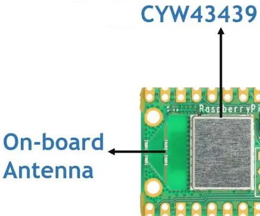  
*Figura 19 - Parte inferior de la RPico W*

Si volteamos nuestra **RPico W**, apreciaremos la inferior de nuestra placa, también conocida como *bottom layer*. Pero notaremos que está escrita, ya que incorpora una capa de lo que se conoce como "Capa de serigrafía" o *Silk-screen Layer*, la cual etiqueta cada uno de los pines con su función principal. Verás cosas como *GP0*, *GND*, etc., que se utilizan como referencia. Sin embargo, no podremos verla cuando la **RPico W** se inserte en la protoboard, por lo que nos guiaremos con el *pinout* que veremos en la sección siguiente.

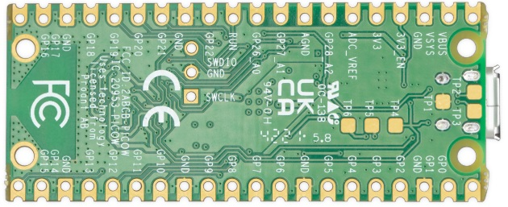  
*Figura 20 - Bottom Layer RPico W*

Por último, notarás que hay cuatro agujeros más grandes que no forman parte del pinout de la **RPico W**; en realidad, son orificios de montaje. Están diseñados para asegurar nuestra placa de forma permanente mediante tornillos, pernos e incluso carcasas plásticas, conocidas como *case*.

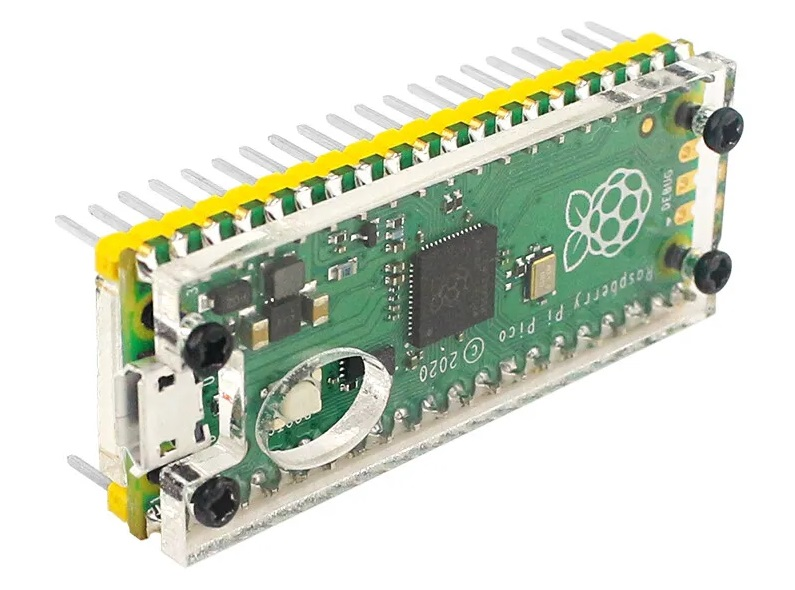  
*Figura 21 - RPico Case*

### 1.4.3 Pinout

Ya mencionamos que la **RPico W** se comunica con el hardware que le conectemos (sensores, actuadores, displays, etc.) mediante una serie de 40 pines que denominamos *pinout*, los cuales se detallan en la **Figura 22**.

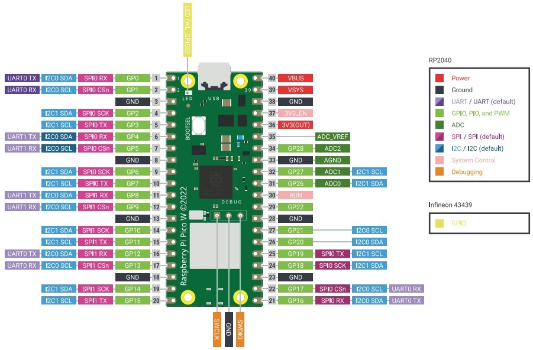  
*Figura 22 - Pinout RPico W*

La mayoría de estos pines funcionan como *Pines de Entrada/Salida de Propósito General* (o *GPIO*, por sus siglas en inglés, *General Purpose Input/Output*), lo que significa que pueden programarse para actuar como entrada o salida de datos (algo que veremos con detalle en la próxima clase). Estos pines los identificamos con la sigla *GP* y contabilizan un total de 26. 

Además, visualizarán pines que son de alimentación, tales como *VBUS*, *VSYS* y *3V3(OUT)*; otros destinados a funcionar como tierra eléctrica para nuestras conexiones, indicados como *GND*; y un pin de habilitación identificado como *3V3_EN*.

El *RP2040* cuenta con 30 pines GPIO, de los cuales la **RPico W** expone 26 de ellos a través de los pines en sus laterales, por este motivo existe una brecha en la numeración entre el pin *GP22* y el *GP26*. Los pines *GP23*, *GP24*, *GP25* y *GP29* se utilizan para funciones internas de la placa y no son accesibles al usuario.

Algo importante a señalar, y que veremos con detalle más adelante, es que los pines *GP0* a *GP22* son sólo digitales, mientras que los pines *GP26*, *GP27* y *GP28* se pueden usar como *GPIO* digitales o como entradas para un *Convertidor Analógico a Digital* (o *ADC*, por sus siglas en inglés,*Analogue-to-Digital Converter*).

La mayoría de los pines *GP* también ofrecen una funcionalidad secundaria (seleccionable desde software), para los dispositivos que requieren protocolos de comunicación *SPI*, *I2C* o *UART* para su funcionamiento. Estas funciones adicionales también se muestran en la **Figura 22**, y las iremos activando durante el desarrollo del curso.

### 1.4.4 Comercialización

**Raspberry Pi Pico** y **Raspberry Pi Pico W** componen lo que se denomina *Raspberry Pi Pico family* y se comercializan de forma individual en un empaquetado plástico antiestático proveniente de un reel de 480 unidades.

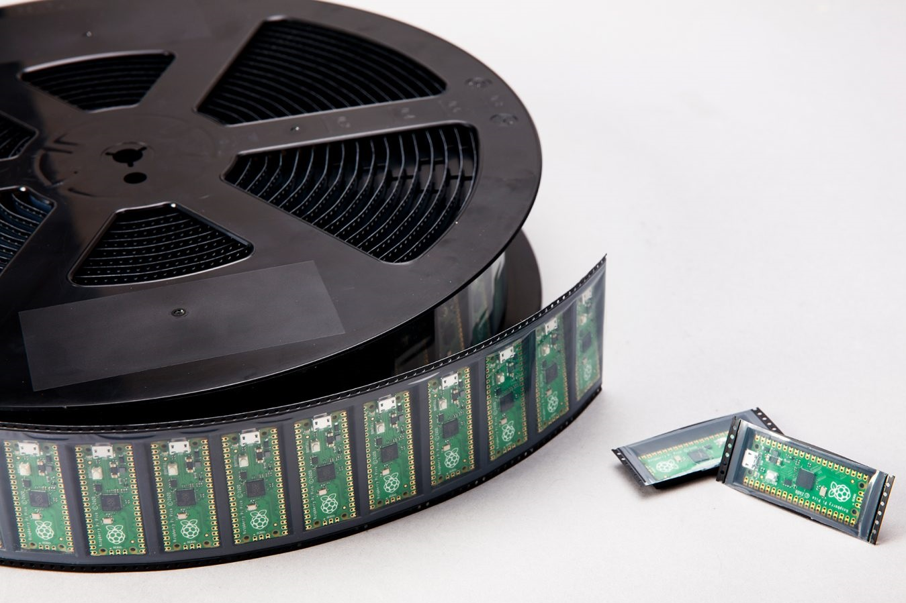  
*Figura 23 - RPico family reel*

Actualmente, además de los mencionados, se comercializan también los modelos **Raspberry Pi Pico H (RPico H)** y **Raspberry Pi Pico WH (RPico WH)**, con precios de U$S5 y U$S7 respectivamente. La única diferencia de ellos radica en que el modelo *H* ya está equipado con 40 pines macho pre-soldados y un conector *JTAG* de 3 pines para el "DEBUG".

  
*Figura 24 - RPico family*

## 1.5 Descripción de los materiales a utilizar

La **RPico W** es solo una parte de los elementos que emplearemos en este curso; el resto consiste en componentes electrónicos que serán controlados a través de los pines *GP* de nuestra placa. Aunque hay una amplia variedad de componentes disponibles, la mayoría de los proyectos con **sistemas embebidos** incluyen los que pedimos para este curso y que repasaremos a continuación.

### 1.5.1 Placa de prueba o Protoboard

Nos facilita considerablemente los proyectos que llevemos a cabo. En lugar de tener un montón de componentes separados que deben conectarse con cables, una protoboard nos permite insertar y retirar componentes fácilmente, y conectarlos a través de pistas de metal que están ocultas debajo de su superficie. A los costados veremos unas secciones que están marcadas con color rojo y celeste, estás se utilizan para la distribución de la energía a lo largo de la protoboard.

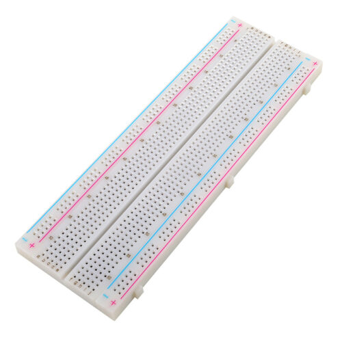  
*Figura 25 - Protoboard 830 puntos*

En este curso, utilizaremos el modelo más común de 830 puntos, como se muestra en la **Figura 25**. Sin embargo, actualmente también se encuentran disponibles otros tamaños, siendo los de 400 puntos y 170 puntos los más conocidos. Estos modelos pueden variar también en cuanto a formas y colores.

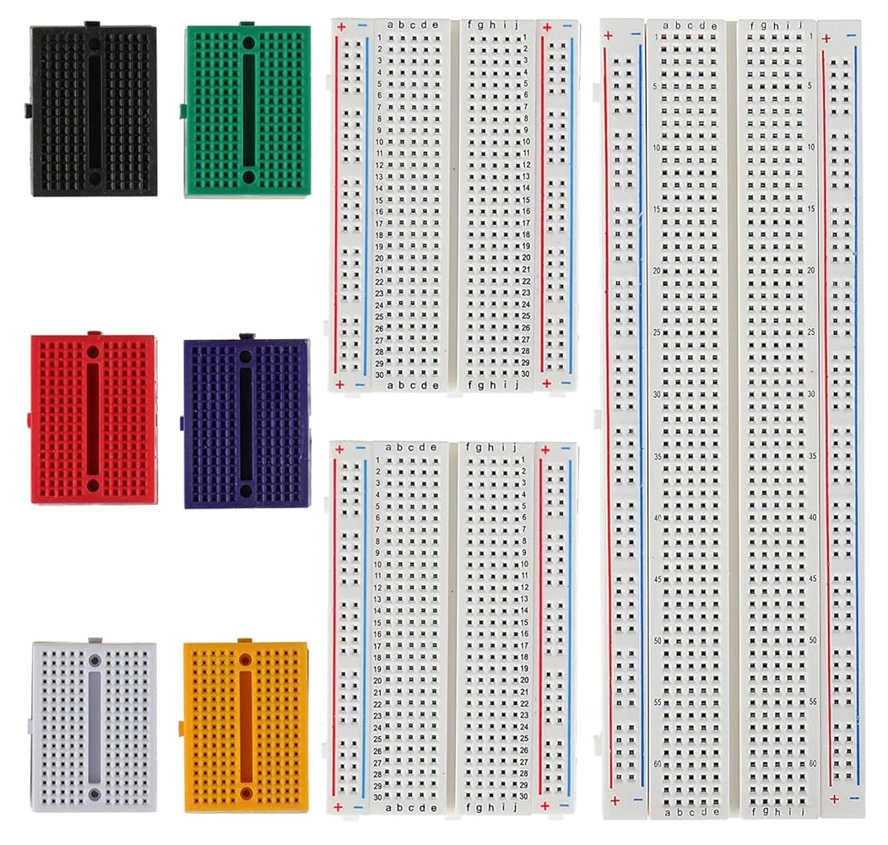  
*Figura 26 - Modelos de Protoboard*

### 1.5.2 Cable Dupont Macho-Macho(M2M) y Macho-Hembra(M2F) 

Se trata de un cable con un conector en cada extremo, diseñado principalmente para interconectar componentes dentro de una protoboard. Estos cables están disponibles en tres versiones, cada una con diferentes cabezales en los extremos: *Macho-Macho (M2M)*, *Macho-Hembra (M2F)* y *Hembra-Hembra (H-H)*. Según el tipo de proyecto que estemos llevando a cabo, es posible que necesitemos los tres tipos de cables Dupont, pero para este curso únicamente utilizaremos dos de ellos.

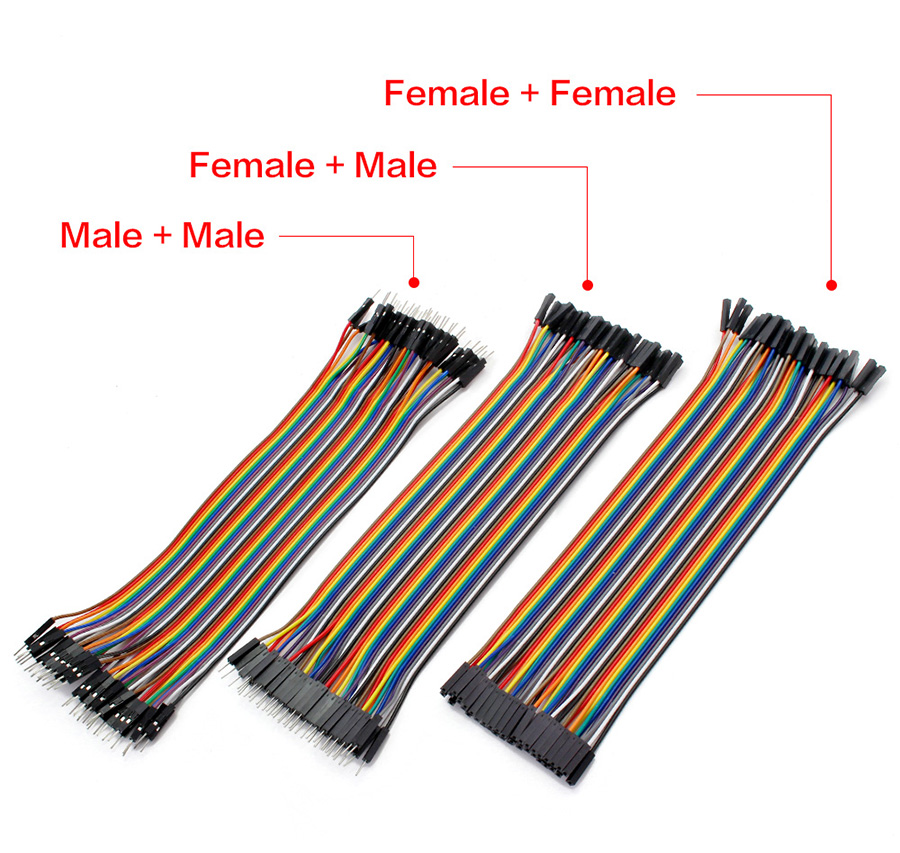  
*Figura 27 - Cable Dupont*

### 1.5.3 Diodo Emisor de Luz (LED) 

Es un dispositivo de salida, que enciende una luz de un color determinado cuando lo energizamos desde nuestra **RPico W**. Están disponibles en una amplia gama de formas, colores, tamaños e intensidad lumínica. En el curso utilizaremos LEDs de 5[mm], siendo este el tamaño del diámetro exterior del mismo, y el más común de todos los disponibles.

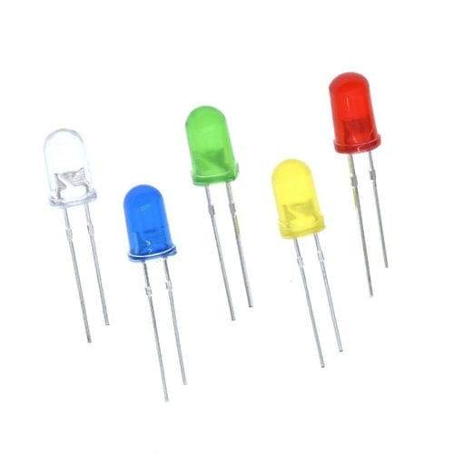  
*Figura 28 - Led 5mm*

### 1.5.4 Resistencia de 470[ohm]

Son componentes que limitan el flujo de corriente eléctrica y están disponibles en diferentes valores,  los cuales se expresan utilizando la unidad de medida *ohm* (simbolizada como *&ohm;*). Cuanto mayor sea el número de ohmios, más resistencia proporcionará. En nuestro curso las utilizaremos principalmente para evitar que los LEDs consuman una corriente excesiva y, como consecuencia, se dañen.

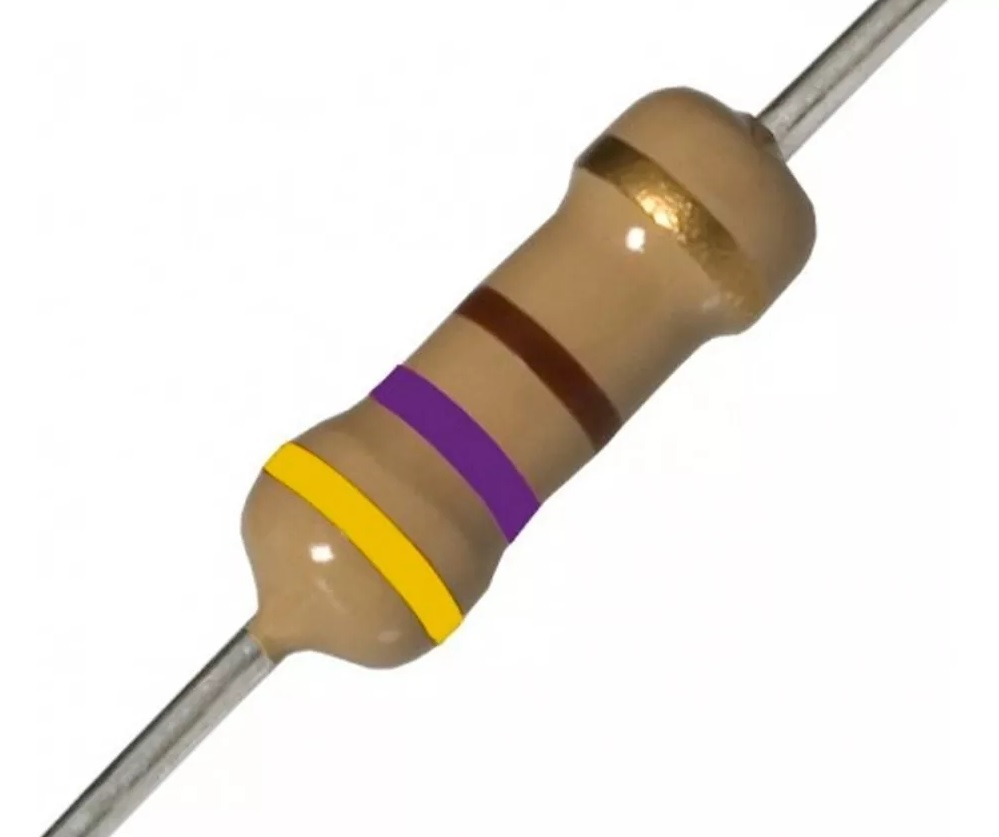  
*Figura 29 - Resistencia de 470 ohm*

### 1.5.5 Pulsador táctil Normal Abierto (Pulsador NA)

El pulsador es un dispositivo de entrada que se emplea para controlar el flujo de corriente eléctrica. Este dispositivo se activa al ser presionado por el usuario y se desactiva al liberarlo, volviendo a su posición inicial.

Existen dos tipos principales de pulsadores, clasificados según su posición de reposo: *Normal Abierto - NA* y *Normal Cerrado - NC*. Un *pulsador NA* no permite el paso de corriente cuando no está siendo pulsado, mientras que un *pulsador NC* sí permite el paso de corriente en su posición de reposo.
    
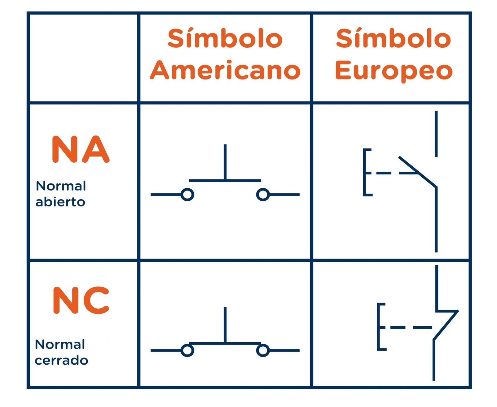  
*Figura 30 - Pulsador NA y NC*

Están disponibles en una amplia gama de modelos y tamaños, pero en este curso trabajaremos con aquellos cuyas dimensiones nos permitan colocarlo en nuestra protoboard.

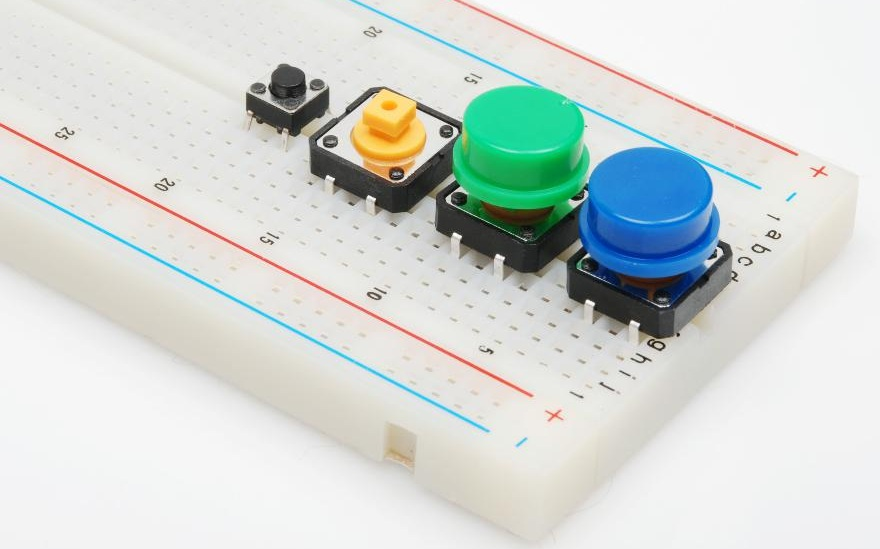  
*Figura 31 - Pulsadores para Protoboard*

### 1.5.6 Buzzer piezoeléctrico activo

El *buzzer*, también conocido simplemente como *zumbador*, es otro dispositivo de salida que emplearemos. A diferencia de un *LED*, que genera luz, un *buzzer* emite sonido cuando se energiza, produciendo un zumbido característico. Dentro de su carcasa plástica, el *buzzer* contiene un par de placas metálicas que vibran entre sí cuando se activan, generando el sonido.

Existen dos tipos de zumbadores: activos y pasivos. En este curso, utilizaremos un zumbador activo. Además, estos dispositivos están disponibles en una amplia variedad de formas, tamaños e intensidades sonoras.

  
*Figura 32 - Buzzer Piezoeléctrico Activo*

### 1.5.7 Potenciómetro de 10[k&ohm;]

El potenciometro es un dispositivo de entrada que puede operar de dos maneras según cómo se conecten sus tres terminales. Cuando se establece una conexión entre dos de sus tres terminales, actúa como una *resistencia variable*, permitiendo ajustar su valor en cualquier momento girando la perilla que posee. Por otro lado, al conectar las tres patas correctamente, el potenciómetro se convierte en un *divisor de voltaje*. En esta configuración, emite una señal que va desde 0[Voltios] hasta el valor completo del voltaje de entrada, dependiendo de la posición de la perilla. 

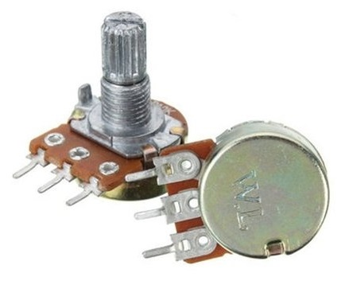  
*Figura 33 - Potenciómetro*

### 1.5.8 Display LCD 1602 con módulo I2C 

Es otro dispositivo de salida que se comunica con la **RPico W** a través de un protocolo de comunicación denominado *I2C* (*Inter-Integrated Circuit*) utilizando un bus de cuatro cables. Este bus le permite a nuestra **RPico W** controlar el panel de visualización, enviando todo tipo de caracteres alfanuméricos.

Se comercializan en una variedad de tamaños, colores y formas. Uno de los modelos más utilizados es el modelo *1602*, el cual tiene la capacidad de mostrar 16 caracteres alfanuméricos por renglón, contando con dos renglones en total.

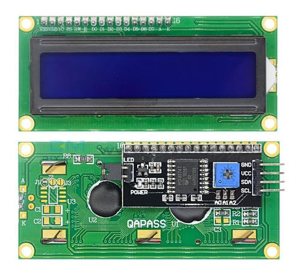  
*Figura 34 - Display LCD 1602 Con Módulo I2C*

### 1.5.9 Sensor de temperatura y humedad DHT11

Como su nombre indica, es un dispositivo diseñado para medir tanto la temperatura como la humedad del ambiente. Dentro de la amplia variedad de sensores disponibles, se destacan los pertenecientes a la serie *DHT*. Estos sensores ofrecen una salida digital que puede ser interpretada por nuestra **RPico W**, lo que facilita su integración en proyectos de **IoT** y **sistemas embebidos** sin inconvenientes.

Para este curso, hemos escogido el sensor [DHT11](https://www.mouser.com/datasheet/2/758/DHT11-Technical-Data-Sheet-Translated-Version-1143054.pdf). Sin embargo, si necesitamos un rango de medición más amplio y una mayor precisión, podemos considerar el [DHT22](https://www.sparkfun.com/datasheets/Sensors/Temperature/DHT22.pdf).

  
*Figura 35 - Sensor DHT11 y DHT22*

## 1.6 Fundamentos de MicroPython

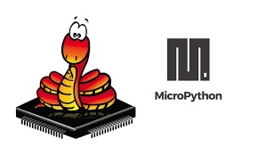  
*Figura 36 - Fundamentos de MicroPyhton*

Como sabemos, el lenguaje de programación *Python* fue desarrollado principalmente para sistemas informáticos como computadoras de escritorio, notebooks y servidores. Sin embargo, las *placas de desarrollo basadas en microcontrolador*, como la **RPico W**, son dispositivos más pequeños y con recursos limitados, lo que impide ejecutar el mismo lenguaje *Python* que sus contrapartes más grandes. Como resultado de esto, nace [MicroPython](https://micropython.org/), un lenguaje interpretado basado en *Python*, desarrollado *Damien George* y lanzado por primera vez en 2014. 

**MicroPython** es una implementación sencilla y eficiente del lenguaje de programación *Python 3*, diseñado específicamente para ejecutarse en microcontroladores. Aunque ofrece un subconjunto reducido de la biblioteca estándar de *Python*, **MicroPython** está optimizado para aprovechar al máximo los recursos limitados de los microcontroladores. Además de incluir una selección de las principales bibliotecas de *Python*, **MicroPython** también proporciona módulos propios para acceder al hardware de bajo nivel, lo que facilita el desarrollo de aplicaciones para **sistemas embebidos**.

Además, **MicroPython** se esfuerza por ser lo más compatible posible con *Python*, lo que significa que si ya estás familiarizado con *Python*, no tendrás problemas para trabajar con **MicroPython**. De hecho, cuanto más aprendas sobre **MicroPython**, más te beneficiarás en tu conocimiento de *Python* en general.

## 1.7 Instalación del firmware en nuestra Raspberry Pi Pico W

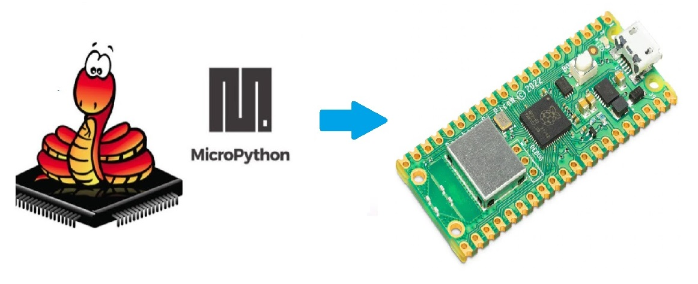  
*Figura 37 - MicroPython En RPico W*

Con todo lo visto hasta ahora, solo nos queda realizar una tarea antes de comenzar nuestros proyectos: instalar **MicroPython** en la **RPico W**.

Para ello, comenzamos conectando un cable micro-USB al puerto correspondiente de la **RPico W**.

  
*Figura 38 - Conexión cable micro-USB a RPico W*

Luego, mantén presionado el pulsador *BOOTSEL* y conecta el otro extremo del cable micro-USB a uno de los puertos USB de tu computadora.

  
*Figura 39 - Conexión cable micro-USB a la PC*

Cuenta hasta tres y luego suelta el pulsador. Unos instantes después, deberías ver que la **RPico W** aparece en tu computadora como si se tratase de una unidad extraíble con el nombre *RPI-RP2*.

En el administrador de archivos del sistema operativo, podrás observar dos archivos que están alojados en la placa, tal como se muestra en la **Figura 40**: *INDEX.HTM* e *INFO_UF2.TXT*.

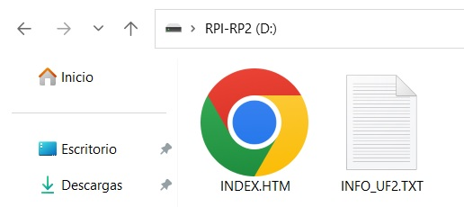  
*Figura 40 - Archivos INDEX.HTM e INFO_UF2.TXT en RPico W*

El archivo *INFO_UF2.TXT* simplemente contiene información de fabricación de nuestra **RPico W**, mientras que el archivo *INDEX.HTM* es el que nos interesa. Al hacer doble clic en él, nos redirige a la sección de la página oficial de *Raspberry Pi* que contiene toda la documentación acerca de los equipos y accesorios que comercializa, como se ve en la **Figura 41**. Luego, hacemos clic en la ventana **MicroPython** para abrir esta sección específica en nuestro navegador.

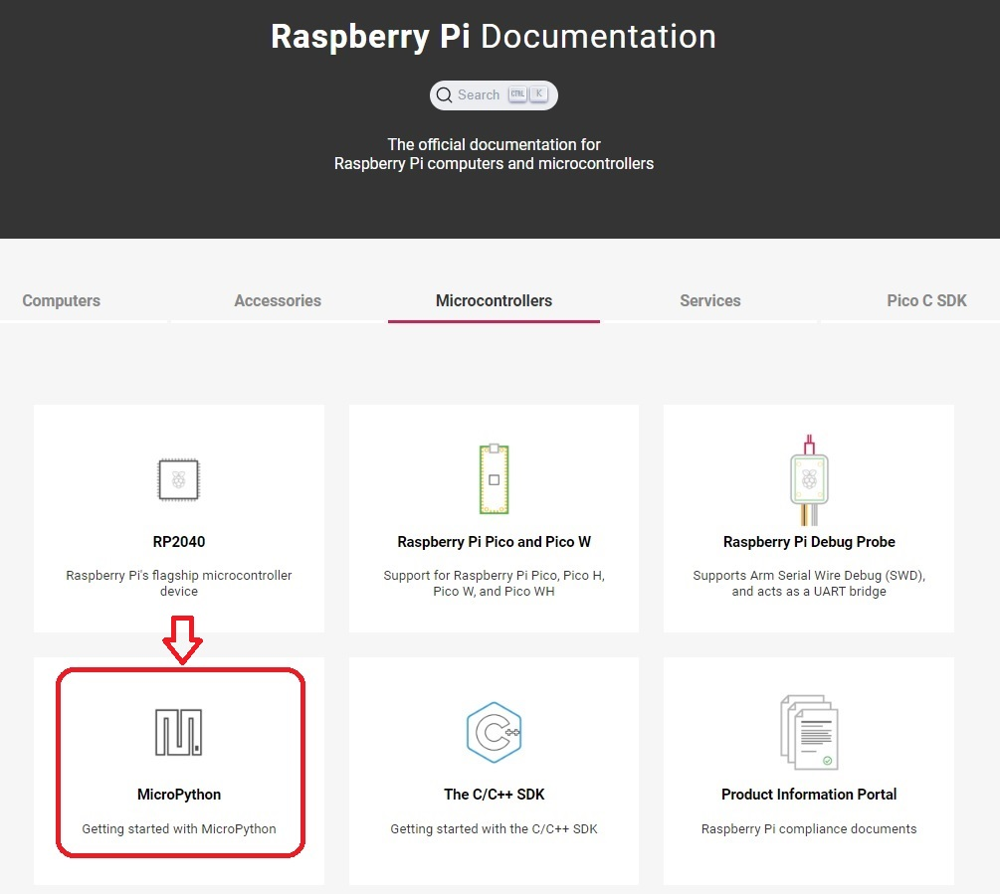  
*Figura 41 - Raspberry Pi Official Documentation*

Una vez allí, buscamos el texto *Download the correct MicroPython UF2 file for your board:* y hacemos clic en el link *Raspberry Pi Pico W* para descargar el firmware de **MicroPython**, como se muestra en la **Figura 42**. Este pequeño archivo nos permitirá ejecutar la última versión disponible de **MicroPython** en nuestra **RPico W**.

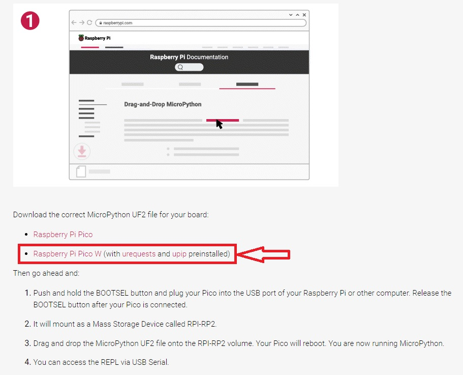  
*Figura 42 - Raspberry Pi Pico W Official Firmware*

Luego, abrimos la carpeta *Descargas* de nuestro sistema operativo y localizamos el archivo que acabamos de descargar con la extensión *uf2*. A continuación, hacemos clic en él, lo arrastramos y lo soltamos en el administrador de archivos de nuestra **RPico W**, como se aprecia en la **Figura 43**.

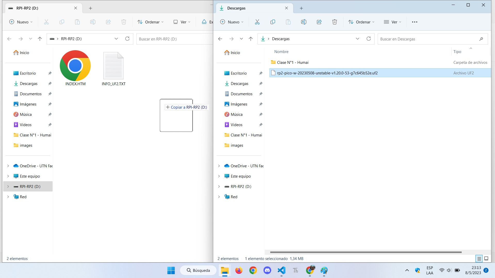  
*Figura 43 - Arrastre Del Firmware De MicroPython A RPico W*

Después de unos segundos, notarás que tu **RPico W** ha desaparecido del administrador de archivos de tu sistema operativo (y es posible que aparezca una advertencia indicando que se eliminó una unidad sin expulsarla). No te preocupes, ¡se supone que eso sucedería!

Cuando arrastraste el archivo *uf2* a tu **RPico W**, le indicaste que actualizara el firmware de **MicroPython** en su almacenamiento interno. Al hacerlo, tu **RPico W** sale del modo especial en el que lo pusiste con el pulsador *BOOTSEL* y carga el nuevo firmware, lo que significa que ahora está ejecutando **MicroPython**.

Ahora sí, todo está listo para comenzar a trabajar con **MicroPython** en tu **RPico W**, y solo nos resta realizar un pequeño paso más.

## 1.8 Thonny IDE Python: instalación, características e interfaz. 

Antes de comenzar a programar la **RPico W**, es necesario instalar y configurar lo que conocemos como *Entorno de Desarrollo Integrado* (*IDE*, por sus siglas en inglés, *Integrated Development Environment*). Para nuestro curso, utilizaremos un *IDE* muy popular para *Python* y **MicroPython**, ampliamente divulgado por la *Raspberry Pi Foundation*: **Thonny**.

**Thonny**, desarrollado por la *Universidad de Tartu* en Estonia, ofrece las herramientas necesarias para programar y cuenta con una interfaz simple e intuitiva, lo cual lo hace muy adecuado para principiantes.

La instalación de **Thonny** es muy sencilla. Dado que ya está integrado con *Python 3.10*, solo necesitamos descargar un ejecutable. Para ello, basta con dirigirnos a la página oficial de **Thonny** y seleccionar el paquete de instalación correspondiente al sistema operativo que estemos utilizando de la esquina superior derecha de la página.

  
*Figura 44 - Instalación De Thonny*

Después de descargar el paquete de instalación, simplemente haz doble clic en él y sigue las instrucciones en pantalla para completar la instalación. Una vez finalizada, ejecuta **Thonny** y te encontrarás con una interfaz similar a la que se muestra en la **Figura 45**.

  
*Figura 45 - Interfaz De Thonny*

La interfaz principal de **Thonny** es simple y puede dividirse en las siguientes cuatro partes:

1. Barra de herramientas: ofrece acceso rápido a través de íconos a las funciones de programa más utilizadas como *Nuevo Programa*, *Abrir Fichero*, *Guardar*, *Ejecutar el script actual*, entre otras.

2. Área de Script: donde se escriben los programas en **MicroPython**. Se divide en un área principal para el código y un pequeño margen lateral para mostrar los números de línea.

3. Shell: permite ejecutar comandos de la consola y también proporciona información sobre la ejecución de los programas.

4. Intérprete: muestra y permite cambiar el intérprete de *Python*, es decir, la versión de *Python* utilizada para ejecutar nuestros programas. Aquí debemos hacer clic, y seleccionar *MicroPython (Raspberry Pi Pico)* como se aprecia en la **Figura 46**.

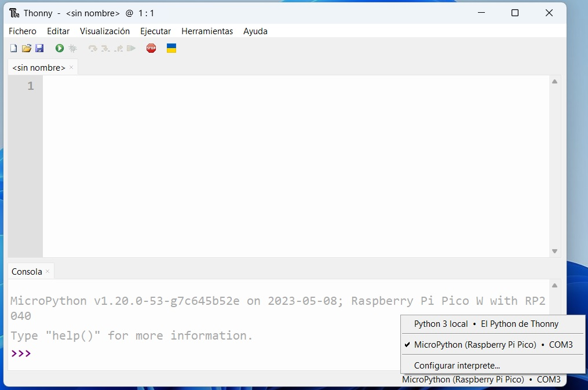  
*Figura 46 - Interprete de Thonny*

¡Ahora si ya tenemos todo preparado para comenzar a realizar nuestros proyectos!