# Clase N°2: Primeros pasos con nuestra RPico W. Entradas y salidas digitales.

  
*Figura 01 - Presentación Clase N°2*

En esta clase trabajaremos en el desarrollo de sistemas físicos que, empleando hardware y software, nos permitan captar información e interactuar con el mundo real. La **RPico W** es una excelente opción para llevar a cabo esta tarea gracias a los pines *GPIO* con los que cuenta.

Comenzaremos por conectar componentes electrónicos básicos a nuestra **RPico W**, para luego comprender y poder realizar la conexión de sensores y actuadores.

¡Empecemos!

## 2.1 Tu primer programa en MicroPython - ¡Hola LED!

Así como imprimir *Hello World!* en la pantalla es un conocido primer paso para aprender un lenguaje de programación, hacer que un *LED* se encienda es la introducción tradicional al mundo de la electrónica.

Para comenzar, utilizaremos el pequeño *LED* que tiene nuestra **RPico W** y al que hicimos referencia en la clase anterior. Recordemos que se encuentra en la esquina superior izquierda de nuestra placa, al lado del puerto micro-USB, acompañado de la etiqueta *LED* como se ilustra en la **Figura 02**. Este pequeño *LED* funciona como cualquier otro: cuando esté encendido, brillará; y cuando esté apagado, permanecerá oscuro.

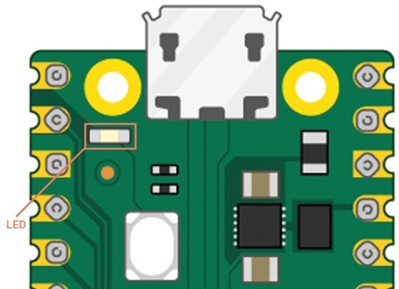  
*Figura 02 - LED Onboard*

Si observamos el pinout de la **RPico** notaremos que está conectado a uno de los pines *GPIO* que posee el *RP2040*; el *GP25*. Recordemos que este es uno de los pines *GPIO* que no está disponible a los laterales de nuestra placa y solo puede utilizarse para comandar este *LED*. Si bien no puede conectarse ningún hardware externo al *GP25*, ya que está destinado a este *LED*, puede tratarse de la misma manera que cualquier otro pin *GPIO* de la **RPico**, y es una excelente manera de contar con una salida indicativa (lumínica en este caso) para nuestros programas, sin la necesidad de añadir componentes externos.

Pero, a diferencia de la **RPico**, el *LED* incorporado en la **RPico W** no está conectado a un pin del *RP2040*, sino a un pin *GPIO* del chip *CYW43439*. En términos de programación, solo cambiará la referencia al pin correspondiente como detallaremos más adelante.

Comencemos por conectar la **RPico W** a nuestra computadora, ejecutar **Thonny** y hacer clic en el área de Script para escribir la siguiente línea:

```python
import machine
```
Esta breve línea de código es clave para trabajar con **MicroPython** en nuestra **RPico W** y ya la conocen: importa una colección de código conocida como *biblioteca*, en este caso, la biblioteca *machine*. Esta contiene todas las instrucciones que **MicroPython** necesita para comunicarse con la **RPico W** y otros dispositivos compatibles con **MicroPython**. 

Tanto en **MicroPython** como en **Python** es posible importar parte de una biblioteca, en lugar de toda la biblioteca, mediante la instrucción *from*. En estos primeros códigos, utilizaremos la función *Pin* de la biblioteca *machine*. Esta función, como su nombre indica, está diseñada para manejar los pines *GPIO* de la **RPico W**, y también nos permite comandar el pin *GPIO* del chip *CYW43439* que se encuentra conectado al *LED* de nuestra placa. Por defecto, ninguno de los pines *GPIO*, sabe lo que debe hacer, y es la función *Pin* la que nos ayuda a configurar cada uno de ellos. 

Incorporando la instrucción *from* tenemos entonces:

```python
from machine import Pin
```
Luego, escribiremos la siguiente línea:  

```python
LED_onboard = Pin("LED", Pin.OUT)  # LED_onboard = Pin(25, Pin.OUT) si empleamos la RPico
```
La primera parte de esta línea, define un objeto con un nombre descriptivo que usaremos para referirnos al *LED* que se encuentra en nuestra **RPico W**, en este caso, usaremos el nombre *LED_onboard*. La segunda parte de la línea, llama a la función *Pin* de la biblioteca *machine*, que en su primer argumento, "LED", le indica el pin que estamos configurando; mientras que el segundo argumento, *Pin.OUT*, le indica a la **RPico W** que el pin debe usarse como salida en lugar de como entrada.

Esa línea por sí sola es suficiente para configurar el pin, pero aún no encenderá el *LED*. Ahora debemos decirle puntualmente a la **RPico W** que encienda el *LED*. Para ello, escribiremos lo siguiente:  

```python
LED_onboard.value(1)
```

Este método permite establecer y obtener el valor del pin, dependiendo si se proporciona o no el argumento. En nuestro caso, establecemos su *value* en *1*, lo que se corresponde con la acción de "encendido". De forma similar, podría establecerse el *value* en *0* para "apagado".

Ahora sí ya podemos ejecutar nuestro código completo, para ello, debemos hacer clic en el botón *Ejecutar el script actual (F5)* que se encuentra en la barra de herramientas. Si estamos ejecutando un nuevo programa que nunca se ha guardado, **Thonny** automáticamente nos muestra un menú con dos opciones para el almacenamiento de nuestro código (**Figura 03**): *Esta computadora* o *Raspberry Pi Pico*. Podemos elegir dónde hacerlo según nuestras propias necesidades. En este caso, vamos a elegir la segunda opción.

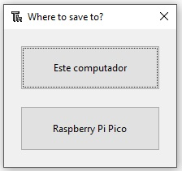  
*Figura 03 - Guardar Código*

Y ahora sí, verás que el LED de nuestra **RPico W** se ha encendido. ¡Felicitaciones!

Sin embargo, notarás que el *LED* permanece encendido durante toda la ejecución del programa. Esto se debe a que le indicamos a la **RPico W** que lo encienda, pero nunca le indicamos que lo apague. Para ello, agregamos la siguiente línea en la parte inferior del código:  

```python
LED_onboard.value(0)
```

Ahora ejecutamos el programa con esta modificación, y notaremos que el *LED* nunca enciende... ¿qué sucedió?

La **RPico W** ejecuta las instrucciones a una velocidad muy elevada, entonces el encendido y el apagado del *LED* no puede ser percibido a simple vista por el ojo humano. El *LED* efectivamente enciende, pero durante un breve periodo de tiempo que no llegamos a percibir, dando la impresión que permaneció a oscuras durante toda la ejecución del programa. Para arreglar esto, necesitamos ralentizar nuestro programa introduciendo un retraso o *delay*. 

Volvemos a la parte superior de nuestro programa e importaremos la función *sleep* de la biblioteca *utime*. Esta biblioteca contiene todo lo relacionado con el tiempo, desde medirlo hasta permitirnos insertar retrasos en nuestros códigos.

```python
from utime import sleep
```

Y ahora, debajo de la línea *led_onboard.value(1)* escribimos lo siguiente:
```python
sleep(5)
```

Esto hace que la ejecución del programa se detenga la cantidad de segundos que se indica entre paréntesis. En este caso, cinco segundos. El código completo queda de la siguiente manera (Ver *Ejemplo1_LedOnBoard.py* en el repositorio):

```python
from machine import Pin
from utime import sleep

LED_onboard = Pin("LED", Pin.OUT)  # LED_onboard = Pin(25, Pin.OUT) si empleamos la RPico

LED_onboard.value(1)

sleep(5)

LED_onboard.value(0)
```

Nuevamente ejecutamos nuestro programa y veremos que el *LED* incorporado en nuestra **RPico W** se enciende, permanece encendido durante cinco segundos y luego se apaga. 

Si lo que deseamos es que el *LED* parpadee con una determinada frecuencia, debemos crear un bucle utilizando un *while*. Para ello, reescribimos el código anterior de la siguiente manera: 

```python
from machine import Pin
from utime import sleep

LED_onboard = Pin("LED", Pin.OUT)  # LED_onboard = Pin(25, Pin.OUT) si empleamos la RPico

while True:
    LED_onboard.value(1) # Encendido
    sleep(5)
    LED_onboard.value(0) # Apagado
    sleep(5)
```

Ejecutamos el programa y veremos que el *LED* se enciende durante cinco segundos, se apaga durante otros cinco segundos y luego se vuelve a encender, repitiéndose esto en un bucle infinito. El *LED* seguirá parpadeando hasta que hagamos clic en el icono *Detener*.

Existe otra manera de realizar esto utilizando el método *toggle()*, que simplemente cambia el estado de un pin entre encendido y apagado: si el pin está encendido, *toggle()* lo apaga; y si está apagado, *toggle()* lo enciende. Realizamos una modificación en el bucle del programa anterior de la siguiente manera (Ver *Ejemplo2_LedOnBoard.py* en el repositorio):

```python
while True:
    LED_onboard.toggle()
    sleep(5)
```

## 2.2  General Purpose Input/Output (GPIO) - Controlando entradas y salidas

En la clase anterior hablamos acerca del *GPIO* de nuestra **RPico W**. Sabemos que se compone de dos filas de conexiones o pines metálicos que se pueden usar como entradas o salidas, y nos permitirán conectar a nuestra placa distintos dispositivos como LEDs, pulsadores, sensores, etc.

Estos pines están incluidos en todos los modelos de *Raspberry Pi* aunque con diferencias, por lo que siempre es importante tener a mano el *pinout* completo del modelo que estemos utilizando.

La utilización del *GPIO* y el desarrollo de proyectos que llevemos a cabo durante el curso, será mucho más fácil si utilizamos una *placa de pruebas* o *protoboard*, la cual nos permite sujetar los componentes que queramos comandar y realizar las conexiones eléctricas.

Una placa de pruebas está cubierta de orificios con separaciones de 2,54[mm], en los que podemos insertar nuestros componentes. Debajo de estos orificios hay tiras de cobre que actúan como conductores eléctricos entre ellos, que se distribuyen en toda la superficie de la placa de pruebas de una forma determinada.

La mayoría de las placas de pruebas tienen una separación que las divide en dos mitades. También tienen letras en la parte superior y números en los laterales. Esto nos permite encontrar un orificio determinado; *A1* está en la esquina superior izquierda, *B1* es el orificio justo a su derecha, mientras que *B2* es el orificio situado debajo de *B1*. *A1* está conectado a *B1* por las tiras de cobre ocultas, pero ningún orificio *1* está conectado a un orificio *2* a menos que agreguemos un puente.

Por otro lado, las placas de pruebas también tienen tiras de orificios en los laterales, normalmente identificadas por rayas rojas y negras, o rojas y azules; que se utilizan como líneas energización para nuestra **RPico W** y del resto de los componentes que usemos. Siempre se encuentran acompañadas de los signos *+* (línea de energización roja) y *-* (línea de energización azul o negra) como se ve en la **Figura 04**. 

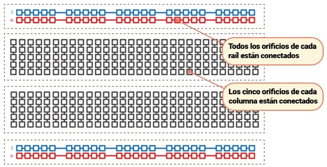  
*Figura 04 - Esquema Protoboard*

Es muy fácil añadir componentes electrónicos a una placa de pruebas: solo hay que alinear sus pines salientes con los orificios y presionar levemente para que el componente encaje. Y si necesitamos realizar otras conexiones además de las que posee la placa de pruebas, utilizaremos los cables Dupont Macho-Macho (M2M) y Macho-Hembra (M2F).

No debemos insertar más de un pin o cable en los orificios individuales de la placa de pruebas. Recordemos que los orificios están conectados en columnas, y que solamente se encuentran aislados por la división del medio, por lo que un pin de algún componente colocado en *A1* está conectado eléctricamente a cualquier cosa que coloquemos en *B1*, *C1*, *D1* y *E1*.

Con estas indicaciones, comencemos por colocar nuestra **RPico W** en la placa de pruebas. Para ello, la situamos de forma tal que cubra el espacio intermedio de la protoboard con el puerto micro-USB apuntando hacia afuera como se ve en la **Figura 05**. Si la protoboard está numerada, el orificio *1* debe quedar alineado con el pin superior izquierdo de nuestra **RPico W**. Finalmente, y antes de empujar la **RPico W** hacia abajo suavemente, debemos asegurarnos que todos los pines del pinout estén colocados correctamente; si dobla un pin, puede ser difícil volver a enderezarlo sin que se dañe.

Recordemos que la **RPico W** mantiene la compatibilidad de pines con la **RPico**, esto significa que la distribución de los 40 pines externos (que denominamos *pinout*) no cambia. Es por ello que, en los distintos esquemas de conexión que veamos a lo largo del curso, resulta indistinto si empleamos la **RPico** o la **RPico W**.

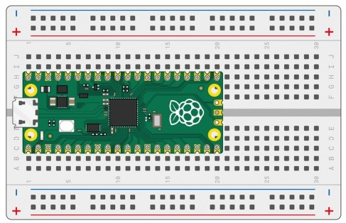  
*Figura 05 - RPico en la Protoboard*

### 2.2.1 Conexión de un LED externo

Y ahora sí, arranquemos con nuestro primer proyecto. Utilizaremos un *LED* de cualquier color, una resistencia de 470[ohms] (o de un valor cercano como 330[ohms]) y dos cables Dupont Macho-Macho (M2M).

La resistencia es un componente vital en este circuito y en otros que realicemos, ya que protege a la **RPico W** y al *LED*, limitando la cantidad de corriente eléctrica que puede tomar el *LED*. Sin ella, el *LED* puede tomar demasiada corriente y quemarse, o incluso podría dañarse la **RPico W**. Cuando se usa de esta manera, la resistencia se conoce como *resistencia limitadora de corriente*. El valor exacto de la resistencia que necesites depende del *LED* que utilices, pero 470[ohms] es un valor adecuado para la mayoría de los *LEDs*. Cuanto más alto sea el valor, más atenuada será la luz del *LED*. Cuanto más bajo sea el valor, más brillante será el *LED*. Nunca debemos conectar un *LED* a una **RPico W** sin una *resistencia limitadora de corriente*, a menos que sepamos que el *LED* ya cuenta con una resistencia incorporada de un valor apropiado.

Toma ahora alguno de los *LEDs* que tengas; verás que tiene dos patas o terminales (**Figura 06**), y que uno es más largo que el otro. El terminal más largo se conoce como *ánodo* y es el que debemos conectar al positivo (+) del circuito que estemos armando; mientras que el terminal más corto se conoce como *cátodo* y es el que debemos conectar al terminal negativo (-) del circuito. El *ánodo* debe conectarse a uno de los pines *GPIO* de la **RPico W** a través de la resistencia y el *cátodo* debe conectarse a un pin de tierra (GND).

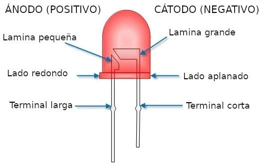  
*Figura 06 - Terminales de un LED*

Con estas indicaciones concluidas, llegó el momento de colocar todo en nuestra protoboard. Arranquemos con la resistencia; tomamos una de ellas y colocamos un extremo (no importa cuál) en la placa de pruebas, en la misma columna que el pin *GP15* de la **RPico W** (esquina inferior izquierda). Si contamos con una placa de pruebas numerada, con la **RPico W** colocada en la parte superior, el extremo de la resistencia debería estar en la columna 20. El otro extremo debemos colocarlo en una columna libre hacia la derecha de donde colocamos el extremo anterior; por ejemplo, la columna 24.

Luego continuamos con el *LED*; tomamos el terminal más largo (*ánodo*) y lo colocamos en la misma columna que el extremo de la resistencia que se encuentra en la columna 24 , mientras que al terminal más corto (*cátodo*) lo colocamos en la misma columna pero a través del espacio central en la placa de pruebas, de modo que esté alineado pero no conectado eléctricamente a la pata más larga, excepto a través del propio *LED*.

Finalmente, insertamos un extremo de un cable Dupont M2M en la misma columna que la pata más corta del *LED*, y el otro extremo a la línea de energización *-* (color azul o negro, dependiendo del modelo de nuestra placa de pruebas). 

El segundo cable Dupont se utiliza para cerrar el circuito de la siguiente manera; un extremo se coloca en la línea de energización *-* y el otro en la misma columna que el pin 38 de la **RPico W**. Recordemos que este pin se corresponde con el pin *GND* de nuestra placa.

El circuito terminado debe parecerse al que se muestra en la **Figura 07**. Ahora nos resta realizar el código para que la **RPico W** pueda encender el *LED* que se encuentra en la placa de pruebas.

  
*Figura 07 - Circuito Ejemplo N°3*

Controlar un LED externo en **MicroPython** no es diferente a controlar el *LED* interno de nuestra **RPico W**; solo debemos cambia el número de pin. Abramos el archivo correspondiente al parpadeo del *LED* onboard (*Ejemplo2_LedOnBoard.py*) y posicionémonos en la siguiente línea:

```python
LED_onboard = Pin("LED", Pin.OUT)
```

Aquí realizaremos dos modificaciones. La primera de ellas será cambiar la referencia al pin que queremos comandar; de *"LED"* a *15* (el pin que se conectó al *LED* externo). La segunda modificación es reemplazar el nombre del objeto creado; ya no estamos utilizando el *LED* onboard, así que lo reemplazaremos por *LED_externo*. El código completo queda de la siguiente manera (Ver *Ejemplo3_LedExterno.py* en el repositorio):

```python
from machine import Pin
from utime import sleep

LED_externo = Pin(15, Pin.OUT)

while True:
    LED_externo.toggle()
    sleep(5)
```

Ejecutamos el programa y veremos que el *LED* parpadea en la placa de pruebas. ¡Felicitaciones!

Y esto recién comienza...

### 2.2.2 Conexión de un pulsador externo

Las salidas como los *LED* son un tipo de componente que podemos conectar a la **RPico W**, pero como su nombre lo indica, el *GPIO* también nos permite utilizar los pines como entradas. Realizaremos un proyecto para comprobar esto. Necesitaremos, además de la placa de pruebas con la **RPico W** conectada, tres cables Dupont Macho-Macho (M2M) y un pulsador táctil normal abierto (pulsador NA).

Empecemos por añadir el pulsador a la placa de pruebas. Si el pulsador tiene solo dos patas, asegúrate de que estén en diferentes columnas. Pero si tiene cuatro patas, debe colocarse utilizando la división central de la placa de pruebas, cuidando que los lados con patas estén a lo largo de las filas de la placa de pruebas, y los lados planos sin patas apunten a las partes superior e inferior de la placa de pruebas (**Figura 08**).

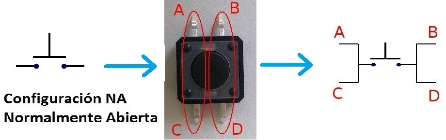  
*Figura 08 - Pulsador NA de cuatro patas*

Luego localizaremos el pin 36 de la **RPico W**, *3V3(OUT)*, y lo conectaremos a la línea de energización roja *+*, con la ayuda de uno de los cables Dupont M2M. Partiendo de esa misma línea, y con otro cable Dupont M2M, conectaremos con una de las patas del pulsador. Y por último, con el tercer cable Dupont M2M, enlazaremos el pin 19, *GP14*, con la otra pata del pulsador. 

Si estamos trabajando con un pulsador de cuatro patas, el circuito solo funcionará si usamos el par de patas correcto: las patas están conectadas de pares, por lo que necesitamos usar las dos patas del mismo lado o las patas diagonalmente opuestas como se indica en la **Figura 08**.

El circuito completo, utilizando en este caso las patas diagonalmente opuestas del pulsador, se muestra en la **Figura 09**.

  
*Figura 09 - Circuito Ejemplo N°4*

A diferencia de un *LED*, un pulsador no necesita una *resistencia limitadora de corriente*. Sin embargo, todavía necesita una resistencia: requiere lo que se conoce como *Resistencia Pull-Up* o *Resistencia Pull-Down*, dependiendo de cómo funcione el circuito. 

Cuando hablamos de resistencias de *Pull-Up* y *Pull-Down*, no nos referimos a un tipo especial de resistencia, sino que nos referimos a una configuración específica de resistencias. Son muy utilizadas en **Electrónica Digital**, ya que tienen la función de *definir un nivel de tensión concreto*.

En **Electrónica Digital**, se trabaja siempre usando dos estados: *ALTO* o *1*, que quiere decir que hay presencia de voltaje, y *BAJO* o *0*, que indica ausencia de voltaje o que se encuentra conectado a tierra. Desde el punto de vista eléctrico, lo que acabamos de describir conforma lo que se denomina **señal digital binaria**.

Este tipo de señal solo puede tomar dos niveles de voltaje. En las entradas y salidas digitales de la **RPico W**, los niveles son +3,3 Volts (3,3[V]) y 0 Volts (0[V]). En la **Figura 10** se muestra la variación en el tiempo de una **señal digital binaria**. Observen que la forma de onda es un *tren de pulsos*; con 0[V], que representa el *nivel BAJO* o *valor lógico 0*, y con +3,3[V], que representa el *nivel ALTO* o *valor lógico 1*.

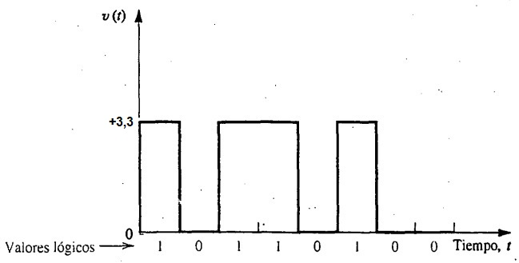  
*Figura 10 - Variación de una señal digital binaria en el tiempo*

¿Qué ocurriría si tenemos un pin sin conectar a nada? Si esto se produce, decimos que el pin está en un estado *flotante*, algo que no es recomendable al trabajar en **Electrónica Digital**, ya que cualquier interferencia o perturbación va a producir cambios de estado en la entrada del pin, haciendo que algunas veces leamos la entrada como *ALTO* y otras como *BAJO*. Por este motivo, siempre se usan resistencias *Pull-Up* o *Pull-Down* en los pines de entrada.

Cuando configuramos una entrada digital con una resistencia *Pull-Up*, estamos asegurando, que en todo momento vamos a tener una señal *ALTA* hasta el momento en que accionemos el pulsador, en ese momento la entrada digital quedará conectada directamente tierra, o lo que es lo mismo, a un nivel de tensión 0[V] (**Figura 11**).

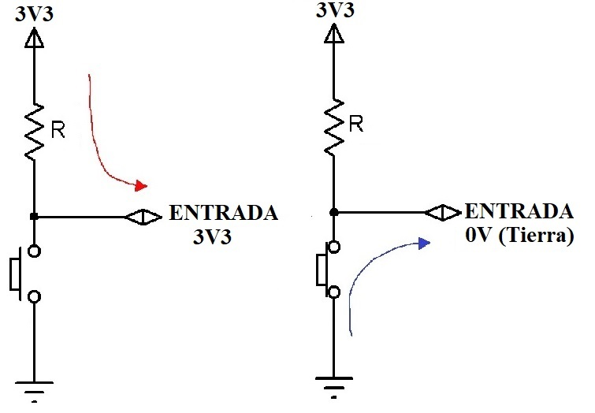  
*Figura 11 - Resistencia Pull Up*

En una resistencia *Pull-Down*, el funcionamiento es similar al de la resistencia *Pull-Up* pero invirtiendo la lógica, es decir, esta configuración asegurará un nivel lógico de 0[volts] hasta que sea accionado el pulsador (**Figura 12**)

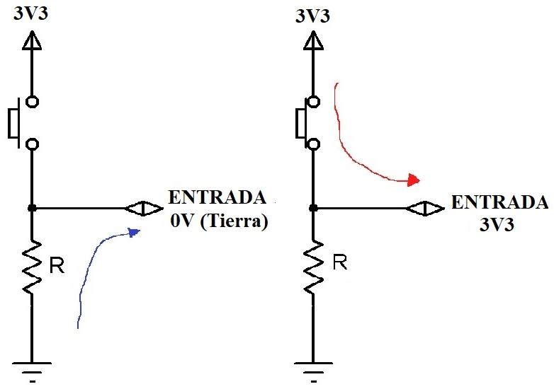  
*Figura 12 - Resistencia Pull Down*

Pero, ¿dónde está la resistencia en el circuito que armamos? ¡Escondido en tu **RPico W**! La **RPico W** incluye una resistencia programable integrada conectada a cada pin *GPIO*. Estos normalmente se configuran con resistencias *Pull-Down*, pero podemos cambiarlas a resistencias *Pull-up* en **MicroPython** si el circuito lo necesita.

Por defecto, todos los pines están en *flotante*, por lo que debemos indicar explícitamente la configuración escogida en la función *Pin()*.

Y ahora a programar. Abrimos **Thonny**, e iniciamos un nuevo código con dos líneas que se volverán habituales:

```python
from machine import Pin
from utime import sleep
```

Luego, escribiremos la siguiente línea:

```python
pulsador = Pin(14, Pin.IN, Pin.PULL_DOWN)
```

Esto funciona de la misma manera que los proyectos con *LEDs* que realizamos. La primera parte de esta línea define un objeto llamado *pulsador*, y la segunda parte indica el número de pin que estamos configurando, *14* en este caso, y le indica a la **RPico W** que el pin debe usarse como entrada mediante *Pin.IN*. El tercer argumento nos permite definir si vamos a trabajar con una resistencia *Pull-Up* o *Pull-Down*; en nuestro caso, vamos a usar una *Pull-Down*, por lo que debemos usar *Pin.PULL_DOWN*.

Sin embargo, crear el objeto no significa que hará algo por sí mismo, al igual que al crear los objetos *LED_onboard* y *LED_externo* anteriormente no hizo que los *LEDs* se encendieran. Debemos decirle puntualmente a la **RPico W** que *"lea"* el pin. Para ello, escribiremos lo siguiente:

```python
print(pulsador.value())
```

Como ya lo mencionamos, este método permite establecer y obtener el valor del pin, dependiendo si se proporciona o no el argumento. En nuestro caso, nos interesa obtener el valor del pin e imprimirlo en pantalla. 

Guardamos y ejecutamos el código, y notaremos que el programa imprime un número en el área de Shell: es el valor de la entrada *GP14*. En este caso, como el pulsador no está presionado, este valor será *0*. Si mantenés presionado el pulsador con el dedo y ejecutas nuevamente el programa, verás el valor *1* impreso en el Shell.

Para leer el pulsador de forma continua, debemos agregar un bucle al programa, quedando de la siguiente manera (Ver *Ejemplo4_LecturaPulsadorNA.py* en el repositorio):

```python
from machine import Pin
from utime import sleep

pulsador = Pin(14, Pin.IN, Pin.PULL_DOWN)

while True:
    if pulsador.value() == 1:
        print("Presionaste el pulsador!")
        sleep(3)
```

Ejecuta nuevamente el programa, y verás que no ocurre nada hasta que presiones el pulsador; cuando lo hagas, verás el mensaje impreso en el área de Shell. Has logrado controlar una entrada de tu **RPico W**.

Recordemos que la **RPico W**  ejecuta las instrucciones a una velocidad muy elevada, por lo que es esencial añadir un retardo. Si no lo hacemos, al accionar el pulsador, la **RPico W** imprimirá cientos de mensajes en el Shell. 

Al añadir *sleep(3)*, la **RPico W** imprimirá el mensaje durante tres segundos cada vez que presiones el pulsador. Por otra parte, si mantienes presionado el pulsador durante más de tres segundos, se volverá a imprimir el mensaje cada tres segundos hasta que sueltes el pulsador.

### 2.2.3 Combinando entradas y salidas: pulsador NA + LED

¿Y si juntamos estos últimos dos ejercicios? La mayoría de los circuitos tienen más de un componente externo, combinando entradas y salidas, razón por la cual la **RPico W** tiene tantos pines *GPIO*. Es hora de juntar todo lo que hemos aprendido para construir un circuito más complejo: un dispositivo que encienda y apague un *LED* con un pulsador.

Recordemos que usamos el pin *GP15* para controlar el *LED* externo y el pin *GP14* para leer el pulsador; ahora reconstruyamos el circuito para que tanto el *LED* como el pulsador estén en la placa de pruebas al mismo tiempo, también conectados a *GP15* y *GP14* respectivamente. El resultado final tendría que ser similar al que se muestra en la **Figura 13**.

  
*Figura 13 - Circuito Ejemplo N°5*

Iniciamos **Thonny**, y comenzamos un nuevo código con las librerías que necesitamos:

```python
from machine import Pin
from utime import sleep
```

A continuación, configuramos los pines de entrada y salida:

```python
led_externo = Pin(15, Pin.OUT)
pulsador = Pin(14, Pin.IN, Pin.PULL_DOWN)
```

Luego se crea un bucle para que lea el pulsador:

```python
while True:
    if pulsador.value() == 1:
```

Sin embargo, en lugar de solo imprimir un mensaje en el área de Shell, cambiaremos el estado del pin de salida y por ende, encenderemos el *LED*. Recordemos también la importancia de colocar un retardo (en este caso, escogemos 2 segundos):

```python
        print("Presionaste el pulsador!")
        led_externo.value(1)
        sleep(2)
``` 

Lo realizado es suficiente para encender el *LED*, pero también deberemos apagarlo nuevamente cuando no se presione el pulsador, por lo que escribiremos la siguiente línea por fuera del condicional:

```python
led_externo.value(0)
``` 
El código completo queda de la siguiente manera (Ver *Ejemplo5_LEDyPulsadorNA.py* en el repositorio):

```python
from machine import Pin
from utime import sleep

led_externo = Pin(15, Pin.OUT)
pulsador = Pin(14, Pin.IN, Pin.PULL_DOWN)

while True:
    if pulsador.value() == 1:
            print("Presionaste el pulsador!")
            led_externo.value(1)
            sleep(2)
            
    led_externo.value(0)
``` 

Guardamos y ejecutamos el programa. Al principio, notarás que no pasa nada. Sin embargo, presiona el pulsador y verás que el *LED* se enciende. Suelte el pulsador, y después de dos segundos, el *LED* se apagará nuevamente hasta que vuelvas a presionar el pulsador.

¡Felicitaciones, has construido tu primer circuito que combina entradas y salidas!

## 2.3 Sensores y actuadores 

El desarrollo de cualquier proyecto que requiera la integración de hardware y software implica el uso de sensores y actuadores como componentes fundamentales, siendo la *automatización industrial* y el **Internet de las Cosas** sus campos de aplicación más destacados.

Un sensor es un dispositivo capaz de detectar *magnitudes físicas* como temperatura, intensidad lumínica, distancia, etc., y convertirlas en *magnitudes eléctricas* como tensión o corriente. En otras palabras, recolecta información del mundo real y la convierte en datos interpretables por nuestra **RPico W**.

Por otro lado, un actuador es un dispositivo que, a diferencia de un sensor, transforma una *magnitud eléctrica* en una *magnitud física*. En otras palabras, interpreta los datos enviados desde nuestra **RPico W** y realiza una acción específica en el mundo real.

Nuestra **RPico W** recibe información del entorno a través de los sensores, esta información proporciona datos para que nuestro programa decida si es necesario llevar a cabo alguna acción; y si es así, dicha acción se ejecuta mediante un actuador con la capacidad de realizarla.

De hecho, la arquitectura que hemos descrito, con la **RPico W** como unidad central, puede replicarse con cualquier equipo de *Raspberry Pi* en particular y con cualquier **sistema embebido** en general.

  
*Figura 14 - Arquitectura Básica con RPi*

Existe un gran número de sensores y actuadores disponibles en el mercado, pero no todos son adecuados para nuestra **RPico W**. A la hora de elegir un sensor y/o actuador, debemos leer detenidamente las características y elegir uno que sea compatible con nuestro sistema (fundamentalmente voltajes y corrientes de trabajo) y que sea sencillo de usar, o nos facilite una librería sencilla y correctamente documentada.

Algunos ejemplos de sensores compatibles con nuestra **RPico W** incluyen el sensor de movimiento *HC-SR501*, el sensor de temperatura y humedad *DHT11*, y el sensor de distancia *HC-SR04*. En la última sección de esta clase, veremos cómo se emplea el *HC-SR501*. Ya hemos hablado del *DHT11* en la primera clase, y en la **Figura 15** se muestra el *HC-SR04*.

En cuanto a los actuadores para nuestra **RPico W**, además de los *LEDs* que hemos estado empleando, también podemos mencionar los *buzzers* y los *servomotores* como el *SG90*. Utilizaremos un *buzzer* en la siguiente sección, y el *SG90* se muestra en la **Figura 15**.

  
*Figura 15 - HC-SR04 y SG90*

### 2.3.1 Utilización de un actuador: buzzer activo

Un *buzzer* o *zumbador piezoeléctrico* es un actuador que es capaz de vibrar y emitir sonido cuando es sometido a una tensión eléctrica. Se utilizan en aquellos sistemas en los que necesitamos una señal de señalización o aviso, por lo que es un dispositivo muy empleado. Existen dos tipos de *buzzer*; activos y pasivos. 

Un *buzzer activo* es capaz de generar sonido a una determinada frecuencia (un sonido en concreto) al someterse a una tensión. Esto se debe a que cuentan con un oscilador interno que emite señales periódicas al alimentar el *buzzer*, como esa señal no varía, el sonido que emiten es siempre el mismo. En contraposición, los pasivos no disponen de un oscilador interno con lo que si variamos la frecuencia de la tensión de alimentación conseguiremos variar el sonido que emite el *buzzer*. 

Al contar el *buzzer activo* con un oscilador en su interior, se vuelve más fácil de utilizar, ya que empieza a emitir sonido tan pronto como se conecte a la alimentación. Por el contrario, en el *buzzer pasivo*, el oscilador interno desaparece y su funcionamiento depende de la una señal externa, la cual debe ser una señal cuadrada (**Figura 16**).

A fines prácticos, utilizaremos un *buzzer activo* cuando simplemente queramos hacer un sonido constante como puede ser el de una alarma, y un *buzzer pasivo* cuando queramos que suene una melodía.

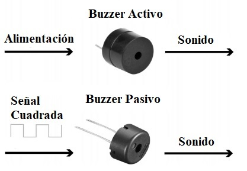  
*Figura 16 - Buzzer activo y pasivo*

Comercialmente, los *buzzer* se comercializan en un amplio abanico de tamaños y potencias, desde tonos casi imperceptibles hasta alarmas realmente estridentes. El consumo eléctrico, lógicamente, también varía con la potencia del *buzzer*, un dato que debemos tener en cuenta a la hora de comprar uno.

Además, debemos diferenciar entre *buzzer* y *módulo buzzer*. El *buzzer*, a secas, es el componente individual que tiene como función generar sonidos. Mientras que el *módulo buzzer* es una placa en la que encontramos el *buzzer* junto con los componentes externos adicionales necesarios para conectarlo a un microcontrolador.

Los buzzer tienen polaridad, es decir, tienen un terminal positivo y otro negativo. En la **Figura 17** se muestran dos modelos; el de la izquierda posee dos cables, donde el rojo es el positivo y el negro es el negativo. Por su parte, el modelo de la derecha, posee dos patas, donde el terminal positivo es más largo que el negativo. Además, suelen llevar una inscripción que indica cual es el terminal positivo.

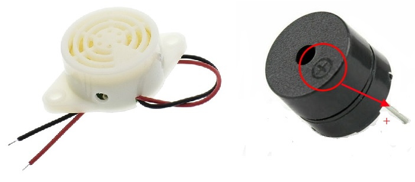  
*Figura 17 - Modelos de Buzzer*

Por su parte, los *módulos buzzer* suelen contar con un tercer pin que, dependiendo del modelo que tengamos, lo conectaremos o no, a nuestra **RPico W**. En la **Figura 18** se muestran el *KY-012* y el *MH-FMD* que son *módulos buzzer* muy comercializados actualmente.

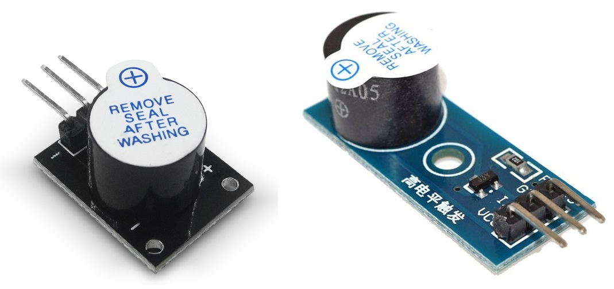  
*Figura 18 - Módulo Buzzer KY-012 y MH-FMD*

Ahora sí, vamos a realizar un ejemplo. Necesitaremos, además de la placa de pruebas con la **RPico W** conectada, un *buzzer* o *módulo buzzer* y cables Dupont M2F.

En términos de conexión y programación, un *buzzer activo* es igual a un *LED* (ya que ambos son dispositivos de salida que se activan y desactivan con una **señal digital binaria**). Repite el circuito que hiciste para el Ejemplo N°3, pero sustituye el *LED* por el *buzzer* y no uses la resistencia, ya que el *buzzer* necesitará más corriente para funcionar. 

Si empleamos un *buzzer* como el que se encuentra a la izquierda en la **Figura 17**, el cable rojo queda conectado al *GP15* y el cable negro a *GND*. Por su parte, si utilizamos un *buzzer* como el que se encuentra a la derecha en la **Figura 17**, el terminal positivo queda conectado al *GP15* y el terminal negativo a *GND*.

Si usamos un *módulo buzzer KY-012*, asegúrate de que la pata marcada con el símbolo menos (-) esté conectada al pin *GND*, y la marcada con "S" o "SIGNAL" esté conectada a *GP15*. Uno de los pines quedará sin conectar. Por su parte, si disponemos de un *módulo buzzer MH-FMD* si conectaremos los tres pines con los que cuenta, y lo haremos como se muestra en la **Figura 19**.

  
*Figura 19 - Conexión módulo buzzer MH-FMD a la RPico W*

El código completo debería quedar de la siguiente manera (Ver *Ejemplo6_BuzzerActivo.py* en el repositorio), donde solo hemos cambiado el nombre del objeto con respecto al Ejemplo N°3:

```python
from machine import Pin
from utime import sleep

buzzer = Pin(15, Pin.OUT)

while True:
    buzzer.toggle()
    sleep(5)
```
Ejecuta el programa y obtendrás una señal de alarma con una intermitencia de 5 segundos!

Con lo aprendido hasta el momento; ¿te animás a accionar el buzzer con el pulsador?

### 2.3.2 Utilización de un sensor: PIR HC-SR501. Proyecto de una alarma de movimiento.  

  
*Figura 20 - Proyecto de una alarma de movimiento*

Como tema final de esta clase, vamos a realizar un proyecto que utilice un sensor como dispositivo de entrada y que cuente con algunos de los componentes que vimos hasta el momento. El proyecto escogido es una alarma de movimiento y para ello utilizaremos un sensor infrarrojo pasivo (o *PIR*, por sus siglas en inglés, *Passive InfraRed*), que nos permite detectar la presencia o movimiento de un objeto y envía una señal determinada a nuestro microcontrolador. Hay cientos de sensores *PIR* disponibles, pero utilizaremos el *HC-SR501* que es económico, de buen rendimiento y funciona perfectamente con la **RPico W**.

Todos los seres vivos e incluso los objetos, emiten radiación electromagnética infrarroja, debido a la temperatura a la que se encuentran. A mayor temperatura, la radiación aumenta. Los sensores PIR detectan el calor corporal (energía infrarroja) en un rango de espacio determinado, buscando cambios de temperatura, y envían una señal eléctrica de aviso cuando esto ocurra. Su funcionamiento es similar al de una cámara, pero en lugar de capturar la luz visible, buscan el calor emitido por un cuerpo vivo como radiación infrarroja. Se le conoce como sensor infrarrojo pasivo, en lugar de activo, porque al igual que un sensor de cámara, no envía ninguna señal infrarroja propia.

Si tomas un sensor *HC-SR501* (**Figura 21**) muy probablemente te esté llamando la atención su forma. Ese encapsulado semiesférico que tiene se denomina *lente de Fresnel*, está hecho de polietileno y su objetivo es permitir el paso de la radiación infrarroja en el rango de los 8 y 14 micrones. La lente detecta radiación en un ángulo determinado y, adicionalmente, concentra la energía en la superficie de detección del sensor PIR, permitiendo una mayor sensibilidad del dispositivo. 

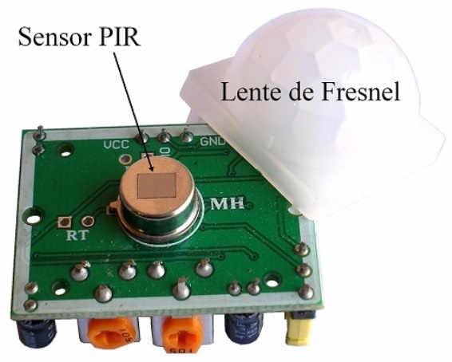  
*Figura 21 - Sensor PIR y Lente de Fresnel*

Por otro lado, si miramos la placa electrónica que tiene, podemos diferenciar las partes que se muestran en la **Figura 22**. El sensor utiliza dos potenciómetros (que se ajustan con la ayuda de un destornillador) y un jumper, que permiten modificar sus parámetros y adaptarlo a las necesidades de la aplicación.

  
*Figura 22 - Placa Electrónica HC-SR501*

Mediante los potenciómetros podemos ajustar tanto el tiempo de disparo de la señal de alarma de movimiento, como la distancia de detección. Los potenciómetros correspondientes deben girarse en la dirección mostrada en la **Figura 23** para realizar los ajustes.

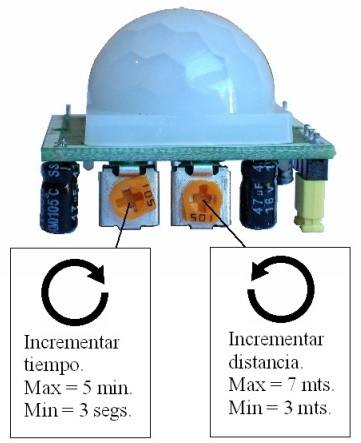  
*Figura 23 - Ajustes del HC-SR501*

El rango de detección de movimiento de los PIR es generalmente con alcances de hasta 7 metros, y con aperturas de 90° a 110°, como se muestra en la **Figura 24**.

  
*Figura 24 - Rango de detección del HC-SR501*

De acuerdo a la posición del jumper, tenemos dos modos de operación:

1. Un solo disparo: en este modo, cuando ocurre una detección de movimiento (el cual llamaremos "evento"), la salida del sensor se activa durante el tiempo que se haya ajustado a través del potenciómetro correspondiente. Por ejemplo, supongamos que el tiempo de activación es de 60 segundos. Si durante esos 60 segundos ocurre un segundo evento, éste no será considerado.

2. Disparos repetitivos: en este modo, cada evento detectado genera un nuevo tiempo de activación. Volviendo al ejemplo de tiempo de 60 segundos. Cuando ocurre el primer evento, la salida se activa. Si transcurridos 30 segundos ocurre un segundo evento, entonces se sumarán 60 segundos al tiempo transcurrido, dando un total de 90 segundos continuos con la salida activa. Y así, cada evento adicional, sumará un tiempo de 60 segundos de activación al tiempo ya transcurrido.

En cualquiera de los casos, si la salida regresa a su estado inactivo, habrá un lapso de 3 segundos durante los cuales los nuevos eventos no serán considerados. Pasados esos 3 segundos, el dispositivo regresa a su funcionamiento normal.

Concluidos los detalles acerca de nuestro sensor, vamos a realizar un proyecto. Para ello, recopilaremos algunas de las conexiones que hemos realizado anteriormente e incorporaremos el *HC-SR501*. Comienza por conectar el *LED* (con su correspondiente resistencia) al *GP15* y el *buzzer* o *módulo buzzer* al *GP14* , utilizando cables Dupont para todas las conexiones.

Luego toma tu *HC-SR501*, y localiza los tres pines macho que tiene, que son los que utilizaremos para la vinculación con la **RPico W**. Sin embargo, no podemos empujarlos directamente sobre la protoboard debido a su tamaño. En lugar de ello, tomaremos tres cables Dupont Macho-Hembra (M2F) e insertaremos los extremos hembra en los pines de tu *HC-SR501*. 

A continuación, tomaremos los extremos macho y los conectaremos a la **RPico W** a través de la placa de pruebas. Tomando como referencia la denominación de la **Figura 22** y considerado que el sensor se utilizará de forma vertical, los pines quedan dispuestos de modo que el pin de tierra está en la parte inferior (cable negro), el pin de señal o disparador está en el medio (cable azul) y el pin de alimentación está en la parte superior (cable rojo).

Comencemos con el cable de tierra, que debe conectarse a cualquiera de los pines *GND* de la **RPico W**, como por ejemplo el pin N°38. También podemos utilizar la línea *-* de la protoboard, ya que se encuentra eléctricamente conectado al pin *GND* correspondiente al pin N°23. A continuación, conectemos el cable de señal a algún pin *GPIO* que no esté en uso por otro componente (tomaremos como ejemplo el pin *GP28*). 

Finalmente, debemos conectar el cable de alimentación. Sin embargo, no lo conectes al pin *3V3* de la **RPico W**: el *HC-SR501* es un sensor de 5[V], lo que significa que necesita 5[volts] de electricidad para funcionar. Si conectamos el sensor al pin *3V3* de la **RPico W** no funcionará ya que el pin no le proporciona la suficiente energía. 

¿Y entonces cómo hacemos? Para darle al sensor los 5[volts] que necesita, vamos a conectar este cable al pin superior derecho de la **RPico W**, identificado como *VBUS*. Este pin está conectado al puerto micro-USB de la **RPico W** y aprovecha la línea de alimentación USB de 5[volts] antes de que se convierta a 3,3[volts] para alimentar el *RP2040* de la **RPico W**. El circuito completo debería quedar como el que se muestra en la **Figura 25**.

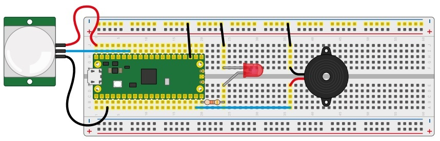  
*Figura 25 - Circuito Ejemplo N°7*

Para este primer proyecto, y con la ayuda de un destornillador, colocaremos el potenciómetro correspondiente a "Incrementar tiempo" completamente a la izquierda (como se encuentra en la **Figura 23**); y el potenciómetro "Incrementar distancia" completamente a la derecha. Por otro lado, dejaremos el jumper en posición de "un solo disparo". Luego, cuando nos familiaricemos con la utilización del sensor, podremos ir regulando y ajustando todo de acuerdo a nuestros requerimientos.

Y ahora a programar. Comenzamos como siempre, cargando las librerías:

```python
from machine import Pin
from utime import sleep
```

Luego definiremos la función que cumplirá cada pin de la siguiente manera:

```python
sensor_pir = Pin(28, Pin.IN, Pin.PULL_DOWN)
led = Pin(15, Pin.OUT)
buzzer = Pin(14, Pin.OUT)
```

El sensor es un dispositivo de entrada, por lo que no debemos olvidarnos de añadir *Pin.PULL_DOWN* cuando estemos definiendo el pin correspondiente. Su programación es muy sencilla, y trabaja de forma similar a un pulsador; cuando detecte la presencia de un objeto, enviará un *1* al pin *GP28* de la **RPico W** (similar a accionar el pulsador NA del Ejemplo N°4). Cuando esto ocurra, accionaremos el *buzzer* y el *LED*. Además, para leer el sensor de forma continua, debemos agregar un bucle al programa como en los ejemplos anteriores.

El código completo queda de la siguiente manera (Ver *Ejemplo7_SensorPir.py* en el repositorio):

```python
from machine import Pin
from utime import sleep

sensor_pir = Pin(28, Pin.IN, Pin.PULL_DOWN)
led = Pin(15, Pin.OUT)
buzzer = Pin(14, Pin.OUT)

while True:
    if sensor_pir.value() == 1:
            print("Movimiento detectado")
            led.toggle()
            buzzer.toggle()
            sleep(3)
    else:   
            led.value(0)
            buzzer.value(0)
```

Ejecuta el programa y habrás creado tu primera alarma, ¡felicitaciones!

Las variaciones que se le pueden hacer a este proyecto son muchas, por ejemplo: que el *buzzer* y *LED* actúen de forma intermitente cuando se detecta un movimiento, que el *LED* este parpadeando todo el tiempo a modo de señal de funcionamiento y solamente el *buzzer* se accione cuando se lo requiera, etc. 

¿Ustedes cuales propondrían?