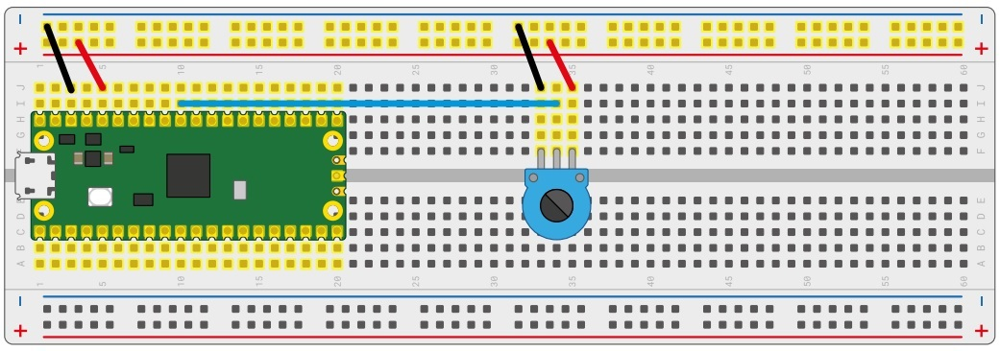

# Clase N°3: Entradas y Salidas analógicas. Convertidor Analógico a Digital (ADC) y Modulación por Ancho de Pulso (PWM)

  
*Figura 01 - Presentación Clase N°3*

En la clase anterior, hemos usado las **entradas digitales** de nuestra **RPico W**. Es decir, aquellas entradas que solo admiten dos estados; *encendido* o *apagado*, *uno* o *cero*, *3,3[V]* o *0[V] (tierra)*. Cuando accionábamos el pulsador NA, el pin *GP* de nuestra **RPico W** que se encuentra conectado al pulsador, cambia de *bajo* (*apagado*); a *alto* (*encendido*). Lo mismo ocurre en el ejemplo del *sensor PIR* que vimos; cuando detecta movimiento, envía una señal de *alto* a nuestra placa a través del pin *GP* correspondiente.

Pero también hemos utilizado los pines *GP* como salidas, precisamente, como **salidas digitales**, ya que los dispositivos que conectábamos solo admitían dos estados para su funcionamiento. En el caso del *LED*, este podía estar *encendido* (iluminándose con su color correspondiente), o *apagado* (permaneciendo a oscuras). Si volvemos al ejemplo del *buzzer*, notaremos lo mismo; este podía estar emitiendo sonido o permanecer en silencio.

En resumen, todas las señales que hemos manejado hasta ahora, tanto de entrada como de salida, han sido **digitales**. Es decir, señales que solo pueden tomar dos valores, normalmente denotados como *1* o *HIGH*, y *0* o *LOW* (**Figura 02**). Y como vimos, podemos manejarlas con todos los pines **GP** de la **RPico W**. 

  
*Figura 02 - Ejemplo de Señal Digital*

Sin embargo, existen muchos otros elementos que pueden tomar *cualquier valor* dentro de unos límites, y no únicamente dos, como ocurre con las **señales digitales**. Si lo que queremos es, por ejemplo, leer la temperatura de un objeto determinado, controlar la intensidad del brillo de un *LED* o la velocidad de giro de un motor, necesitaremos de las **señales analógicas**. Es decir, señales que pueden tomar un rango infinito de valores en un determinado periodo de tiempo (**Figura 03**). 

  
*Figura 03 - Ejemplo de Señal Analógica*

La mayoría de las señales que representan una magnitud física (temperatura, luminosidad, humedad, etc.) son **señales analógicas**, y el microcontrolador *RP2040* de la **RPico W** es un *circuito digital* (como todos los microcontroladores convencionales que conocemos), entonces, ¿cómo hacemos para manipular este tipo de señales? Para resolver esto, emplearemos lo que se conoce como **Convertidor Analógico a Digital** (*ADC*, por sus siglas en inglés, *Analogic-to-Digital Converter*), un dispositivo que se encuentra integrado a nuestra **RPico W** que le permite trabajar con este tipo de señales de forma óptima.

¡Empecemos a conocerlo! 

## 3.1 El Convertidor Analógico a Digital (ADC)

Como indica su nombre, un **Convertidor Analógico a Digital** toma una **señal analógica** y la transforma en una **señal digital** de n-bits (**Figura 04**). Está integrado dentro del propio *RP2040*, por lo que no es necesario usar un **ADC** externo conectado a una o más de sus entradas digitales.

  
*Figura 04 - Ilustración ADC*

El proceso de conversión analógico a digital se divide en tres etapas fundamentales: muestreo, cuantización y codificación (**Figura 05**).

  
*Figura 05 - Proceso de Conversión de un ADC*

En la etapa de muestreo, la señal analógica se captura a intervalos regulares de tiempo para garantizar la adquisición adecuada de puntos representativos. Luego, en la etapa de cuantización, se asigna un valor digital a cada muestra analógica obtenida durante el muestreo, utilizando una *resolución* determinada por la configuración del **ADC**. Finalmente, en la etapa de codificación, los valores digitales se convierten en palabras binarias que representan la señal digitalizada (**Figura 06**).

  
*Figura 06 - Ejemplo de un Proceso de Conversión de un ADC*

Los dos parámetros más importantes de un **ADC** son la *resolución* y sus *canales*, es decir, cuántas señales analógicas puede aceptar y convertir simultáneamente.

La *resolución* en un **ADC** nos permite determinar el número de niveles en los que se puede dividir un rango de entrada analógico. Cuanto mayor sea la *resolución*, mayor será la precisión con la que se puede representar la señal analógica en forma digital.

La *resolución* de un **ADC** de n-bits se calcula utilizando la siguiente ecuación:

$resolución = \frac{Vref}{(2^n)-1}$

Donde *Vref* es el *voltaje de referencia*, que por defecto coincide con el voltaje de alimentación de la placa (3,3[Volts] en nuestro caso), y *n* es el número de bits del **ADC**. Cuando la entrada del **ADC** alcanza el valor de *Vref*, todas las salidas binarias del conversor se establecen en "1".

Tomemos como ejemplo un **ADC** de 4 bits como el de la **Figura 04**, con un voltaje de referencia de 15[Voltios]. Su resolución será: 

$resolución = \frac{15[Voltios]}{2^{4}-1} = 1[Voltio]$

Esto significa que un cambio de 1[Voltio] en la entrada será representado por un cambio de 1 bit en la salida; y que variaciones por debajo de 1[Voltio] no serán detectadas por el **ADC**. Esto se puede apreciar en la **Figura 07**.

  
*Figura 07 - Entrada y Salida de un ADC de 4 bits*

Para la **RPico W**, que cuenta con un **ADC** de 12 bits y un voltaje de alimentación de 3,3[Voltios], la resolución será:

$resolución = \frac{3,3[Voltios]}{2^{12}-1} ≈ 0,000805[Voltios] ≈ 805[\mu V]$

Lo que significa que podremos medir variaciones de 805[μV] en la **señal analógica** de entrada. Variaciones por debajo de este voltaje no serán detectadas.

Además, en el caso de la **RPico W**, el valor de 0[Voltios] analógico es expresado en digital como un binario de 12 dígitos de la forma 000000000000 (0 en decimal); y el valor de 3,3[Voltios] analógico es expresado en digital como un binario de 12 dígitos de la forma 111111111111 (4095 en decimal). Por lo tanto, todo valor analógico intermedio es expresado con un valor entre 0 y 4095, es decir, se suma un *1* en binario cada 805[μV] que tengamos en la **señal analógica** de entrada.

Aunque el **ADC** de nuestra **RPico W** tiene una resolución de 12 bits, en **MicroPython** los datos se manejan internamente como números de 16 bits (2 bytes). Esto implica que, aunque la **señal analógica** se convierte en una **señal digital** con valores de 12 bits, al ser procesada por **MicroPython** se almacena y se manipula como un dato entero de 16 bits que varía de 0 a 65535.

Pero, ¿de dónde proviene este rango de números enteros? La respuesta se relaciona con lo expresado anteriormente. 

La **RPico W** trabaja empleando el **sistema numérico binario**, donde los únicos valores posibles para un dígito son *0* o *1*. Un número binario de *16 bits* se compone de 16 dígitos y el valor máximo posible es entonces 1111111111111111. Si convertimos este número binario a números decimales, obtendremos 65535, y como nuestro conteo incluye el *0*, los valores posibles van del *0* al *65535*, contabilizando un total de 65536 valores posibles que podemos representar. En la **Figura 08** se muestra la equivalencia entre número de bits, y la cantidad de valores posibles que podemos representar con ellos.

  
*Figura 08 - Equivalencia Bits - Cantidad de Valores*

Por otro lado, el *RP2040* posee cinco canales **ADC**; cuatro de ellos están vinculados a pines *GPIO* del chip: *GP26*, *GP27*, *GP28* y *GP29*, y el quinto canal (*ADC4*) se encuentra conectado a un sensor de temperatura integrado en el *RP2040*, que utilizaremos más adelante en la clase.

Sin embargo, en el pinout de la **RPico W** veremos que solo tres canales son accesibles para conexiones externas, los cuales están identificados como *ADC0*, *ADC1* y *ADC2*. A nivel hardware, se implementan utilizando los pines *GP26*, *GP27* y *GP28*, que ofrecen una funcionalidad secundaria como entradas de los **ADC**, por lo que se conocen como *GP26_ADC0*, *GP27_ADC1* y *GP28_ADC2* para los canales analógicos *0*, *1* y *2* respectivamente.

Esto se debe a que el *GP29* del *RP2040* está vinculado internamente con el pin *VBUS* y se utiliza para detectar la fuente de alimentación. En la Clase N°5, nos detendremos en este pin y veremos el rol que cumple al momento de dotar de alimentación externa a nuestra **RPico W**.

  
*Figura 09 - Canales ADC del RP2040*

## 3.2 El potenciómetro

Para comenzar a utilizar los canales **ADC** necesitamos una **señal analógica**, y podemos crear una muy fácilmente empleando un **potenciómetro**. Existen varios tipos de ellos: algunos como los del sensor *PIR HC-SR501* que vimos en la clase anterior, diseñados para ajustarse con un destornillador; otros, a menudo utilizados para controles de volumen y luz, con perillas o controles deslizantes. El tipo más común tiene una pequeña perilla, que sale de la parte superior o frontal: este se conoce como **potenciómetro rotatorio** o **potenciómetro giratorio**. En la **Figura 10** se muestran algunos modelos de **potenciómetros**. 

  
*Figura 10 - Tipos de Potenciómetros*

Como mencionamos en la *Clase N°1*, es un dispositivo de *entrada* que puede trabajar de dos formas distintas dependiendo de cómo conectemos las tres patas que posee. Con dos de sus tres patas conectadas, actúa como una *resistencia variable*, un tipo de resistencia que se puede ajustar en cualquier momento girando la perilla que posee. Y, por otro lado, con las tres patas correctamente cableadas, se convierte en un *divisor de voltaje* y emite desde 0[Voltios] hasta la entrada de voltaje completo que tengamos conectado, según la posición de la perilla.

### 3.2.1 Utilización como resistencia variable

Realicemos nuestro primer ejemplo de la clase. Toma tu **potenciómetro** y verás que tiene tres patas que encajan en la placa de prueba, por lo que comienza insertándolas en ella, teniendo cuidado de no doblarlas. Luego conecta la pata del medio al pin *GP26_ADC0* de la **RPico W** usando un cable Dupont M2M, como se muestra en la **Figura 11**. Por último, toma dos cables Dupont M2M más, y conecta una de las patas externas del potenciómetro, no importa cuál, al riel de alimentación *+* de tu placa de pruebas, y luego conecta el riel de alimentación *+* al pin *3V3* de tu **RPico W**.

  
*Figura 11 - Potenciómetro como resistencia variable*

Y ahora a programar. Comencemos por conectar la **RPico W** a nuestra computadora, ejecutar **Thonny** y hacer clic en el área de Script para cargar las librerías habituales, incorporando ahora la función *ADC*:

```python
from machine import Pin, ADC
from utime import sleep
```

Al igual que los pines de entrada/salida digital de propósito general (*GPIO*), los pines de entrada analógica se manejan por la biblioteca *machine*, y al igual que los pines digitales, deben configurarse antes de poder usarlos:

```python
potenciometro = ADC(26)
```

Esta definición siempre debe corresponderse con el pin que escogimos como entrada analógica cuando hicimos las conexiones en nuestra placa de pruebas, en este caso el *GP26_ADC0*. Lo mismo podríamos haber hecho con los pines *GP27_ADC1* y *GP28_ADC2*.

Para leer el potenciómetro de forma continua, debemos agregar un bucle al programa, quedando de la siguiente manera:

```python
from machine import Pin, ADC
from utime import sleep

potenciometro = ADC(26)

while True:
    print(potenciometro.read_u16())
    sleep(5)
```

En este ciclo, leemos el valor del pin y lo imprimimos en la consola (todo en una sola línea en este caso). Aquí también debemos agregar un *sleep* de una determinada cantidad de segundos (en este caso 5 segundos).

Leer una **entrada analógica** es casi idéntico a leer una **entrada digital**, excepto por una cosa: al leer una **entrada analógica** usamos *read()* (y no *value()*). Pero esta **entrada analógica** se lee con *read_u16()*. Esa última parte, *u16*, le indica el tipo de dato que recibirá. En este caso, un número entero sin signo entre 0 y 65535.

Guardamos el código, ejecutamos, y prestaremos atención al valor que aparece en el área de Shell. 

Observaremos que el programa imprime un número un elevado, siempre por encima de 60000. Intenta girar el potenciómetro completamente en una dirección; según la dirección en la que giraste la perilla y la pata exterior que utilizaste en su circuito, el número aumentará o disminuirá. Gíralo al revés: el valor cambiará en la dirección opuesta.

Sin embargo, no importa en qué dirección lo gires, nunca se acercará a 0. Eso se debe a que, con solo dos patas conectadas, el potenciómetro actúa como una *resistencia variable* o *varistor*, es decir, una resistencia con un valor que puede cambiar; en el caso de un potenciómetro de 10[kOhmios], entre 0[Ohmios]y 10000[Ohmios]. 

Cuanto mayor sea la resistencia, menos voltaje del pin *3V3* llega a la entrada analógica correspondiente (*GP26_ADC0* en este caso), por lo que el número disminuye. Cuanto menor sea la resistencia, más voltaje llega a su entrada analógica, por lo que el número aumenta.

### 3.2.2 Partes

Un potenciómetro funciona con una tira conductora en el interior, conectada a los dos pines laterales, y un cursor conectado al pin del medio (**Figura 12**). A medida que gira la perilla, el cursor se acerca a un extremo de la tira y se aleja del otro. Cuanto más se aleje el cursor del extremo de la tira que conectó al pin *3V3* de la **RPico W**, mayor será la resistencia; cuanto más se acerque, menor es la resistencia.

  
*Figura 12 - Partes de un potenciómetro*

### 3.2.3 Utilización como divisor de voltaje: Lectura directa

Los potenciómetros son componentes extremadamente útiles, pero tienen un inconveniente: notarás que no importa cuánto gires la perilla en cualquier dirección, nunca podrás obtener un valor de *0*, o cualquier valor cercano a él. Esto se debe a que una resistencia de 10[kOhmios] no es lo suficientemente fuerte como para reducir la salida del pin *3V3* a 0[Voltios]. Podríamos buscar un potenciómetro más grande con una resistencia máxima más alta, o simplemente podríamos conectar el potenciómetro existente como un **divisor de voltaje**.

¿Cómo utilizamos el potenciómetro como **divisor de voltaje**? Empleando el pin que quedó sin conexión en el circuito de la **Figura 11**. 

Tomamos dos cables Dupont M2M; con el primero de ellos conectamos el pin libre del potenciometro a la línea de energización *-* , y con el segundo cerramos el circuito conectando este bus a un pin *GND* de la **RPico W** (por ejemplo, el pin físico N°38). El circuito completo quedaría como se muestra en la **Figura 13**. 

  
*Figura 13 - Potenciómetro como divisor de voltaje*

El código que ejecutaremos es el mismo que realizamos anteriormente (ver *Ejemplo7_LecturaPotenciometro.py* en el repositorio), ¿pero qué notaremos ahora? Gira la perrilla del potenciómetro nuevamente, completamente en una dirección y luego completamente en la otra. Observa los valores que se imprimen en el área de Shell: a diferencia de antes, ahora van de casi 0 a casi un total de 65535, ¿por qué?

Agregar la conexión a tierra al otro extremo de la tira conductora del potenciómetro ha creado un **divisor de voltaje**: mientras que antes el potenciómetro simplemente actuaba como una resistencia entre el pin *3V3* y el pin de entrada analógica (en este caso el *GP26_ADC0*), ahora **divide** el voltaje entre la salida de 3,3[Voltios] por el pin *3V3* y el 0[Voltios] del pin *GND*. Gira la perilla completamente en una dirección, obtendrás el 100% de los 3,3[Voltios]; gíralo completamente hacia el otro lado, obtendrás el 0% (0 [Voltios]).

Es probablemente que en área de Shell no leas exactamente los valores 0 y 65353 cuando gires por completo la perilla del potenciómetro hacia los extremos. Esto no significa que hayas realizado mal el circuito, lo que sucede es que los componentes electrónicos están construidos con una *tolerancia*.

### 3.2.4 Tolerancia y curva de variación 

La *tolerancia* de una resistencia eléctrica nos indica, en porcentaje, cuanto puede variar el valor declarado en ella por el fabricante. Esto aplica para resistencias variables como el potenciómetro, como así también para resistencias de valor fijo como las que usamos para los *LEDs*. Valores típicos de *tolerancia* son 5%, 10% y 20%. En nuestro caso, el potenciómetro utilizado posee una tolerancia del 20%, por lo que es muy probable que la **entrada analógica** de nuestra **RPico W** no lea exactamente el 0% o el 100% de los 3,3[Voltios], pero se acercará bastante.

Algo importante respecto a los potenciómetros es su *curva de variación*, la cual define como aumenta (y disminuye) la resistencia al girar la perilla. Según esta curva, los potenciómetros se clasifican en *lineales* (identificados con la letra B) y *logarítmicos* (identificados con la letra A) como se aprecia en la **Figura 14**.

  
*Figura 14 - Potenciómetro Lineal y Logarítmico*

Los lineales varían su resistencia de forma lineal mientras giramos la perilla; así que cuando se encuentre a la mitad del recorrido total, la resistencia efectiva será la mitad de la nominal del potenciómetro. Por el contrario, los logarítmicos varían según una curva logarítmica, y cuando la perilla esté a la mitad del recorrido, la resistencia efectiva es casi la nominal del potenciómetro (**Figura 15**).

  
*Figura 15 - Curvas de variación de los potenciómetros*

La elección entre uno y otro dependerá del proyecto que estemos realizando. Por ejemplo, en fuentes de voltaje variable emplearemos los potenciómetros lineales, ya que buscamos una regulación que se corresponda con el movimiento que le imprimamos a la perilla. Por otro lado, debido a que el oído humano percibe las variaciones de volumen con una curva muy similar a la logarítmica, es común utilizar este tipo de potenciómetros para ajustar el volumen de nuestros aparatos domésticos.

### 3.2.5 Utilización como divisor de voltaje: Lectura con factor de conversión

Con respecto al último código que hicimos, hay una modificación interesante que podemos plantear. El número que se ve impreso en el Shell es una representación decimal de la salida del **ADC** como ya lo explicamos anteriormente, pero no es la forma más "amigable" de verlo. Es más interesante si lo expresamos en términos de voltaje, desde 0[Voltios] a 3,3[Voltios]. ¿Y cómo podemos hacer esto?, con algo que ya hemos visto: ¡utilizando la ecuación de la *resolución*! 

Regresa a tu código y agrega la siguiente línea antes del bucle *while*:

```python
factor_conversion = 3.3 / (65535)
```

Esto establece una forma matemática de convertir el número que arroja el **ADC** en una aproximación precisa del voltaje real que representa. El código completo debería quedarte así (ver *Ejemplo8_LecturaPotenciometroConversion.py* en el repositorio): 

```python
from machine import Pin, ADC
from utime import sleep

potenciometro = ADC(26)

factor_conversion = 3.3 / (65535)

while True:
    voltaje = potenciometro.read_u16()*factor_conversion
    print(voltaje)
    sleep(5)
```

Ejecuta el código y gira el potenciómetro completamente en una dirección y luego en la otra. 
Observa los números que se imprimen en el área de Shell: verás que cuando el potenciómetro está completamente en una dirección, los números se acercan a 0; y cuando está en la dirección contraria, se acercan mucho a 3,3. 

Estos números representan el voltaje real que lee el pin, y a medida que giras la perilla del potenciómetro, estás dividiendo el voltaje suavemente entre el mínimo y el máximo, de 0[Voltios] a 3,3[Voltios]. 

¡Felicitaciones! Ahora sabes cómo cablear un potenciómetro como *resistencia variable* y como *divisor de voltaje*. Además, has aprendido a leer entradas analógicas de forma directa y a interpretarlas como voltaje de entrada.

Si te fijas, has simulado una **señal analógica** muy similar a la mostrada en la **Figura 03**, solo que sin el semiciclo negativo que va de 0[Voltios] a -3,3[Voltios], ¿podrías indicar por qué?

## 3.3 Medición de la temperatura del RP2040

Como mencionamos anteriormente, el *RP2040* de la **RPico W** incluye un sensor de temperatura interno que se lee a través del quinto canal *ADC* del microcontrolador.  Y al igual que con el potenciómetro utilizado como divisor de voltaje, la salida de este sensor es un voltaje variable (es decir, una señal analógica): a medida que cambia la temperatura, también lo hace el voltaje. A continuación, realizaremos un ejemplo para demostrar su funcionamiento.

No necesitamos realizar ninguna conexión externa, por lo que pasaremos directamente al código. Como siempre, arrancamos por conectar la **RPico W**, ejecutar **Thonny** y hacer clic en el área de Script para cargar las librerías habituales, incorporando ahora también la función *ADC*:

```python
from machine import Pin, ADC
from utime import sleep
```

Al igual que antes, debemos configurar el **ADC**. Pero esta vez, al tratarse de un sensor que se encuentra integrado en el chip y que no utiliza un pin *GPIO* para su implementación, en vez indicar un número de pin *GPIO*, debemos indicar el número de canal conectado al sensor de temperatura, en este caso el *4*. Por lo que la definición correcta queda de la siguiente manera:

```python
sensor_temp = ADC(4)
```

Nuevamente, necesitaremos el factor de conversión para cambiar el valor que nos devuelve el **ADC** (un binario de 16 bits) a un valor de voltaje, que oscila entre 0[V] y 3.3[V]. Por lo tanto, agregaremos:

```python
factor_conversion = 3.3 / (65535)
```

Luego configuramos un bucle para tomar lecturas de la entrada analógica, aplicarles el factor de conversión y almacenarlas en un variable:

```python
while True:
    lectura = sensor_temp.read_u16() * factor_conversion
```
Sin embargo, en lugar de imprimir la lectura directamente, debemos realizar una segunda conversión: tomar este voltaje y convertirlo a *Grados Celsius*. 

Recordemos que un sensor es un dispositivo capaz de detectar magnitudes físicas (temperatura en este caso) y convertirla en una magnitud eléctrica (tensión en este caso). Por lo tanto, todos los sensores que utilicemos nos deben proporcionar una ecuación que relacione la magnitud que está midiendo, con el voltaje que entregará a su salida. Es decir, una ecuación que establezca una **proporcionalidad** entre ambas magnitudes, lo que nos permite interpretar de manera precisa los datos suministrados por el sensor.

Por ejemplo, un sensor de temperatura muy conocido en la electrónica es el **LM35**. En su hoja de datos o datasheet [LM35 Datasheet](https://www.ti.com/lit/ds/symlink/lm35.pdf), puntualmente en la hoja 13, encontraremos la *función de transferencia* que se muestra en la **Figura 16**.

  
*Figura 16 - Función de transferencia LM35*

Esto significa que su salida es una **señal analógica de voltaje** (VOUT), y esta es directamente proporcional la temperatura que detecte (T). Puntualmente, mirando la función, vemos que el **LM35** proporciona 10[miliVoltios] por cada *Grado Celsius* que detecte (10 mV/°C).

A partir de esta información podemos obtener una expresión que nos relacione la temperatura medida (T) con el voltaje que nos facilita el **LM35** (VOUT), simplemente despejando *T* en la ecuación anterior:

$T = \frac{Vout}{10[mV/°C]} $

Para la **RPico W**, tenemos esta ecuación en la página 566 del [Datasheet del RP2040](https://datasheets.raspberrypi.com/rp2040/rp2040-datasheet.pdf) y se muestra en la **Figura 17**:

  
*Figura 17 - Función de transferencia del sensor de temperatura del RP2040*

Esta función relaciona la temperatura medida con el dato que nos devuelve el *ADC4* ya convertido a valores de voltaje con el *factor de conversión* que implementamos (por ello la indicación *ADC_voltage* en la fórmula). Llevando esto al código, debemos escribir: 

```python
temperatura = 27 - (lectura - 0.706)/0.001721
```

El código completo, imprimiendo en consola la temperatura, debería quedar de la siguiente manera (ver *Ejemplo9_LecturaTemperaturaRP2040.py* en el repositorio):

```python
from machine import Pin, ADC
from utime import sleep

sensor_temp = ADC(4)

factor_conversion = 3.3 / (65535)

while True:
    lectura = sensor_temp.read_u16() * factor_conversion
    temperatura = 27 - (lectura - 0.706)/0.001721
    print(temperatura)
    sleep(3)
```

Ejecuta el código y presta atención al área de Shell. Verás números impresos que representan la temperatura reportada por el sensor en *Grados Celsius*. 

¡Excelente trabajo! Has logrado con éxito monitorear la temperatura de tu **RPico W**.

## 3.4 Modulación por ancho de pulso (PWM): Conceptos básicos y ciclo de trabajo (duty cicle)

Como mencionamos anteriormente, la **RPico W** no puede trabajar directamente con **señales analógicas**; es necesario convertirlas en **señales digitales** utilizando alguno de los *ADC* que posee. Del mismo modo, la **RPico W** no puede generar directamente **señales analógicas** para controlar un *circuito analógico*; primero debe convertir su **señal digital** en una **señal analógica** utilizando algún método.

Si deseamos ir por el *"camino inverso"* y hacer que un microcontrolador digital cree una **salida analógica**, normalmente necesitaríamos un **Convertidor Digital a Analógico** (*DAC*, por sus siglas en inglés, *Digital-to-Analogic Converter*). Sin embargo, la **RPico W** no cuenta con un **DAC** incorporado en su circuitería que le permita llevar a cabo este proceso, ¿entonces cómo hacemos?

Existe una manera de "falsificar" una **señal analógica**, empleando lo que se conoce como **Modulación por Ancho de Pulso** (*PWM*, por sus siglas en inglés, *Pulse Width Modulation*). Entonces, cuando la **RPico W** necesita emitir una **señal analógica**, emplea otro método para controlar un circuito analógico: **PWM**.

La **salida digital** de un microcontrolador solo puede estar *encendida* o *apagada*, *0* o *1*. Encender y apagar una **salida digital** se conoce como *pulso*, y al alterar la rapidez con que el pin se enciende y apaga, se puede cambiar o *modular* el *ancho* de estos *pulsos*, por ello el nombre de **Modulación por Ancho de Pulso**.

Cuando hablamos de "pulso" nos referimos a la **señal de pulso**, que es una **señal digital** enviada en patrones periódicos continuos de encendido y apagado por el microcontrolador. Debido a que la señal enviada solo tiene dos estados, *encendido* y *apagado*, la señal cambia solo entre *nivel alto* y *nivel bajo*. 

La señal **PWM** se define principalmente por tres componentes: *ciclo*, *ciclo de trabajo* y *frecuencia*. Como se muestra en la **Figura 18**, el *ciclo (T)* es el tiempo total para que una señal de pulso pase por un *estado de nivel alto (T1)* y un *estado de nivel bajo (T2)*, es decir, *ciclo (T) = T1 + T2*. 

  
*Figura 18 - Señal PWM*

El *ciclo de trabajo* o *Duty Cicle* (D), representa la relación entre el tiempo en que la señal está en un nivel alto (T1) y el ciclo completo de la señal (T). Es una relación porcentual y se puede calcular como: 

$\text{Ciclo de Trabajo (D)}  = \frac{T1}{T} .100 \% $

Por ejemplo, un *Duty Cycle* de 10% indica que la señal permanece en un estado alto (T1) el 10% de su ciclo completo (T). En la **Figura 19** se muestran más ejemplos de este concepto.

  
*Figura 19 - Ejemplos de Duty Cicle*

Por su parte, la *frecuencia* representa el número de ciclos por segundo, su unidad es el *Hertzio* - *[Hz]* y se calcula de la siguiente manera:

$\text{f}  = \frac{1}{T}$

Por ejemplo, una frecuencia de 1000[Hz] significa 1000 ciclos por segundo. Cuanto más corto es el ciclo, mayor es la frecuencia.

El objetivo de una señal **PWM** es cambiar el *ciclo de trabajo* como se observa en los ejemplos de la **Figura 19**, sin cambiar otros parámetros de la señal de pulso, como la frecuencia y los valores picos de tensión (que son 3,3[V] y 0[V] en todo momento), con el fin de simular una **señal analógica** de voltaje constante a partir de una **señal digital**.

Como se puede apreciar en la **Figura 19**, el *ciclo de trabajo* tiene la función de controlar el *voltaje promedio* de la señal, el cual se determina mediante la siguiente expresión:

$\text{Vprom}  = (V_{H}-V_{L}).\frac{D}{100} $

Donde:

. $V_{H}$ es el voltaje en estado *ALTO* o *1*.  
. $V_{L}$ es el voltaje en estado *BAJO* o *0*.  

Dado que en las **RPico W** el voltaje en estado *BAJO* es de 0[Voltios] y el voltaje en estado *ALTO* es de 3,3[Voltios], la expresión se simplifica de la siguiente manera:

$\text{Vprom}  = 3,3[V].\frac{D}{100} $

## 3.5 Control automático del brillo de un LED con PWM 

Para comprender los últimos conceptos y ver su aplicación, tomemos como ejemplo un *LED*. En las conexiones de la clase pasada, cuando utilizábamos los pines *GP* como **salidas digitales**, solo podíamos cambiar el valor de la misma entre *1* y *0*, es decir, *encender* o *apagar* el *LED*.

No podíamos controlar el brillo del *LED*, y mucho menos realizar cualquier otro efecto. Para lograr esto, necesitamos usar **señales analógicas** para la salida, y aquí es cuando **PWM** toma un papel crucial.

Cuando aplicamos una señal **PWM** al *LED*, lo que realmente está recibiendo es una **señal digital** que varía constantemente entre un *nivel alto* y un *nivel bajo*. Esta **señal digital** hace que el *LED* se encienda y apague constantemente. Si la frecuencia de esta alternancia es lo suficientemente rápida, es decir, cuando la frecuencia de la señal **PWM** es lo suficientemente alta, el destello de luz resultante no será percibido por el ojo humano.

Ahora, si cambiamos la relación entre el tiempo durante el cual el *LED* permanece encendido y el tiempo durante el cual está apagado (sin cambiar la frecuencia), nuestra señal **PWM** nos permitirá ajustar el brillo del LED. En otras palabras, necesitamos ajustar el *ciclo de trabajo* de nuestra señal **PWM** para modificar el brillo del *LED*.

Incorporemos un ejemplo numérico como el que muestra en la **Figura 20**. Si el *LED* se enciende durante 0,5[ms] (T1) y se apaga durante 0,5[ms] (T2), no notarás que la luz parpadea porque la frecuencia es demasiado rápida. En cambio, observarás que el brillo del *LED* se reducido a la mitad de su estado "siempre encendido". Por otro lado, cuando la luz se enciende en 0,1[ms] y se apaga en 0,9[ms], la luz percibida por tus ojos será solo una décima parte de su brillo original, y tampoco notarás el parpadeo. 

  
*Figura 20 - Ejemplo de control de brillo de un LED*

En ambos ejemplos, no hemos modificado el *ciclo* (y por ende tampoco la frecuencia) de la señal **PWM**, solo hemos trabajado sobre su **ciclo de trabajo**:

$\text{f}  = \frac{1}{T} =  \frac{1}{T1+T2} =  \frac{1}{0,5[ms]+0,5[ms]} = \frac{1}{1[ms]} = 1000[Hz]   -\text{Ciclo de Trabajo}  = \frac{T1}{T} .100 \% = \frac{0,5[ms]}{1[ms]} .100 \%= \text{50}%$%  

$\text{f}  = \frac{1}{T} =  \frac{1}{T1+T2} =  \frac{1}{0,1ms]+0,9[ms]} = \frac{1}{1[ms]} = 1000[Hz] -\text{Ciclo de Trabajo}  = \frac{T1}{T} .100 \% = \frac{0,1[ms]}{1[ms]} .100 \% = \text{10}%$%    

Esta modulación es empleada para controlar la cantidad de energía que se envía a un dispositivo. Es una técnica muy utilizada para regular la velocidad de giro de los motores y como regulación de intensidad lumínica como en el ejemplo.

La mayoría de los **sistemas embebidos** no tienen la capacidad de generar una **salida analógica**, y sólo pueden proporcionar una **salida digital**. Entonces, para conseguir una **señal analógica**, la mayoría de ellos utiliza **PWM**.

En nuestra **RPico W** cada pin *GP* es capaz de proporcionar una señal **PWM**, pero trabajando de a bloques (que contabilizan un total de 8) donde cada uno de ellos proporciona dos salidas (A y B). Observemos la **Figura 21**; verás que cada pin tiene una letra y un número. El número representa el bloque **PWM** conectado a ese pin; la letra representa qué salida del bloque se utiliza.

  
*Figura 21 - Pines PWM de la RPico*

Esto puede sonar confuso, por lo que es necesario detallarlo. En nuestras conexiones, debemos chequear los bloques **PWM** que estemos utilizando, asegurándonos de conectar solo los pines con una combinación de letras y números *que no coincidan*.

Por ejemplo, si estámos utilizando el *PWM_A[0]* del pin *GP0* y el *PWM_B[0]* del *GP1*, todo funcionará bien y seguirá funcionando si empleamos el *PWM_A[1]* del *GP2*. Sin embargo, si intentamos usar el canal **PWM** del pin *GP0* y del pin *GP16*, tendremos problemas ya que ambos están conectados a *PWM_A[0]*.

Sabremos si accidentalmente usamos la misma salida **PWM** dos veces, porque cada vez que modifiquemos los valores **PWM** en un pin, también afectaremos al otro pin. Si esto sucede, observaremos el diagrama de pines de la **Figura 21** y usaremos una salida **PWM** que se encuentre libre.

Y ahora, con estas indicaciones, realicemos un ejemplo práctico. Puntualmente, controlaremos el brillo de un *LED* de forma gradual y automática, algo conocido como *"breathing LED"*. El brillo del *LED* cambiará de oscuro a claro y luego de claro a oscuro. 

Comencemos por repetir el conexionado del *Ejemplo N°3* de la clase pasada (que ahora llamaremos *Ejemplo N°10*),y que mostramos en la **Figura 22**  

  
*Figura 22 - Circuito Ejemplo N°10*

Luego conectamos la **RPico W**, ejecutamos **Thonny** y hacemos clic en el área de Script para cargar las librerías habituales, incorporando ahora también la función *PWM*:

```python
from machine import Pin, PWM
from utime import sleep
```

Al igual que al configurar el **ADC**, debemos indicar el bloque **PWM** que utilizaremos, refiriéndonos al pin *GP* al momento de realizar la definición. En este caso, mirando la **Figura 21**, la definición correcta queda de la siguiente manera:

```python
LED_PWM = PWM(Pin(15))
```

Esto crea un objeto *LED* en el pin *GP15*, pero con una diferencia: activa la salida de **PWM** en el pin, puntualmente el bloque *B[7]*.

También debemos configurar la *frecuencia* de nuestra señal **PWM**. Para ello, utilizaremos el método *freq()* de la siguiente manera:

```python
LED_PWM.freq(1000)
```

En la **RPico W** la frecuencia puede tomar un valor entre 7 y 125000000 (7[Hz] y 125[MHz]), cuya elección depende de la aplicación que estemos realizando. Es muy importante elegir la frecuencia adecuada. Si la frecuencia es muy baja, el parpadeo del *LED* durante el encendido y el apagado será visible a simple vista y se producirá de forma intermitente. Si la frecuencia es muy alta, hará que el *LED* no pueda trabajar de forma correcta, lo que afectará la estabilidad.

Para controlar el brillo del *LED*, podemos utilizar 1000[Hz] sin inconvenientes, ya que el ojo humano es incapaz de detectar estos cambios tan rápidos. El efecto percibido es que el *LED* brilla con menor intensidad, aunque en realidad se está apagando y encendiendo muy rápido.

En otras aplicaciones más complejas, como por ejemplo el control de velocidad de un motor, este valor de frecuencia **PWM** dependerá del motor en particular que utilicemos.

A través del análisis, podemos deducir que un *"breathing LED"* se compone de dos partes. En la primera parte, el *LED* se enciende gradualmente desde el estado tenue, hasta que el brillo alcance su valor máximo. En la segunda parte, el brillo del *LED* comenzará a decaer desde su valor máximo hasta apagarse. Repitiendo estas dos partes en alternancia, podemos darnos cuenta del efecto de una luz que "respira".

Podemos usar dos bucles *while* para darnos cuenta de los efectos de estas dos partes. Primero, configuramos una variable "val" para ayudarnos a ajustar el ciclo de trabajo de la señal **PWM**. Al comienzo del programa, establecemos *val* en 0:

```python
val = 0
```

Luego trabajaremos en la primera parte, donde el *LED* se enciende gradualmente:

```python
while val<65535:
    val = val + 50
    sleep(0.05) # 50 milisegundos
    LED_PWM.duty_u16(val)
```

Anteriormente utilizamos *read_u16()* para *leer* el valor del **ADC**, en este caso utilizamos "duty_u16()" para *escribir* el valor del ciclo de trabajo de nuestra **PWM**. Al igual que antes, esta última parte, *u16*, le indica el tipo de dato que recibirá. En este caso, un número entero sin signo entre 0 (indicando un ciclo de trabajo del 0%) y 65535 (indicando un ciclo de trabajo del 100%).

En este programa incrementamos el valor de *val* en 50 cada 50[ms] (ambos valores pueden ajustarse a voluntad) hasta que sea mayor a 65535, y usamos la función “duty_u16” para ajustar el ciclo de trabajo de la señal **PWM** usando este mismo valor.

Cuando el valor de "val" es mayor que 65535, nuestro código saldrá del primer bucle *while* y entrará en el siguiente bucle *while*. De manera similar, para que la luz se atenúe gradualmente, seguimos disminuyendo el valor de *val* hasta que sea 0.

```python
while val>65535:
    val = val - 50
    sleep(0.05) # 50 milisegundos
    LED_PWM.duty_u16(val)
```

Luego, colocaremos ambos bucles en otro bucle *while True* para que las dos partes del programa se ejecuten de forma continua, y se complete el efecto de "respiración" (ver *Ejemplo9_BreathingLED.py* en el repositorio). Se agrega un *print()* para ir monitoreando los valores en la consola mientras va cambiando el brillo del *LED*:

```python
from machine import Pin, PWM
from utime import sleep

LED_PWM = PWM(Pin(15))

LED_PWM.freq(1000)

val = 0

while True:
    while val<65535:
        val = val + 50
        sleep(0.05) # 50 milisegundos
        LED_PWM.duty_u16(val)
        print(val)
    while val>0:
        val = val - 50
        sleep(0.05) # 50 milisegundos
        LED_PWM.duty_u16(val)
        print(val)
```

¡Ejecuta el programa y habrás realizado tu primer sistema de control automático de una **señal analógica**!

## 3.6 Control regulable del brillo de un LED con ADC y PWM

Como tema final de la clase, vamos a realizar un ejemplo que aplique todo lo que hemos visto. Puntualmente, controlaremos el brillo de un *LED* con la ayuda de una señal **PWM** cuya regulación proviene de un potenciómetro, del cual tomaremos su valor gracias a uno de los **ADC** que posee la **RPico W**.

Para ello, combinaremos los circuitos de la **Figura 13** y de la **Figura 22**, quedando un circuito que se muestra en la **Figura 23**.

  
*Figura 23 - Circuito Ejemplo N°11*

Lo que haremos, es emplear el valor que nos retorna el canal **ADC** que está conectado al potenciómetro, y usar ese mismo valor para controlar el ciclo de trabajo de la señal **PWM**, modificando así, el brillo del *LED*.

El código completo, utilizando todas las herramientas vistas, quedaría de la siguiente manera (ver *Ejemplo11_ControlADCyPWM.py* en el repositorio):

```python
from machine import Pin, ADC, PWM
from utime import sleep

potenciometro = ADC(26)
LED_PWM = PWM(Pin(15))

LED_PWM.freq(1000)

while True:
    val = potenciometro.read_u16()
    LED_PWM.duty_u16(val)
```

Antes de ejecuta el código, nos detendremos en la siguiente línea:

```python
LED_PWM.duty_u16(val)
```
Esta línea toma la lectura directa del *ADC* conectado a tu potenciómetro, y luego la usa para modificar el *ciclo de trabajo*. 

Como vimos, el *ciclo de trabajo* controla la salida del pin **PWM**. Un *ciclo de trabajo* del 0% deja el pin apagado para los 1000 pulsos por segundo de la señal **PWM** (imagen superior de la **Figura 19**) y apaga efectivamente el pin. Por otro lado, un *ciclo de trabajo* del 100% deja el pin encendido para los 1000 pulsos por segundo y es funcionalmente equivalente a simplemente encender el pin como una salida digital fija (imagen inferior de la **Figura 19**). Un caso intermedio, sería un ciclo de trabajo del 50%, el cual tiene el pin encendido durante una mitad de los pulsos y apagado durante la otra mitad de los pulsos (imagen central de la **Figura 19**).

Ahora sí, ejecuta el código y gira el potenciómetro completamente en un sentido y luego completamente en el otro. Observa el *LED*: a menos que esté usando un potenciómetro logarítmico, verás que el brillo del *LED* cambia suavemente desde completamente apagado en un extremo del límite de la perilla del potenciómetro hasta completamente iluminado en el otro.

Esto se debe a que la lectura tomada del pin analógico conectado al potenciómetro se convierte en un valor para el ciclo de trabajo de la señal **PWM**: un ciclo de trabajo bajo es como un voltaje bajo en una **salida analógica**, lo que hace que el *LED* se atenúe; un ciclo de trabajo alto es como un alto voltaje, lo que hace que el *LED* brille.

Además, no necesitamos hacer ninguna conversión de datos; el mismo formato que recibe del pin de **entrada analógica** de la **RPico W**, se lo estamos pasando como valor del ciclo de trabajo al **PWM**: un número entero de 16 bits sin signo - *u16*.

¡Felicitaciones, no solo has dominado las **entradas analógicas**, sino que ahora puedes crear el equivalente a una **salida analógica** usando **Modulación por Ancho de Pulso**!