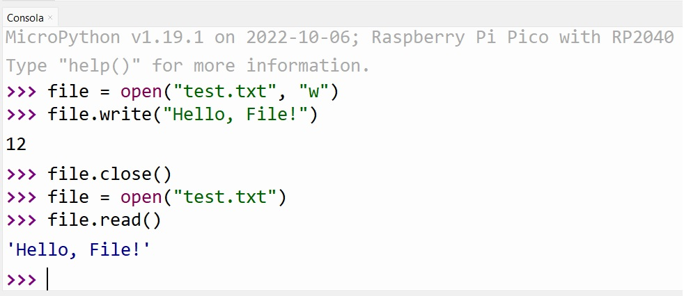
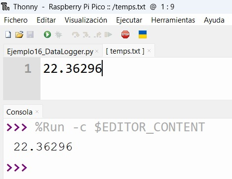
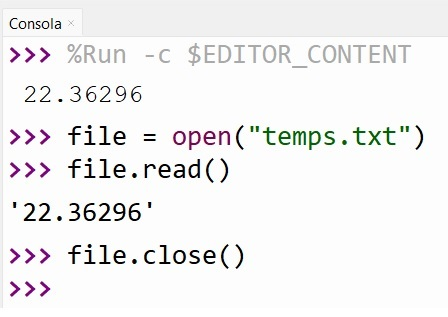
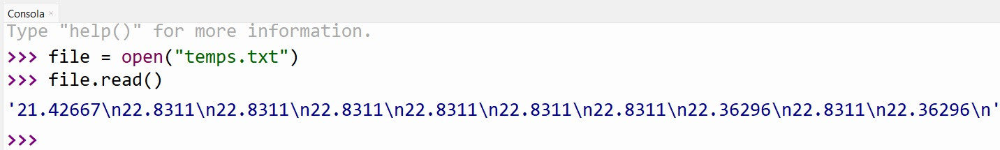
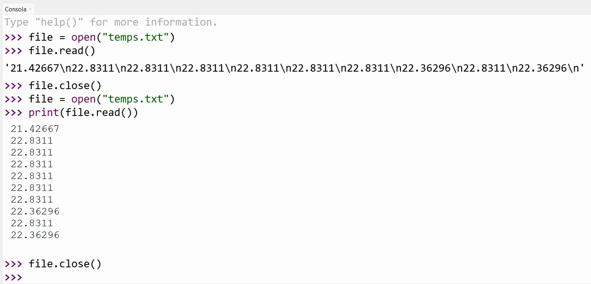
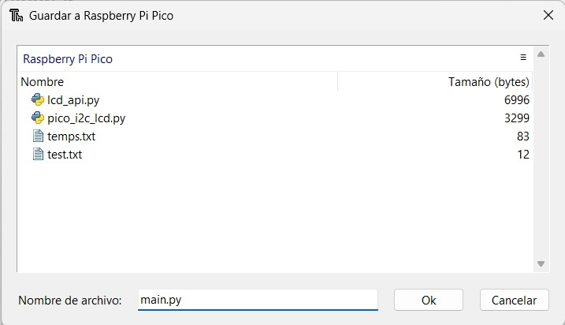
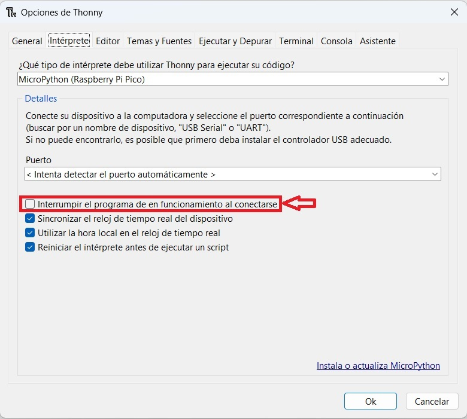
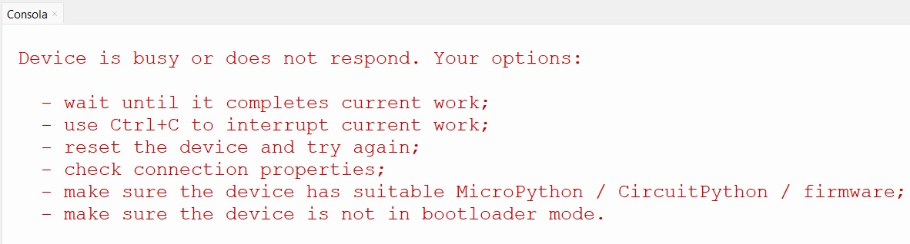
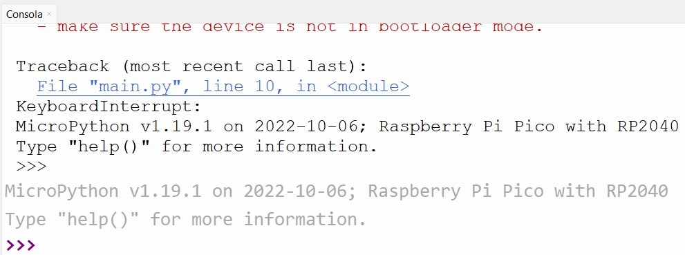
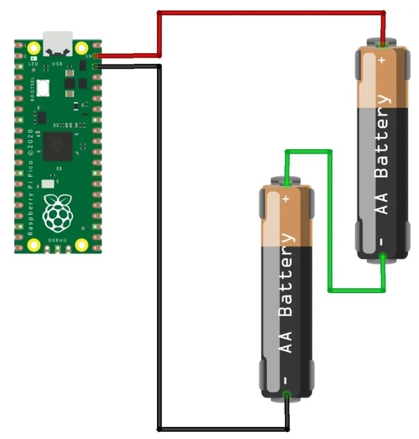

# Clase N°5: Almacenamiento de datos

  
*Figura 01 - Presentación Clase N°5*

A lo largo del curso, hemos usado la **RPico W** conectada a nuestra computadora a través de su puerto micro-USB para proveerle energía eléctrica y para cargar nuestros programas. Sin embargo, al igual que con todos los microcontroladores, no hay razón para que la **RPico W** esté conectada exclusivamente de esta manera, ya que es un sistema autónomo, completamente funcional, con capacidades de procesamiento y memoria, y dotada además de toda la circuitería necesaria para ser alimentada con fuentes externas.

Además, nuestra **RPico W** también nos permite crear, escribir y leer archivos, logrando que podamos colocarla en cualquier sitio que deseemos y hacer que registre datos para acceder a ellos más tarde, convirtiéndolo en lo que se conoce como un *registrador de datos* o *Data Logger*. 

En esta clase, conoceremos el *Sistema de Archivos* (*File System*) de la **RPico W**, lo que nos permitirá almacenar datos dentro de ella, y mantenerlos aunque esté desconectada de la alimentación. Y también veremos cómo poner en funcionamiento nuestra **RPico W** y ejecutar nuestros códigos de **MicroPython** con alimentación externa, independizándonos de la conexión a la PC.

¡Empecemos!

## 5.1 Sistema de archivos

En informática, el *Sistema de Archivos* (también conocido como *Sistema de Ficheros* o *File System* en inglés), es una estructura utilizada para organizar y administrar los archivos en un sistema operativo o en un dispositivo de almacenamiento, como un disco duro o una unidad flash.

En nuestra **RPico W**, el *Sistema de Archivos* define cómo y dónde se almacenan y se organizan los datos en ella; permitiendo la creación, modificación, eliminación y búsqueda de archivos. 

Es equivalente en su función, a la memoria microSD que emplean las *Raspberry Pi*, o el disco duro en una computadora convencional; es decir, que define una *forma de almacenamiento no volátil*, lo que significa que todo lo que se almacena, permanece en su lugar incluso cuando desconectemos el cable micro-USB de nuestra **RPico W**.

Para ver esto, conectemos la **RPico W** a nuestra computadora y ejecutemos **Thonny**. Si hacemos click en el ícono *Abrir fichero..* nos encontraremos con una ventana emergente con dos opciones. Si hacemos click en *Este computador*, encontraremos todos los archivos con extensión *.py* que escribimos a lo largo del curso y que hemos almacenado en nuestro equipo; pero si seleccionamos *Raspberry Pi Pico* encontraremos aquellos que están almacenados en el *Sistema de Archivos* de nuestra **RPico W**. En nuestro caso, solo encontraremos los archivos *lcd_api.py* y *pico_i2c_lcd.py* correspondientes a la librería *RPI-PICO-I2C-LCD* que cargamos la clase anterior (**Figura 02**).

  
*Figura 02 - Abrir de Raspberry Pi Pico*

No vamos a abrir ningún archivo por el momento, por lo que hacemos click en *Cancelar* y nos dirigimos al área de Shell. Allí, a continuación de **>>>**, escribiremos lo siguiente:

```python
file = open("test.txt", "w")
```

Esto le dice a **MicroPython** que abra un archivo llamado *test.txt* para escritura (la parte *"w"* de la instrucción).

No veremos nada impreso en el área de Shell cuando presionemos *ENTER* al final de la línea, porque aunque hayamos abierto el archivo, aún no hemos hecho nada con él. Entonces, escribamos por ejemplo la siguiente línea:

```python
file.write("Hello, File!")
```

Cuando presionemos *ENTER* al final de esta línea, veremos aparecer el número *12* como se muestra en la **Figura 03**. Esto nos confirma que **MicroPython** ha escrito *doce bytes* en el archivo que hemos abierto anteriormente. Observemos que cuenta la cantidad de caracteres en el mensaje que escribimos: incluidas las letras, la coma, el espacio y el signo de exclamación, contabilizamos un total de doce, cada uno de los cuales ocupa un solo byte.

  
*Figura 03 - Tamaño de los datos escritos en un archivo*

Evidentemente, si escribimos en un archivo, debemos posteriormente cerrarlo para confirmar los cambios realizados en él y garantizar que los datos se escriban realmente en el *Sistema de Archivos*. Para ello, utilizamos la siguiente instrucción:

```python
file.close()
```

El archivo ahora está almacenado de forma segura en el *Sistema de Archivos* de nuestra **RPico W**. Para comprobar esto, volvemos a hacer click en el ícono *Abrir fichero..* y seleccionamos *Raspberry Pi Pico*; encontraremos ahora nuestro archivo *test.txt*. Si lo abrimos, veremos aparecer su contenido en una nueva pestaña de **Thonny**.

Sin embargo, esta no es la única manera de leer archivos: podemos hacerlo directamente en **MicroPython**. Volvemos a hacer click en la parte inferior del área de Shell y escribimos:

```python
file = open("test.txt")
```

Notarás que esta vez no hay *"w"* en la instrucción; esto se debe a que en lugar de escribir en el archivo, lo leeremos. Podemos reemplazar la *"w"* con una *"r"*, pero **MicroPython** abre un archivo en modo de lectura de forma predeterminada, por lo que está bien simplemente dejar esa parte de la instrucción desactivada.

A continuación, escribimos la siguiente línea:

```python
file.read()
```

Luego de presionar *Enter*, veremos el mensaje que escribimos anteriormente en el área de Shell como se aprecia en la **Figura 04**.

  
*Figura 04 - Lectura de un archivo en el Shell de Thonny*

Felicitaciones, ¡has podido leer y escribir archivos en el *Sistema de Archivos* de tu **RPico W**!

Antes de terminar, recuerda cerrar el archivo. No es vital cerrar correctamente un archivo después de leerlo como cuando se escribe en él, pero realizarlo es una buena práctica de programación. Para ello, repetimos nuevamente:

```python
file.close()
```

## 5.2 Registrador de datos o Data Logger

Ahora que ya sabemos cómo abrir, escribir y leer archivos, tenemos todo lo que necesitamos para implementar un *registrador de datos* o *Data Logger* en nuestra **RPico W**. Para exponer esto, trabajaremos con el *Ejemplo N°9* de la *Clase N°3*, donde realizamos la lectura del sensor de temperatura interno de nuestra **RPico W**, e incorporaremos los conceptos vistos anteriormente. 

Las lecturas del sensor son los datos que registraremos en el *Sistema de Archivos*, por lo que no deseamos simplemente imprimirlos en al área de Shell como lo hicimos anteriormente. 

Comenzamos abriendo un archivo, donde posteriormente escribiremos los datos recolectados. Para ello, al igual que antes, repetimos la instrucción:

```python
file = open("temps.txt", "w")
```

Ahora necesitamos escribir algo en el archivo, en este caso, la lectura del sensor de temperatura:

```python
file.write(str(temperatura))
```

Aquí, en lugar de escribir una cadena fija entre comillas como lo hicimos antes, primero convertimos la temperatura, que es un número de punto flotante, en una cadena, y posteriormente escribimos eso en el archivo *temps.txt*. 

Y como antes, para asegurarnos de que los datos estén escritos correctamente, debemos cerrar el archivo:

```python
file.close()
```

El código completo queda de la siguiente manera (ver *Ejemplo16_DataLogger.py* en el repositorio):


```python
from machine import Pin, ADC
from utime import sleep

sensor_temp = ADC(4)

factor_conversion = 3.3 / (65535)

lectura = sensor_temp.read_u16() * factor_conversion
temperatura = 27 - (lectura - 0.706)/0.001721
print(temperatura)

file = open("temps.txt", "w")
file.write(str(temperatura))
file.close()
```

Guardamos el código en nuestra **RPico W** y lo ejecutamos. El programa solo tardará unos milisegundos; cuando el indicador **>>>** vuelva a aparecer en la parte inferior del área de Shell, nos indica que ha terminado de ejecutarse. 

Tenemos dos formas de comprobar si el proceso se realizó de forma correcta. Podemos hacer click en el ícono *Abrir fichero..*, seleccionar *Raspberry Pi Pico*, buscar el archivo "temps.txt" en el *Sistema de Archivos* de nuestra **RPico W** y seleccionarlo. En la ventana emergente deberíamos ver el mismo valor que en el área de Shell como se muestra en la **Figura 05**.

  
*Figura 05 - Temperatura registrada*

Pero, como ya vimos, esta no es la única manera de leer archivos: podemos hacerlo directamente en **MicroPython**. Volvemos a hacer click en la parte inferior del área de Shell y escribimos:

```python
file = open("temps.txt")
file.read()
file.close()
```

Veremos ahora el mismo valor registrado, pero en el área de Shell (**Figura 06**).

  
*Figura 06 - Lectura de temperatura en el Shell*

Sin embargo, un *Data Logger* que solo registra una sola lectura, no es muy útil. Para que sea más potente, debemos modificarlo para que tome muchas lecturas.

La primera modificación, consistirá en incluir un bucle *while* como hemos hecho a lo largo del curso (con la inclusión también de un retardo de tiempo). Dentro de él, colocaremos las instrucciones correspondientes al proceso de lectura del sensor y a la escritura de los valores correspondientes en un archivo. Sin embargo, vamos a necesitar hacer algo nuevo. 

Abrir un archivo para escritura en **MicroPython**, elimina todo lo que se haya almacenado en él. Y si cerramos el archivo como venimos haciendo, no podremos volver a escribir en él, sin volver a abrirlo y borrar su contenido. Y también, si no cerramos el archivo, los datos nunca se escribirán en el *Sistema de Archivos*.

La solución a toda esta situación es incluir la instrucción *flush()*:

```python
file.flush()
```

Cuando estamos escribiendo en un archivo, los datos no se están escribiendo en el *Sistema de Archivos* de forma inmediata; en realidad se almacenan en lo que se conoce como un *buffer*, que es un área de almacenamiento temporal. Entonces, cuando cerramos el archivo, el *buffer* se escribe en el archivo en un proceso conocido como *volcado* o *flushing* en inglés. 

Emplear *file.flush()* es equivalente a *file.close()*, en el sentido de que vuelca el contenido del *buffer* en el archivo, pero a diferencia de *file.close()*, el archivo permanece abierto para que podamos escribir más datos en él más adelante.

Por otro lado, al realizar múltiples escrituras en un archivo, no queremos que todas estas queden en una sola línea, ya que dificulta la posterior lectura de los datos. Para evitar esto, la solución más sencilla es modificar la instrucción *file.write()* para que quede de la siguiente manera:

```python
file.write(str(temperatura) + "\n")
```

Como ya sabemos, el símbolo *+* se emplea en **MicroPython** para concatenar dos cadenas de texto. Y *"\n"* es una cadena especial conocida como *carácter de control*, que actúa como el equivalente a presionar la tecla *Enter*, lo que significa que cada dato de nuestro *Data logger* se encontrará en líneas separadas.

Algo para tener en cuenta, es que la instrucción correspondiente a la apertura del archivo debe estar siempre antes del bucle *while*. 

El código completo, con un retardo de 1 segundo, queda de la siguiente manera (ver *Ejemplo17_DataLogger.py* en el repositorio):

```python
from machine import Pin, ADC
from utime import sleep

sensor_temp = ADC(4)

factor_conversion = 3.3 / (65535)

file = open("temps.txt", "w")

while True:
    lectura = sensor_temp.read_u16() * factor_conversion
    temperatura = 27 - (lectura - 0.706)/0.001721

    file.write(str(temperatura) + "\n")
    file.flush()
    sleep(1)
```

Para comprobar el funcionamiento; ejecutamos el código, contamos diez segundos y luego hacemos click en *Detener*. Lógicamente, esto debería registrar diez datos debido al retardo que hemos ingresado en nuestro código. 

Para leer estos datos desde **MicroPython**, procedemos como hicimos anteriormente. Nos dirigimos a la parte inferior del área de Shell y escribimos las siguientes instrucciones:

```python
file = open("temps.txt")
file.read()
file.close()
```

Sin embargo, nos encontraremos con una situación como la que se muestra en la **Figura 07**. El carácter de control *"\n"* no actúa como si se presionara *Enter*, sino que se imprime como dos caracteres visibles. Esto se debe a que *file.read()* trae el contenido sin procesar del archivo y no intenta formatearlo para la pantalla.

  
*Figura 07 - Lectura de temperaturas en el Shell sin formatear*

Para solucionar este problema de formato, debemos anidar la función *file.read()* dentro de la función *print()* de la siguiente manera:

```python
file = open("temps.txt")
print(file.read())
file.close()
```

De esta forma, verás cada dato en su propia línea, con un formato ordenado y fácil de leer (**Figura 08**).

  
*Figura 08 - Lectura de temperaturas en el Shell con formato*

Y ahora sí, podemos decir que hemos diseñado un *registrador de datos* que puede tomar múltiples lecturas y almacenarlas en el *Sistema de Archivos* de nuestra **RPico W**.

Como desafío; ¿se animan a registrar los datos provenientes de un potenciómetro?.

Por último, una advertencia importante. El *Sistema de Archivos* de la **RPico W** tiene un tamaño de 128 kB, lo que significa que puede contener alrededor de 128.000 bytes de datos. Cada archivo que guardemos en nuestra placa, incluido el archivo de almacenamiento que genera nuestro *registrador de datos*, ocupa espacio. 

El tiempo que se tarde en llenar el almacenamiento, dependerá de cuántos otros archivos tengamos alojados, y del tamaño de los datos y de la frecuencia a la cual nuestro *registrador de datos* guarde una lectura.

Por ejemplo; a nueve bytes por lectura cada diez segundos, llenaremos 128 kB en poco menos de 40 horas. Si en cambio, hiciéramos una lectura por minuto, el *registrador de datos* podría funcionar durante casi diez días. Y si solo lee una vez por hora, podría funcionar durante más de un año y medio.

Una alternativa, es comunicar los datos a una plataforma web y allí almacenar los datos, , independizándonos de la limitación de espacio de la **RPico W**. Esto lo realizaremos más adelante.

## 5.3 Headless Operation en la RPico W

A medida que avanzamos con el desarrollo de proyectos en **MicroPython**, muy probablemente surja la necesidad de darle autonomía a nuestra **RPico W**, de forma tal que pueda funcionar sin la necesidad imperiosa de tener a **Thonny** controlando nuestro proyecto. Veamos a continuación como podemos lograr esto.

El *Sistema de Archivos* de la **RPico W** funciona independientemente de si está conectada o no a nuestra computadora u otra *Raspberry Pi*. Esto implica que si energizamos a nuestra placa a través del puerto micro-USB, o a través de unos pines determinados que posee para tal fin, conseguiremos que funcione de forma autónoma, sin tener que ejecutar nuestros códigos desde **Thonny**. Este tipo de operación que posee nuestra placa se conoce como **Headless Operation**.

Pero antes, necesitaremos realizar una pequeña modificación en nuestro código para que se ejecute por sí solo. Para emplear la **RPico W** sin otro equipo conectado, algo que nos permitirá llevar nuestro proyecto al sitio que deseemos, debemos guardar nuestro código con un nombre de archivo especial: **main.py**. 

Cuando **MicroPython** encuentra un archivo llamado **main.py** en su *Sistema de Archivos*, lo ejecuta automáticamente cada vez que se encendemos o reiniciamos nuestra placa, sin tener que recurrir a **Thonny**.

Entonces, lo único que debemos hacer para que la **RPico W** funcione en **Headless Operation**, es almacenar el código que realizamos en el *Sistema de Archivos* con el nombre **main.py**.

Para exponer esto, trabajaremos con el *Ejemplo N°2* de la *Clase N°2*, donde realizamos el parpadeo del *LED* onboard de nuestra **RPico W**. El código original se repite a continuación y no realizaremos modificaciones en él:

```python
from machine import Pin
from utime import sleep

LED_onboard = Pin("LED", Pin.OUT)  # LED_onboard = Pin(25, Pin.OUT) si empleamos la RPico

while True:
    LED_onboard.toggle()
    sleep(5)
```

Con este código, desde **Thonny**, haremos click en *Archivo*, luego en *Guardar como...* y seleccionaremos *Raspberry Pi Pico*, de forma tal que nuestro código se almacene en el *Sistema de Archivos* de nuestra placa, y en nombre de archivo colocaremos **main.py** (**Figura 09**).

  
*Figura 09 - Archivo main.py en el Sistema de Archivos*

Cerramos **Thonny** y desconectamos cable micro-USB. A continuación, si energizamos la **RPico W**, notaremos como comienza a ejecutar el código que se encuentra en su *Sistema de Archivos* de forma automática, ya que el *LED* onboard comienza a parpadear.

Si no contamos con una fuente externa, podemos simplemente conectar nuevamente el cable micro-USB a nuestra computadora con el objetivo de energizar la **RPico W**, y sin ejecutar **Thonny**, veremos como empieza a ejecutarse el código.

Por otro lado, si deseamos detener la ejecución automática de nuestro código, debemos valernos nuevamente de **Thonny**, y el procedimiento dependerá de cómo esté configurado el intérprete de este. Para ello, haremos click en *Ejecutar* y luego en *Configurar intérprete..*, e inmediatamente se desplegará una ventana como la que vemos en la **Figura 10**.

  
*Figura 10 - Configurar intérprete*

Si la opción *Interrumpir el programa en funcionamiento al conectarse* se encuentra *deshabilitada*, al conectar la **RPico W** a nuestra computadora y abrir **Thonny**, veremos un mensaje en el área de Shell como el de la **Figura 11**, indicándonos que el dispositivo está ocupado, y que por lo tanto no responderá a las ordenes que le enviemos desde **Thonny**.

  
*Figura 11 - Dispositivo ocupado*

Para retomar el control de nuestra **RPico W** desde **Thonny**, interrumpiendo la ejecución del código **main.py** que se encuentra corriendo, debemos teclear *Ctrl+C*. Al hacerlo, veremos un mensaje en el área de Shell como se muestra en la **Figura 12**. 

  
*Figura 12 - Ejecución Interrumpida*

De esta forma, podemos volver a trabajar con nuestra **RPico W** desde **Thonny**; ejecutando nuestros códigos desde allí, o para cambiar el correspondiente al **main.py** que se encuentra en el *Sistema de Archivos* de la misma.

Por otro lado, si la opción *Interrumpir el programa en funcionamiento al conectarse* se encuentra *habilitada*, al conectar la **RPico W** a nuestra computadora y abrir **Thonny**, se interrumpirá de forma inmediata la ejecución del código **main.py** que se encuentra corriendo, y veremos el mensaje de la **Figura 12**.

## 5.4 Alimentación externa

Hemos descubierto que al utilizar el *Sistema de Archivos*, no necesitamos depender de **Thonny** para ejecutar nuestros códigos. Esto nos permite enfocarnos únicamente en la alimentación de la placa para hacer nuestro proyecto totalmente autónomo y portátil.

La **RPico W** puede ser alimentada de dos formas: mediante su puerto micro-USB o a través de pines específicos destinados para ello. 

Hasta ahora hemos utilizado la primera opción. En este caso, simplemente debemos asegurarnos de conectar una fuente externa que proporcione los 5[Voltios] necesarios según el *estándar Micro-USB*. Podemos lograrlo utilizando los puertos USB de nuestra computadora, un cargador de teléfono o una *power bank*. Todos estos dispositivos nos garantizan los parámetros eléctricos adecuados para evitar dañar nuestra placa.

El *estándar Micro-USB*, ampliamente utilizado en dispositivos electrónicos como la **RPico W**, opera a una tensión nominal de 5[Voltios]. Esta es la tensión estándar para la mayoría de los cables y conectores Micro-USB. Sin embargo, es importante destacar que el *estándar Micro-USB* no es compatible con el *Modo de Entrega de Energía* (*Power Delivery Mode*), que permite una mayor corriente y voltaje, como se encuentra en estándares más recientes como USB 3.0, 3.1 y 3.2.

Para la segunda opción de alimentación, utilizaremos el pin *VSYS* y uno de los pines *GND* de nuestra placa (**Figura 13**).

  
*Figura 13 - Pines de la RPico W para Alimentación Externa*

En clases anteriores, hemos utilizado el pin *VBUS*, el cual está conectado al puerto micro-USB de la placa, y aprovecha la línea de alimentación de 5[Voltios] provenientes del puerto micro-USB antes de ser convertidos a 3,3[Voltios] para alimentar el *RP2040* de la **RPico W**.

Por su parte, en el pin *VSYS*, tendremos un voltaje igual a VBUS menos 0,3[Voltios], es decir, VSYS = VBUS - 0,3[Voltios]. Esta diferencia se debe a la presencia de un *diodo Schottky* entre los pines VBUS y VSYS, que tiene una caída de tensión aproximada de 0,3[Voltios]. 

Un *diodo Schottky* es un tipo de diodo semiconductor ampliamente utilizado en aplicaciones electrónicas. Se distingue por tener una baja caída de tensión directa, generalmente entre 0,2 y 0,5[Voltios], lo que conlleva una menor pérdida de potencia y una mayor eficiencia en comparación con los diodos convencionales. Esto los convierte en una opción ideal para aplicaciones que requieren una conmutación rápida y una rectificación de alta frecuencia.

En el caso específico de la **RPico W**, el *diodo Schottky* se utiliza para proporcionar *protección contra polaridad inversa*. Esto impide posibles daños en los circuitos de la placa debido a la conexión incorrecta de la polaridad de la fuente de alimentación o a una inversión accidental de la tensión. El *diodo Schottky* actúa como una barrera que evita que la corriente fluya en la dirección incorrecta, protegiendo así los componentes sensibles de la placa.

Sin embargo, lo más importante aquí, es que mediante este pin también podemos proporcionar alimentación externa a nuestra placa en un rango de voltaje que va desde 1,8[Voltios] hasta 5,5[Voltios] gracias a que cuenta con un *regulador de tensión interno*, que se encarga de garantizar que el *RP2040* recibirá los 3,3[Voltios] necesarios para su funcionamiento. 

Sin embargo, lo más importante aquí, es que este pin nos permite suministrar alimentación externa a la placa en un rango de voltaje de 1,8[V] a 5,5[V], gracias a que se encuentra conectado al regulador de tensión *RT6154* de la firma *Richtek*, el cual nos garantiza que el *RP2040* recibirá los 3,3[V] necesarios para su correcto funcionamiento.

Esto nos proporciona una amplia variedad de opciones para las fuentes de alimentación externas que deseemos utilizar, empleando únicamente los pines *VSYS* y *GND* de nuestra **RPico W**. 

Una opción adecuada consiste en utilizar dos pilas AA convencionales, con una tensión individual de 1,5[Voltios], conectadas en serie para obtener una tensión total de 3[Voltios]. Estas pilas pueden ser conectadas a la placa como se ilustra en la **Figura 14**. Esta configuración nos permitirá suministrar la alimentación necesaria a la placa de manera eficiente y confiable.

  
*Figura 14 - RPico Conectada Con Dos Pilas AA*

Observamos que el terminal positivo del conjunto de pilas se conecta al pin *VSYS*, mientras que el terminal negativo se conecta a un pin *GND* (el pin físico 38 en este caso).

Es importante tener en cuenta que las pilas AA pueden no proporcionar una corriente constante y estable, lo que puede afectar la duración y el rendimiento de la alimentación de la placa RPico W. Para obtener un rendimiento óptimo, se recomienda utilizar una fuente de alimentación confiable y estable.

Una opción recomendada son las baterías de litio, como las baterías de litio-ion (Li-ion) o litio-polímero (Li-Po), que tienen una tensión nominal de 3,7[Voltios]. Estas baterías proporcionan una fuente de alimentación más confiable y ofrecen una mayor duración en comparación con las pilas AA.

Es fundamental asegurarse de que las pilas o baterías utilizadas sean compatibles con la placa y cumplan con las especificaciones de voltaje adecuadas. Además, en algunos casos, puede ser necesario utilizar un circuito de protección adecuado para evitar daños por sobrecarga o descarga excesiva de las baterías y garantizar una operación segura y confiable.