# Clase N°6: Fundamentos de IoT

  
*Figura 01 - Presentación Clase N°6*

A lo largo de nuestro recorrido en este curso, hemos explorado las características clave de nuestra placa, como son las entradas y salidas digitales, las entradas y salidas analógicas (ADC y PWM), los protocolos de comunicación serie (I2C y SPI), el sistema de archivos y las posibilidades para alimentarla de forma externa.

No obstante, ha llegado el momento de explorar un aspecto fundamental y altamente relevante de la **RPico W**: su capacidad de conectividad inalámbrica, la cual le permite integrarse en el fascinante mundo del **Internet de las Cosas**.

En la clase de hoy, explicaremos detalladamente qué es el **Internet de las Cosas** (*IoT*, por sus siglas en inglés, *Internet of Things*), recorreremos sus campos de aplicación, conoceremos qué son los **dispositivos IoT** y los distintos protocolos que se implementan en el **IoT**.

También realizaremos la conexión de nuestra **RPico W** a una red **WiFi** para aprovechar al máximo el potencial de tu placa y llevar a cabo los proyectos de **IoT** que desees.

¡Empecemos!

## 6.1 ¿Qué es IoT?

El **Internet de las Cosas** es un concepto que se refiere a la interconexión de dispositivos físicos a través de Internet, lo cual permite la comunicación y el intercambio de datos entre ellos. 

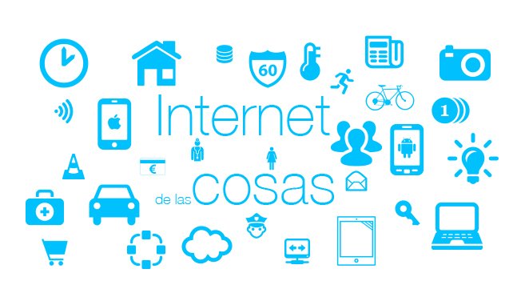  
*Figura 02 - Internet de las Cosas*

Estos dispositivos, llamados "cosas" o **dispositivos IoT**, están equipados con la tecnología necesaria (hardware y software) para facilitar esta conectividad. Pueden recopilar, transmitir y procesar información, y tomar decisiones basadas en esos datos, lo que puede brindar mayor eficiencia, comodidad y automatización en diversos campos como la logística, la industria, la salud, el transporte, la agricultura, la seguridad, entre muchos otros más.

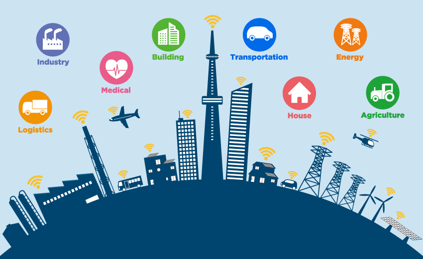  
*Figura 03 - Ejemplos de campos de Aplicación de IoT*

El **IoT** tiene un enorme potencial para mejorar y optimizar una amplia variedad de industrias y áreas de aplicación. Centrándonos en las áreas mencionadas anteriormente, podemos detallar:

1. Logística:

    1.1 Seguimiento de productos: Los **dispositivos IoT** se utilizan para rastrear y monitorear en tiempo real la ubicación de los productos a lo largo de todo el proceso logístico. Esto mejora la visibilidad de la cadena de suministro y ayuda a prevenir pérdidas o robos.

    1.2 Gestión de inventario: La integración de **dispositivos IoT** con los sistemas de gestión de inventario proporciona datos en tiempo real sobre el nivel de existencias. Esto facilita la reposición oportuna y evita la falta de productos en el inventario.

2. Industria:

    2.1 Optimización de procesos: Los **dispositivos IoT** se utilizan para recopilar datos sobre el rendimiento de las máquinas, la calidad de los productos y otros parámetros clave. Estos datos recopilados permiten identificar áreas de mejora y optimizar los procesos de producción, lo que lleva a una mayor eficiencia y calidad en la industria.

    2.2 Mantenimiento predictivo: La monitorización en tiempo real de los equipos industriales a través de **dispositivos IoT** permite predecir fallas y realizar tareas de mantenimiento antes de que ocurran averías importantes. Esta anticipación reduce significativamente los tiempos de inactividad y los costos de reparación, mejorando la productividad y la rentabilidad de las operaciones industriales.

3. Salud:

    3.1 Monitoreo remoto de pacientes: Los **dispositivos IoT** se utilizan para supervisar de forma remota las condiciones médicas de los pacientes, permitiendo el monitoreo continuo de los signos vitales y la detección temprana de problemas de salud.

    3.2 Asistencia médica personalizada: Los **dispositivos IoT** y las aplicaciones de salud conectadas permiten a los pacientes seguir su estado de salud, recibir recordatorios de medicamentos y obtener recomendaciones personalizadas para mejorar su bienestar.

4. Transporte:

    4.1 Gestión de flotas: Los sistemas de seguimiento basados en **IoT** se utilizan para controlar y gestionar flotas de vehículos, optimizando las rutas, mejorando la eficiencia del combustible y proporcionando datos en tiempo real sobre el estado de los vehículos.

    4.2 Transporte inteligente: Los **dispositivos IoT** en carreteras y vehículos permiten la recopilación de datos sobre el tráfico, las condiciones climáticas y otros factores relevantes, lo que facilita la planificación de rutas más eficientes y seguras.

5. Agricultura:

    5.1 Agricultura de precisión: Los **dispositivos IoT** se utilizan para medir y controlar parámetros como la humedad del suelo, la temperatura, la luminosidad y la calidad del aire, lo que permite una gestión más precisa del riego, la fertilización y la protección de los cultivos.

    5.2 Ganadería inteligente: Los **dispositivos IoT** se utilizan para monitorizar y rastrear el comportamiento y la ubicación del ganado, optimizando la alimentación, el bienestar y la gestión de rebaños.

6. Seguridad:

    6.1 Sistemas de seguridad inteligentes: El **IoT** se utiliza para integrar cámaras de seguridad, sensores de movimiento y sistemas de alarma, permitiendo una vigilancia y una respuesta más efectiva ante situaciones de seguridad.

    6.2 Control de acceso inteligente: Los sistemas de acceso basados en **IoT**, como las cerraduras inteligentes, permiten el control remoto y la supervisión del acceso a edificios y áreas restringidas, mejorando la seguridad y la gestión de visitantes.

Estos ejemplos ilustran cómo el **IoT** se aplica en diversos sectores con el fin de mejorar la eficiencia, la seguridad y la toma de decisiones basadas en datos. Cada campo tiene múltiples casos de uso y amplias posibilidades de aplicación dentro del **Internet de las Cosas**.

## 6.2 Dispositivos IoT & RPico W

Cuando nos referimos a un **dispositivo IoT**, hablamos de cualquier objeto que ha sido equipado con conexión a Internet y dotado de una capa de inteligencia en forma de software. Estos dispositivos tienen la capacidad de medir parámetros físicos y permitir acciones remotas, lo que da lugar a la creación de un ecosistema de servicios en su entorno cuyo propósito principal es generar valor y transformar la experiencia del usuario.

Se pueden mencionar varios **dispositivos IoT**, como electrodomésticos controlables y monitoreables a través de una aplicación, termostatos inteligentes para ajustar la temperatura de forma remota, smartwatches que recopilan datos de actividad física y conectan con aplicaciones móviles, entre otros ejemplos.

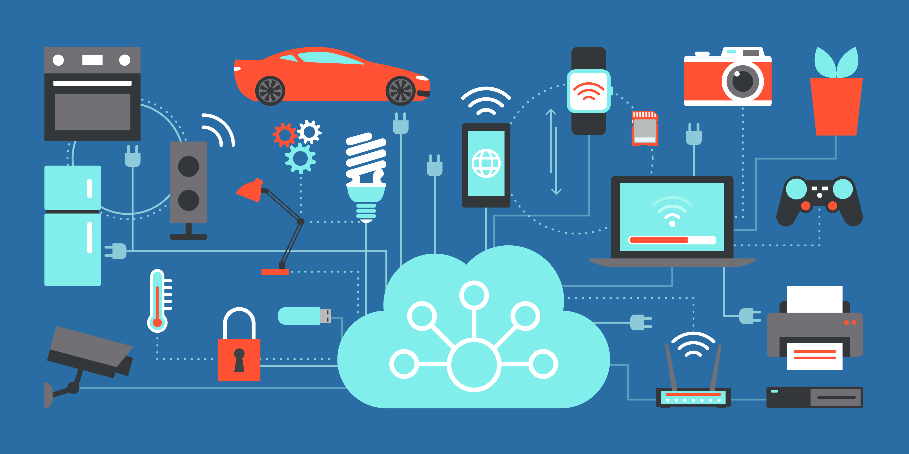  
*Figura 04 - Dispositivos IoT*

Por su parte, en la *Clase N°1* mencionamos que anteriormente los **sistemas embebidos** se utilizaban principalmente en aplicaciones aisladas y autónomas. Sin embargo, a lo largo de los años, se han dotado de capacidades de comunicación inalámbrica, como *WiFi*, *Bluetooth* e incluso tecnologías de baja energía como *Zigbee* o *LoRa*, que veremos más adelante. Esto ha permitido que los **sistemas embebidos** interactúen con otros dispositivos y servicios en línea.

La **RPico W**, al contar con conectividad *WiFi*, puede conectarse a redes inalámbricas y acceder a Internet. Esto significa que puede enviar y recibir datos, comunicarse con otros dispositivos o servicios en la nube, y formar parte de soluciones más grandes en el ámbito de **IoT**.

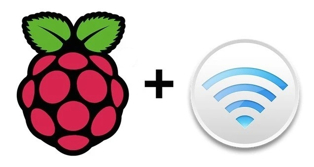  
*Figura 05 - Raspberry Pi con WiFi*

Al integrar la **RPico W** en proyectos de **IoT**, es posible recopilar datos de sensores, controlar actuadores y enviar información a la nube para su procesamiento y análisis. Esto permite crear sistemas más inteligentes e interconectados, capaces de interactuar con otros dispositivos y servicios en línea, ampliando así su alcance y funcionalidad.

## 6.3 Protocolos en el IoT

Si bien el **IoT** ha revolucionado la industria, también presenta varios retos que deben abordarse para su desarrollo y expansión. Entre ellos; la seguridad de los datos intercambiados entre dispositivos, la gestión de grandes volúmenes de información generada y la necesidad de infraestructuras escalables que sean capaces de soportar el creciente número de dispositivos que se van incorporando.

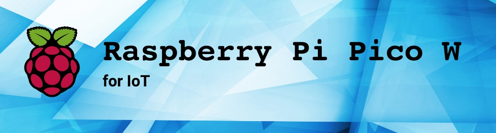  
*Figura 06 - Raspberry Pi Pico W para IoT*

Pero cuando hablamos de **sistemas embebidos** en el **Internet de las Cosas**, los retos se intensifican debido a las limitaciones propias que ya conocemos de los **sistemas embebidos**, es decir, sus recursos y capacidades limitadas en términos de procesamiento y consumo de energía.

Esto ocasiona que el mayor desafío para los **sistemas embebidos** en el **Internet de las Cosas** es la elección del *protocolo de comunicación* a utilizar. Este protocolo no solo debe ser confiable, sino que también debe tener un bajo consumo de energía y una eficiente utilización de los datos en la red.

Con el avance del tiempo, se han desarrollado cada vez más protocolos para el **IoT** que cumplen con estos requisitos. Existen ciertos criterios que los protocolos deben contemplar para ser considerados en el contexto del **IoT**. La escalabilidad, la comunicación eficiente, el manejo de los datos y la seguridad de los mismos, son algunos de los parámetros clave para tener en cuenta al seleccionar un protocolo para su uso en el **IoT**.

Tengamos en cuenta además que, mientras más complejos y mayor velocidad necesiten los *protocolos de comunicación*, mayor será la cantidad de procesamiento y el consumo de energía del dispositivo que lo implemente.

Puede decirse que el *protocolo de comunicación* a utilizar es uno de los temas más importantes en el **IoT**. Antes de detenernos en cada uno de ellos, es necesario comprender el *modelo de comunicación OSI* o **Modelo OSI**, para entender cómo se desarrollan los *protocolos de comunicación* para el **IoT** y en qué capa se implementan.

El **Modelo OSI** es un marco utilizado para comprender cómo funcionan juntos los diferentes sistemas de comunicación existentes. Divide el proceso de envío y recepción de datos a través de una red en siete capas, cada una de las cuales realiza una función específica.

Fue desarrollado por la *Organización Internacional para la Estandarización (ISO)*, a fines de la década de 1970 y principios de la de 1980, como una manera de estandarizar el trabajo de distintos sistemas de comunicación y proporcionar una estructura lógica y organizada para el intercambio de datos.

El modelo cuenta con 7 capas como se muestra en la **Figura 07**, y que enumeraremos de abajo hacia arriba: *Capa física*, *Capa de enlace de datos*, *Capa de red*, *Capa de transporte*, *Capa de sesión*, *Capa de presentación* y *Capa de aplicación*.

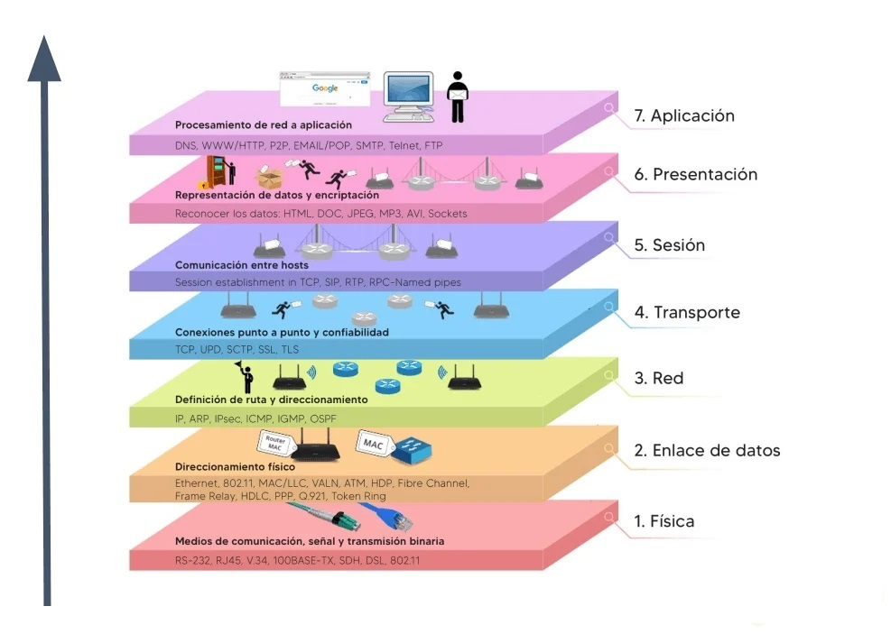  
*Figura 07 - Capas de comunicación del modelo OSI*

Es importante aclarar que el **Modelo OSI** es un modelo de referencia. Esto significa que no es un modelo que se pueda implementar directamente, sino más bien una representación de los elementos necesarios para mantener una comunicación efectiva.

Dentro de las capas del **Modelo OSI**, podemos observar que a medida que descendemos en las capas, estas están más estrechamente relacionadas con el hardware, es decir, con una tecnología específica. Por otro lado, la capa más alta se encuentra más desvinculada del hardware y, por lo tanto, no depende de una tecnología en particular o no está directamente ligada a él.

La mayoría de los protocolos utilizados en el **IoT** se encuentran en la *Capa de Aplicación* del **Modelo OSI**. Esto les brinda una mayor flexibilidad, ya que no dependen de una *Capa Física* específica para su funcionamiento. Al ubicarse en la *Capa de Aplicación*, estos protocolos permiten que el empaquetado/desempaquetado y las adaptaciones necesarias se realicen en la capa más alta del **Modelo OSI**. A continuación se enumeran los *protocolos de comunicación* más relevantes en la actualidad, con una breve descripción de cada uno de ellos:

### 6.3.1. MQTT (Message Queueing Telemetry Transport)

El protocolo **MQTT**, ampliamente utilizado en **IoT**, está diseñado para ser eficiente en términos de ancho de banda y consumo de energía, lo que lo hace especialmente adecuado para entornos de **IoT** donde los dispositivos pueden tener recursos limitados, como ancho de banda, capacidad de procesamiento y duración de la batería. **MQTT** se basa en el *modelo publicación/suscripción*, en el cual los dispositivos se suscriben a "temas" de interés y reciben los mensajes publicados de esos temas.

  
*Figura 08 - MQTT*

Los conceptos claves en MQTT son:

1. Cliente MQTT: Un dispositivo o una aplicación que se conecta a un *broker MQTT* y puede publicar mensajes o suscribirse a temas para recibir mensajes.

2. Broker MQTT: Es el intermediario central en una red **MQTT**. Recibe todos los mensajes publicados por los clientes y los enruta a los clientes suscritos a los temas correspondientes.

3. Tema (Topic): Es una cadena de texto utilizada para etiquetar o categorizar los mensajes en **MQTT**. Los clientes pueden suscribirse a temas específicos para recibir los mensajes relacionados con esos temas.

4. Publicación (Publish): Es el acto de enviar un mensaje a un *broker MQTT* asociado con un tema específico. El broker luego distribuye ese mensaje a los clientes suscritos a ese tema.

5. Suscripción (Subscribed): Es el acto de un *cliente MQTT* de expresar su interés en recibir mensajes relacionados con un tema específico. Cuando se publica un mensaje en ese tema, el cliente suscrito lo recibe del broker.

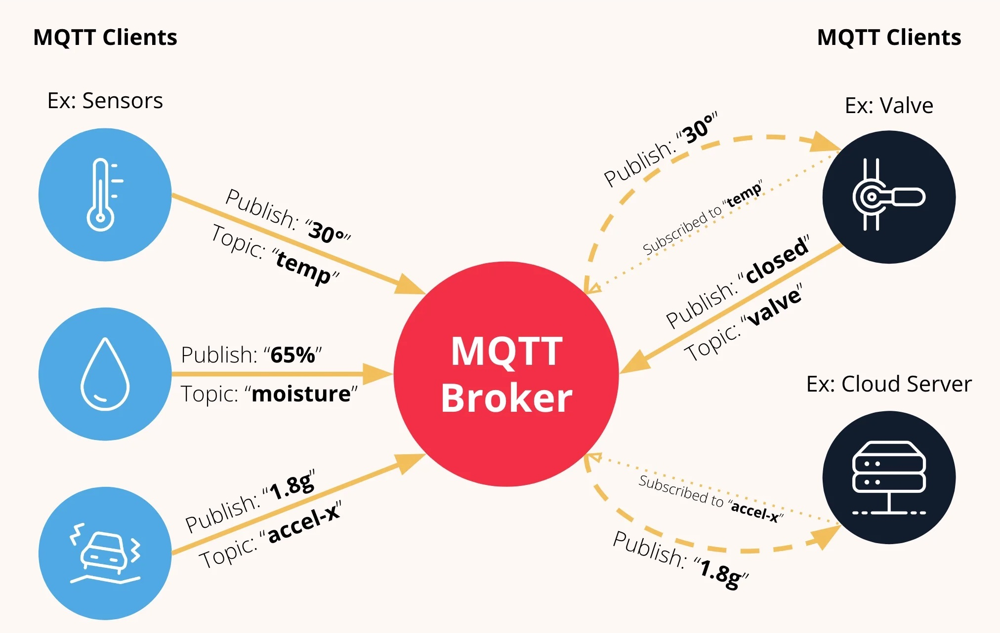  
*Figura 09 - Arquitectura MQTT*

Una de las ventajas principales de **MQTT** es su eficiencia y escalabilidad. Permite la comunicación entre miles de dispositivos de forma simultánea y consume muy poca energía y ancho de banda en comparación con otros protocolos. Además puede ser utilizado tanto en redes inalámbricas como en redes cableadas.

### 6.3.2 HTTP (Hypertext Transfer Protocol)

El protocolo **HTTP** es ampliamente conocido por su empleo en la web para el intercambio de información. Sin embargo, en el contexto del **IoT**, **HTTP** también se puede utilizar para la comunicación entre dispositivos.

  
*Figura 10 - HTTP*

En **IoT**, el protocolo **HTTP** se utiliza para permitir la comunicación y transferencia de datos entre **dispositivos IoT** y servicios en la nube, así como entre **dispositivos IoT** y aplicaciones móviles o de escritorio. **HTTP** se basa en el *modelo cliente/servidor*, donde un cliente (como un **dispositivo IoT**) realiza una solicitud HTTP a un servidor (como un servicio en la nube) y espera una respuesta de este.

### 6.3.3 COAP (Constrained Application Protocol)

Se basa en los principios de **HTTP**, pero está diseñado específicamente para ser más liviano y eficiente, lo que lo convierte en una opción muy práctica para dispositivos con recursos limitados como ocurre en **IoT**.

Al igual que **HTTP**, **CoAP** sigue un *modelo cliente/servidor*, lo que significa que los dispositivos **CoAP** pueden enviar solicitudes a un servidor CoAP y recibir las respuestas correspondientes. No obstante, se diferencia de **HTTP** en el uso de paquetes de información más pequeños, lo que reduce el consumo de ancho de banda y optimiza el uso de recursos en los dispositivos.

  
*Figura 11 - COAP*

**CoAP** representa una solución optimizada para la comunicación en el **IoT**, superando a **HTTP** en términos de eficiencia y rendimiento. Su enfoque en paquetes de información compactos, junto con la optimización del espacio y la simplicidad en la generación de mensajes, garantiza una comunicación eficiente y efectiva incluso en dispositivos con limitaciones de capacidad de procesamiento y duración de la batería, sin comprometer su rendimiento.

### 6.3.4 Zigbee

**Zigbee** es el nombre de un conjunto de protocolos de comunicación inalámbrica ampliamente utilizado en la domótica y en aplicaciones de **IoT**. Proporciona una solución eficiente y confiable para la interconexión y el control de dispositivos inalámbricos con bajo consumo energético. **Zigbee** se basa en el *estándar IEEE 802.15.4*, que define las características físicas y de acceso al medio para las redes de área personal de baja potencia (WPAN).

Una de las principales ventajas de **Zigbee** es su enfoque basado en la eficiencia energética. Permite que los **dispositivos IoT** operen a bajas tasas de transferencia de datos y consuman muy poca energía, lo que es ideal para dispositivos alimentados por batería y aplicaciones de **IoT** que requieren una larga duración de la batería.

  
*Figura 12 - Zigbee*

**Zigbee** utiliza una topología de red de malla, lo que permite que los dispositivos se comuniquen entre sí y formen una red escalable y robusta. Los dispositivos **Zigbee** pueden actuar como nodos de enrutamiento, lo que facilita la transmisión de datos a través de múltiples saltos y mejora la cobertura y la confiabilidad de la red.

### 6.3.5 Blueetooth

El protocolo **Bluetooth** es una tecnología inalámbrica que permite la conexión y comunicación entre dispositivos electrónicos a corta distancia. Basado en el *estándar IEEE 802.15.1*, **Bluetooth** posibilita la transmisión de datos, voz y otros tipos de información entre dispositivos compatibles. En el contexto del **IoT**, **Bluetooth** se utiliza ampliamente para conectar una variedad de dispositivos, como teléfonos móviles, tablets, altavoces, cerraduras inteligentes y electrodomésticos. Estos dispositivos pueden comunicarse entre sí y con otros dispositivos o servicios a través de **Bluetooth**.

Aunque **Bluetooth** no es tan eficiente en términos de consumo de energía en comparación con otros protocolos, su facilidad de uso y amplia compatibilidad lo convierten en una opción popular en aplicaciones de **IoT** que no requieren una vida útil de batería extremadamente larga. Los dispositivos **Bluetooth** compatibles pueden descubrirse automáticamente y emparejarse de manera sencilla, lo que facilita la conexión entre ellos.

  
*Figura 13 - Bluetooth*

Sin embargo, **Bluetooth** ha evolucionado con el tiempo para mejorar su eficiencia energética, especialmente con las últimas versiones como *Bluetooth Low Energy (BLE)*. Esta versión consume menos energía y permite una comunicación eficiente en dispositivos con recursos limitados, como aquellos alimentados por batería. Gracias a estas mejoras, **Bluetooth** se adapta cada vez más a las necesidades de los **dispositivos IoT** y proporciona opciones de conectividad más eficientes.

### 6.3.6 WiFi (Wireless Fidelity)

Al igual que **Bluetooth** y **Zigbee**, **WiFi** es un protocolo de comunicación inalámbrica que permite la conexión de dispositivos en un entorno de red. **WiFi** está basado en el estándar *IEEE 802.11*, que define cómo se transmiten y reciben los datos a través de redes inalámbricas de área local (WLAN).

El uso de **WiFi** en **IoT** ofrece varias ventajas, como una amplia cobertura inalámbrica, una gran disponibilidad de infraestructura **WiFi**, altas velocidades de transferencia de datos y la capacidad de conectarse a Internet. Estas características hacen que **WiFi** sea una opción popular para la conectividad de **dispositivos IoT**, especialmente en entornos domésticos y oficinas.

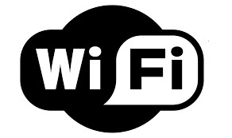  
*Figura 14 - WiFi*

Sin embargo, es importante considerar que el uso de **WiFi** en **IoT** también presenta desafíos, como el consumo de energía, la seguridad y la congestión de la red. Por lo tanto, en ciertos casos, se pueden utilizar otras tecnologías de conectividad inalámbrica, como **Bluetooth** y **Zigbee**, dependiendo de los requisitos específicos del proyecto y del entorno en el que se despliegan los **dispositivos IoT**.

### 6.3.7 LoRaWAN (Long Range Wide Area Network)

Para cerrar, es muy importante hablar de **LoRaWAN**, una tecnología que surgió en los últimos años y llama la atención por su largo alcance y bajo consumo de energía. No obstante, antes de entrar en más detalle sobre la tecnología **LoRaWAN** es importante definir y aclarar las diferencias entra **LoRa** y **LoRaWAN**.

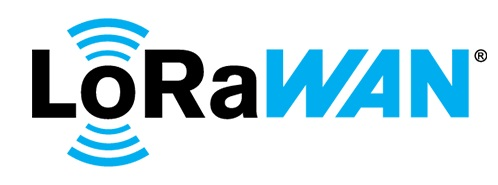  
*Figura 15 - LoRaWAN*

**LoRa** es una tecnología patentada propiedad de *Smentech Corporation*, que opera en la *banda ISM* (banda de radio reservada para usos industriales, científicos y médicos). Básicamente, se trata de un tipo de modulación de radiofrecuencia que cuenta con varias ventajas significativas. Se destacan su alta tolerancia a las interferencias, bajo consumo de energía, alta sensibilidad en la recepción de datos y un alcance de hasta 20 [km] en espacios abiertos.

Todas estas características convierten a **LoRa** en una tecnología ideal para su implementación en ecosistemas de **IoT** en zonas aisladas o con infraestructura tecnológica limitada.

Por otro lado, **LoRaWan** es un protocolo de red que usa la tecnología **LoRa** y que se implementa en la parte superior de la capa física de **LoRa**. **LoraWan** es la encargada de especificar como se realizan las comunicaciones y la arquitectura de la red y está gestionada por la *Lora Alliance*.

El diseño que define **LoRaWan** permite aumentar las bondades de **LoRa**, entre las que destacan: topología de red en estrella, mayor capacidad y seguridad de la red y administración de dispositivos más eficientes.

## 6.4 ¿Con qué protocolos cuenta nuestra placa? ¿Puedo ampliar las posibilidades?

Mencionábamos que la principal y prácticamente única diferencia entre los modelos **Raspberry Pi Pico** y **Raspberry Pi Pico W** es que esta última cuenta con el chip *CYW43439* de la firma *Infineon*, el cual le proporciona conectividad **WiFi** a la placa. Esta nueva característica amplía el abanico de aplicaciones y desarrollos posibles, y la convierte en una opción ideal para integrarse en proyectos relacionados con el **Internet de las Cosas**, debido a su pequeño tamaño, precio accesible (U$S 6) y bajo consumo de energía.

Pero en realidad, el chip *CYW43439* es un dispositivo de bajo consumo que proporciona conectividad **WiFi** y **Bluetooth** a nuestra placa. Sin embargo, las versiones de firmware disponibles para la **RPico W**, tanto en MicroPython como en C/C++, no tienen activada la funcionalidad **Bluetooth**. No obstante, siempre dejaban abierta la posibilidad de que esta funcionalidad se active en futuras actualizaciones.

Finalmente, la actualización llegó hace muy pocos días, específicamente el 14 de junio de este año, y está incorporada en la última versión de **MicroPython**. En resumidas cuentas, para agregar la funcionalidad de **Bluetooth** a la placa, solo se requiere una actualización de software.

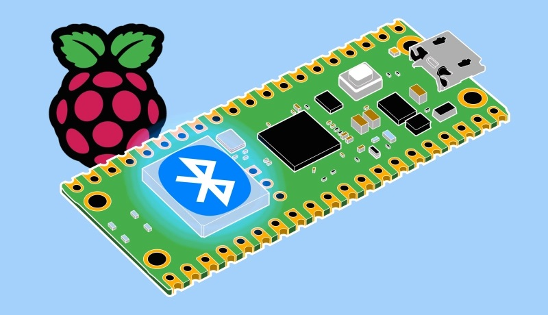  
*Figura 16 - Raspberry Pi Pico W con Bluetooth*

Si bien esta noticia ha sido ampliamente esperada, es crucial destacar que la actualización se encuentra en una fase inicial, por lo cual podemos decir que la comunidad está probando la implementación de esta nueva funcionalidad. A medida que los usuarios compartan sus experiencias, se esperan ajustes y mejoras constantes con el paso del tiempo. 

Es por ello, que nos enfocaremos exclusivamente en explorar la conectividad **WiFi** de la **RPico W**, la cual ha sido ampliamente probada y funciona de manera confiable. No obstante, aquellos interesados en explorar esta nueva actualización relacionada con **Bluetooth** están invitados a hacerlo y compartir sus experiencias con nosotros. 

## 6.5 Conectar la RPico W a una red WiFi

Para conectar nuestra **RPico W** a una red WiFi, necesitaremos utilizar la librería *network* que nos proporciona las herramientas necesarias para la configuración y gestión de redes en dispositivos que ejecutan **MicroPython**. 

No es necesario realizar ninguna conexión especial. Para comenzar, simplemente conectamos la **RPico W** a nuestra computadora y abrimos el entorno de desarrollo **Thonny**. Luego, hacemos clic en el área de Script y escribimos la siguiente línea de código:

```python
import network
from utime import sleep
```

Además de importar la librería *network* mencionada anteriormente, también hemos importado la función *sleep* de la librería *utime*, ya que la utilizaremos en nuestro código.

Luego colocaremos los nombres de nuestra red WiFi de la siguiente manera:

```python
ssid = 'CAMBIA POR TU SSID'
password = 'TU PASSWORD'
```
A continuación definimos el objeto *red* de la siguiente manera: 

```python
red = network.WLAN(network.STA_IF)
```

La instrucción anterior crea un objeto WLAN que se utiliza para gestionar la conexión de la **RPico W** a una red WiFi en *modo estación*. Este, también conocido como "Station Mode" o "STA", se refiere a la configuración en la cual un dispositivo se conecta a una red WiFi existente como cliente.

En **MicroPython**, la constante *network.STA_IF* se utiliza para representar el *modo estación*. Al asignar esta constante al objeto *red*, creamos un objeto WLAN en modo estación que permite establecer la conexión con una red **WiFi** existente y realizar diversas operaciones relacionadas con ella.

Luego, establecemos la conexión con la red **WiFi** y proporcionamos las credenciales necesarias:

```python
red.active(True)
red.connect(ssid,password)
```

A continuación, crearemos un bucle de espera mientras se establece la conexión con la red WiFi:

```python
while red.isconnected() == False :
    print("Estableciendo conexión..")
    sleep(1)
```

En este caso, la instrucción *isconnected()* simplemente devuelve *True* si el dispositivo está conectado a una red y *False* en caso contrario.

Una vez que se establezca la conexión, el código saldrá del bucle anterior y se imprimirán en la consola los datos de la red a la cual nos hemos conectado utilizando la instrucción *ifconfig()* :

```python
print("Conexión Establecida")
print(red.ifconfig())
```

Al llamar a *ifconfig()* sin argumentos, obtendremos una tupla de 4 elementos con la configuración de red actual del dispositivo: dirección IP, máscara de subred, puerta de enlace y servidor DNS. 

El resultado final, con la información correspondiente a nuestra red, debería ser similar a lo ilustrado en la **Figura 17** (ver *Ejemplo18_ConexionARedWiFi.py* en el repositorio).

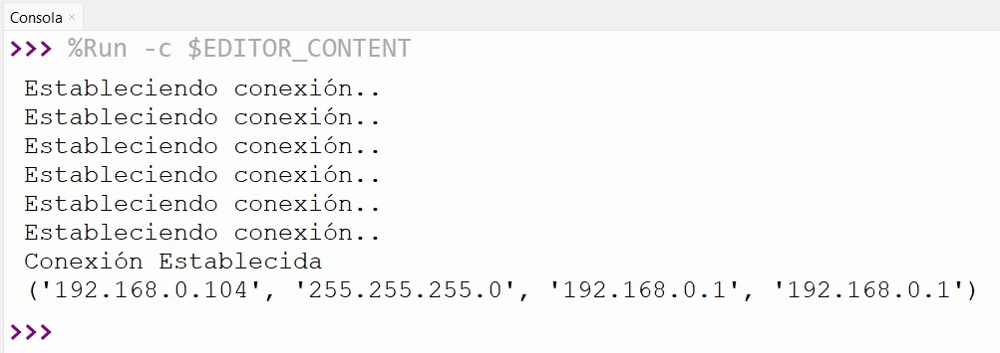  
*Figura 17 - RPico W conectada a la red WiFi*

Felicitaciones, ¡has conectada tu **RPico W** a una red **WiFi**!

También podemos desconectarnos de una red inalámbrica utilizando la instrucción *disconnect()*. En este caso sería de la siguiente manera:

```python
red.disconnect()
```

Una vez que hayas establecido la conexión entre la **RPico W** y la red **WiFi**, tendrás varias opciones disponibles para aprovechar al máximo el potencial de tu placa y llevar a cabo los proyectos de **IoT** que desees.

Gracias a la conexión **WiFi**, podrás acceder de forma remota a tu **RPico W** desde otros dispositivos dentro de la misma red. Esto te permitirá administrar y controlar tu placa de manera remota, sin necesidad de estar físicamente cerca y controlar todos los pines que necesites utilizar de la misma. 