# Clase N°7: IoT & datos en la nube

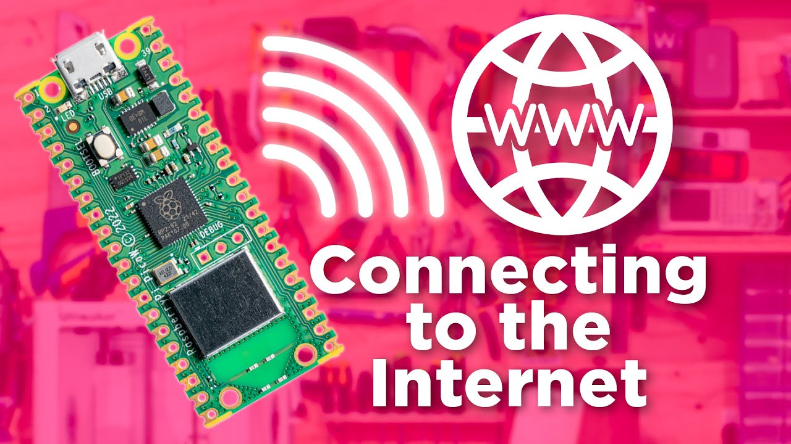  
*Figura 01 - Presentación Clase N°7*

Hemos recorrido un largo camino desde que comenzamos, y ahora estamos listos para adentrarnos en las últimas etapas de nuestra aventura con la **RPIco W**. A lo largo de este curso, hemos adquirido un sólido conocimiento de las principales características de nuestra placa, incluida su conectividad a una red **WiFi**.

En esta última fase, nos enfocaremos en dos aspectos fundamentales que elevarán nuestras habilidades. En primer lugar, aprenderemos a ejecutar un servidor web en nuestra placa. Esto nos brindará la libertad de crear y alojar nuestros propios sitios web, permitiendonos desarrollar proyectos innovadores y personalizados.

En segundo lugar, exploraremos la transmisión de datos recolectados por sensores a una **plataforma IoT** como **Cloud Studio**. Esta integración expandirá nuestras posibilidades y nos permitirá brindar soluciones más completas.

Además, previo a abordar este último tema, hablaremos acerca de la **nube IoT** y las **plataformas IoT**. Analizaremos las ventajas, características y la importancia que tienen ambas en nuestros proyectos.

¡Empecemos!

## 7.1 Primer proyecto IoT con la RPico W: Encendido del LED onboard y medición de la temperatura del RP2040

A modo de ejemplo, vamos a ejecutar un servidor web que nos permitirá controlar el parpadeo del LED incorporado en nuestra placa y monitorear la temperatura del *RP2040*, dos procesos con los que estamos familiarizados (ver *Ejemplo1_LedOnBoard.py* y *Ejemplo9_LecturaTemperaturaRP2040.py* en el repositorio). Este proyecto se considera el equivalente a un "Hola Mundo" para la **RPico W**, ya que nos muestra cómo establecer una conexión a **WiFi**, ejecutar un servidor web HTTP en la placa y controlar los pines *GPIO* correspondientes. 

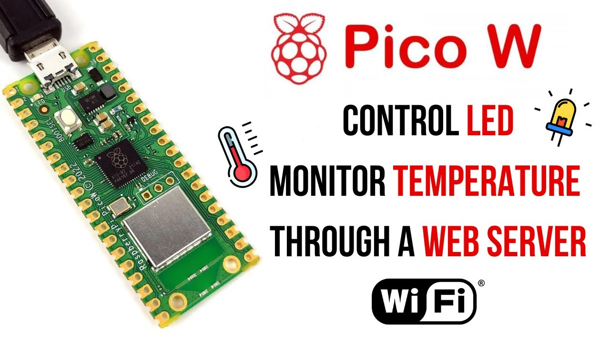  
*Figura 02 - Primer proyecto IoT con la RPico W*

Un servidor web es un software que tiene como objetivo principal responder a las solicitudes de los usuarios y enviarles la información necesaria para mostrar páginas web en sus navegadores. Cuando un usuario realiza una solicitud a través de su navegador, el servidor web procesa esa solicitud y devuelve la página web correspondiente al navegador del usuario para que pueda visualizarla.

Por su parte, un socket, es la forma en que un servidor puede escuchar a un cliente que desea conectarse a él. Los servidores web tienen un socket abierto que espera que tu navegador web establezca una conexión, momento en el cual el contenido de la página web se envía a tu computadora. En este caso, tu servidor será tu **Raspberry Pi Pico W** y el cliente será un navegador web en otra computadora.

Vamos a dividir el proyecto en cuatro etapas: *Conectar la RPico W a una red WiFi*, *Abrir un socket*, *Crear una página Web* y *Desplegar la página web*. La primera parte ya la realizamos en la clase anterior (ver *Ejemplo18_ConexionARedWiFi.py* en el repositorio), y repetimos el código a continuación:

```python
import network
from utime import sleep

ssid = 'CAMBIA POR TU SSID'
password = 'TU PASSWORD'

red = network.WLAN(network.STA_IF)

red.active(True)
red.connect(ssid,password)

while red.isconnected() == False :
    print("Estableciendo conexión..")
    sleep(1)
    
print("Conexión Establecida")
print(red.ifconfig())
```

Con esto, ya podemos pasar a la siguiente etapa: *Abrir un socket*.

En **MicroPython**, debemos utilizar la librería *socket* para abrir un socket. Además de ella, también importaremos la librería *machine* que necesitaremos para ejecutar nuestro código. Incorporando todo esto tenemos:

```python
import network
import socket 
from machine import Pin, ADC
from utime import sleep
```

Para abrir un socket, debemos proporcionar la dirección IP y un número de puerto. Los números de puerto se utilizan en las computadoras para identificar a qué destino deben enviarse las solicitudes. Por ejemplo, el puerto *80* se utiliza comúnmente para el tráfico web, por lo tanto, será el que emplearemos en nuestro caso.

Por su parte, la dirección IP la tomaremos del primer elemento de la tupla que nos devuelve la instrucción *ifconfig()* de la siguiente manera: 

```python
ip = red.ifconfig()[0]
```
Definiremos una tupla llamada *address*, en la que el primer elemento representa la dirección IP, y el segundo elemento corresponde al número de puerto.

```python
address = (ip,80)
```

A continuación, crearemos el objeto *conecction* de la siguiente manera:

```python
connection = socket.socket()
```

Luego utilizaremos el metodo *bind()* para enlazar el socket creado con la dirección que le suministremos en su argumento, y el método *listen(1)*, para establecer el socket en modo de escucha para aceptar conexiones entrantes. El argumento *1* especifica el número máximo de conexiones en cola que se permitirán antes de rechazar nuevas conexiones. En este caso, se está configurando para permitir un máximo de una conexión en cola. Una vez que se alcanza este límite, las conexiones adicionales serán rechazadas hasta que se acepte una de las conexiones existentes o se elimine de la cola. Y por último, colocaremos un *print()* para obtener toda la información del proceso realizado.

```python
connection.bind(address)
connection.listen(1)
print(connection)
```

Para organizar los pasos de *Conectar la RPico W a una red WiFi* y *Abrir un socket*, se definirán dos funciones: *connect()* para la conexión a la red **WiFi** y *open_socket()* para la apertura del socket. El código quedará estructurado de la siguiente manera: 

```python
import network
import socket 
from machine import Pin, ADC
from utime import sleep

ssid = 'CAMBIA POR TU SSID'
password = 'TU PASSWORD'

def connect():
    red = network.WLAN(network.STA_IF)
    red.active(True)
    red.connect(ssid,password)
    while red.isconnected() == False :
        print("Estableciendo conexión..")
        sleep(1)
    
    ip = red.ifconfig()[0]
    print("Conexión Establecida")
    print(red.ifconfig())
    return ip


def open_socket(ip):
    address = (ip,80)
    connection = socket.socket()   
    connection.bind(address)
    connection.listen(1)
    print(connection)
    return connection
```

Hemos incorporado también un *return ip* en la función *connect()* y un *return connection* en la función *open_socket()*. Esto se debe a que incorporaremos una estructura de manejo de excepciones (try/except) de la siguiente manera:

```python
try:
    ip = connect()
    connection = open_socket(ip)
except KeyboardInterrupt :
    machine.reset()
```

Este bloque de código tiene como objetivo establecer una conexión y abrir un socket utilizando una dirección IP obtenida. En caso de que el usuario interrumpa la ejecución presionando Ctrl+C, se reiniciará el programa utilizando la instrucción *reset()* de la biblioteca *machine*. Esta práctica se recomienda especialmente al trabajar con conexiones **WiFi**, ya que permite realizar un reinicio limpio y recuperar la conexión de manera efectiva.

El código completo queda de la siguiente manera (ver *Ejemplo19_ConexionARedWiFiyAbrirSocket.py* en el repositorio):

```python
import network
import socket 
from machine import Pin, ADC
from utime import sleep

ssid = 'CAMBIA POR TU SSID'
password = 'TU PASSWORD'

def connect():
    red = network.WLAN(network.STA_IF)
    red.active(True)
    red.connect(ssid,password)
    while red.isconnected() == False :
        print("Estableciendo conexión..")
        sleep(1)
    
    ip = red.ifconfig()[0]
    print("Conexión Establecida")
    print(red.ifconfig())
    return ip


def open_socket(ip):
    address = (ip,80)
    connection = socket.socket()   
    connection.bind(address)
    connection.listen(1)
    print(connection)
    return connection

try:
    ip = connect()
    connection = open_socket(ip)
except KeyboardInterrupt :
    machine.reset()
```

Ejecuta el código y deberías observar una salida similar como la de la **Figura 03**.

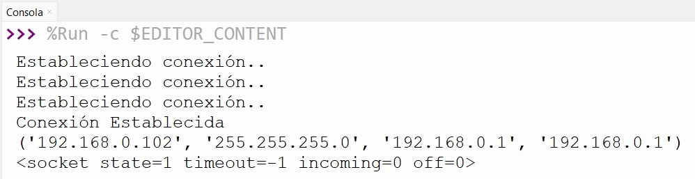  
*Figura 03 - Conexion A Red WiFi y Abrir Socket*

El estado *socket state=1* nos indica que el socket está funcionando correctamente. Con esto, ya podemos continuar con el siguiente paso: 

En este paso, se llevará a cabo la *creación de una página web* que será enviada por el servidor web, que en este caso es tu **RPico W**, hacia un navegador web cliente, que será tu computadora. Para lograrlo, se realizará una prueba con el fin de asegurar que la página se visualice correctamente en el navegador. Una vez realizada esta prueba exitosamente, podremos proceder a agregar el código correspondiente a nuestro programa en **MicroPython**.

En este caso, utilizaremos como ejemplo un archivo HTML muy básico que puede ser ejecutado por cualquier navegador web y proporciona la interactividad necesaria para nuestro proyecto (ver *index.html* en el repositorio). Por supuesto, aquellos con un mayor conocimiento en diseño de páginas pueden realizar las modificaciones que deseen. Aunque **Thonny** no está específicamente diseñado para escribir HTML, se puede utilizar con este propósito.

Si ejecutamos el archivo *index.html*, debería verse en nuestro navegador como en la **Figura 04**.

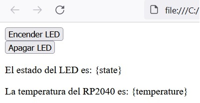  
*Figura 04 - Archivo HTML*

Ahora que tenes nuestra página web funcionando, podemos agregar el código correspondiente a nuestro programa en **MicroPython**. 

Para ello, crearemos la función *webpage()*, la cual recibirá dos argumentos: "temperature" y "state". Estos argumentos representan los datos que deseamos monitorear y controlar respectivamente. Dentro de esta función, incluiremos el contenido del archivo HTML que creamos previamente.

```python
def webpage(temperature, state):
    #Plantilla HTML
```

Pero realizaremos dos pequeñas modificaciones. En primer lugar, incorporaremos la instrucción *html = f"""* al comienzo de la función para insertar el código HTML de manera legible y estructurada dentro de una cadena de texto en **MicroPython**. Y además, agregaremos la instrucción *return str(html)* al final de la función para retornar la cadena HTML desde nuestra función.

```python
def webpage(temperature, state):
    html = f"""
        <!DOCTYPE html>
        <html>
        <body>
        <form action="./lighton">
        <input type="submit" value="Encender LED" />
        </form>
        <form action="./lightoff">
        <input type="submit" value="Apagar LED" />
        </form>
        <p>El estado del LED es: {state}</p>
        <p>La temperatura del RP2040 es: {temperature}</p>
        </body>
        </html>
    """
    return str(html)
```

Almacenaremos esta función en nuestro código de **MicroPython** y se ejecutará en el navegador web de cualquier computadora que se conecte a través de nuestra red. Funcionará de manera similar a una página web almacenada en cualquier otro servidor en el mundo. Sin embargo, es importante tener en cuenta que solo los dispositivos conectados a nuestra red **WiFi** podrán acceder a la página web y controlar la **RPico W**. Con esto, ya hemos concluido el tercer paso.

En el cuarto paso, ejecutaremos el servidor web para permitir que un cliente se conecte a él, y así controlar el LED incorporado en la **RPico W** y leer la temperatura del *RP2040*. 

Comenzaremos creando una función *serve()* que iniciará nuestro servidor web. Esta utilizará el objeto *connection*, definido en la función *open_socket(ip)* como parámetro. 

También es necesario inicializar las variables *{state}* y *{temperature}* en nuestro código HTML. Para ello, estableceremos los valores 'APAGADO' y '0' respectivamente. Además, nos aseguraremos de que el LED esté apagado al iniciar el servidor utilizando la instrucción *LED_onboard.value(0)*.

```python
def serve(connection):
    state = 'APAGADO'
    LED_onboard.value(0)
    temperature = 0
```

Cuando el navegador web solicita una conexión a la **RPico W**, es necesario aceptar dicha conexión y tener conocimiento sobre dicha solicitud realizada. Para ello emplearemos la instrucción *accept()*. 

En **MicroPython**, la instrucción *accept()* nos devuelve una tupla con varios elementos. Al agregar [0] al final, se accede al primer elemento de la tupla, que es el objeto de conexión en sí. Esto permite utilizar el objeto de conexión para realizar operaciones de envío y recepción de datos con el cliente conectado:

```python
client = connection.accept()[0]
```

Los otros elementos de la tupla pueden variar dependiendo de la implementación y de la configuración del servidor, pero comúnmente incluyen información sobre la dirección IP y el número de puerto del cliente, entre otros detalles relacionados con la conexión.

Además, los datos enviados desde el navegador web deben dividirse en fragmentos específicos, en este caso de 1024 bytes. Para ello, empleamos la instrucción *recv(1024)* de la siguiente manera:

```python
request = client.recv(1024)
```

Al llamar a *recv()* en **MicroPython**, se especifica la cantidad máxima de datos que se desea recibir en un solo bloque y la función devuelve los datos recibidos como una cadena de bytes. Esto permite obtener información sobre la solicitud realizada por el navegador web, como los encabezados HTTP, los parámetros de la solicitud y cualquier otro dato enviado por el cliente. Con estos datos, es posible procesar y responder adecuadamente a la solicitud recibida. Por lo tanto, a continuación incluiremos una instrucción *print()* para mostrar esta información.

Además, es necesario mantener el servidor web activo y en escucha constante, por lo que debemos incorporar un bucle *while True:*, junto con un *close()* para cerrar la conexión con el cliente. 

```python
def serve(connection):
    state = 'APAGADO'
    LED_onboard.value(0)
    temperature = 0
    while True:
        client = connection.accept()[0]
        request = client.recv(1024)
        request = str(request)
        print(request)
        client.close()
```

Y también agregaremos la funcion *serve()* al bloque *try/except*. Esto permitirá que cualquier cliente pueda conectarse al servidor.

```python
try:
    ip = connect()
    connection = open_socket(ip)
    serve(connection)
except KeyboardInterrupt :
    machine.reset()
```

A continuación, debemos enviar el código HTML que hemos escrito al navegador web del cliente. Para ello, escribiremos las dos siguientes líneas de código dentro del bucle *While True*:

```python
    html = webpage(temperature, state)
    client.send(html)
```

En este punto, ya tenemos todo lo necesario para comenzar con nuestras primeras pruebas de funcionalidad. Sin embargo, debemos agregar el código correspondiente para encender el LED onboard y medir la temperatura del *RP2040*. En otras palabras, vamos a incorporar a nuestro código, la información que estamos monitoreando y controlando del "mundo exterior". Realizaremos estas tareas una por una.

Aquí se presentan dos opciones: podemos incorporar el código correspondiente a ambas tareas como funciones independientes, o podemos incluirlo directamente en el código que estamos desarrollando. 

Si optamos por la segunda opción, empezaremos por definir un objeto con un nombre descriptivo para referirnos al LED que se encuentra en nuestra **RPico W**. En este caso, utilizaremos el nombre "LED_onboard", ya que fue la denominación que empleamos en la función *serve()* para referirnos al mismo, y que inicializamos como apagado. A continuación, añadiremos la siguiente asignación:

```python
LED_onboard = Pin("LED", Pin.OUT) 
```

El código queda de la siguiente manera:

```python
import network
import socket 
from machine import Pin, ADC
from utime import sleep

ssid = 'CAMBIA POR TU SSID'
password = 'TU PASSWORD'

LED_onboard = Pin("LED", Pin.OUT) 

def connect():
    red = network.WLAN(network.STA_IF)
    red.active(True)
    red.connect(ssid,password)
    while red.isconnected() == False :
        print("Estableciendo conexión..")
        sleep(1)
    
    ip = red.ifconfig()[0]
    print("Conexión Establecida")
    print(red.ifconfig())
    return ip


def open_socket(ip):
    address = (ip,80)
    connection = socket.socket()   
    connection.bind(address)
    connection.listen(1)
    print(connection)
    return connection
    
def webpage(temperature, state):
    html = f"""
        <!DOCTYPE html>
        <html>
        <body>
        <form action="./lighton">
        <input type="submit" value="Encender LED" />
        </form>
        <form action="./lightoff">
        <input type="submit" value="Apagar LED" />
        </form>
        <p>El estado del LED es: {state}</p>
        <p>La temperatura del RP2040 es: {temperature}</p>
        </body>
        </html>
    """
    return str(html)

def serve(connection):
    state = 'APAGADO'
    LED_onboard.value(0)
    temperature = 0
    while True:
        client = connection.accept()[0]
        request = client.recv(1024)
        request = str(request)
        print(request)
        html = webpage(temperature, state)
        client.send(html)
        client.close()

try:
    ip = connect()
    connection = open_socket(ip)
    serve(connection)
except KeyboardInterrupt :
    machine.reset()
```

Al ejecutar este código, debemos ver un mensaje idéntico al de la **Figura 03** en el área de Shell. 

Si hemos seguido todos los pasos correctamente, al ingresar la dirección IP que se muestra en la **Figura 03** en el navegador web de nuestra computadora, podremos ver el HTML creado anteriormente como en la **Figura 05**.

  
*Figura 05 - Ejecución en el Navegador Web*

Y si volvemos al área de Shell, veremos algo como se ilustra en la **Figura 06**:

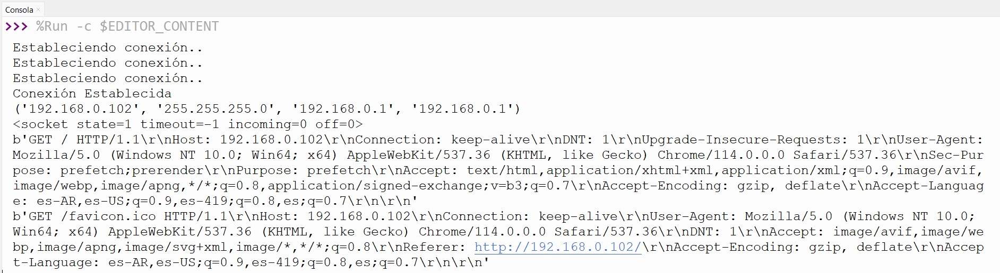  
*Figura 06 - Area de Shell luego de la Ejecución en el Navegador Web*

¿Cuál es la intención de detenernos en esto? Lo siguiente: haz clic en los botones 'Encender LED' y 'Apagar LED' del navegador. En **Thonny** observarás que hay dos salidas nuevas y diferentes en tu área de Shell:

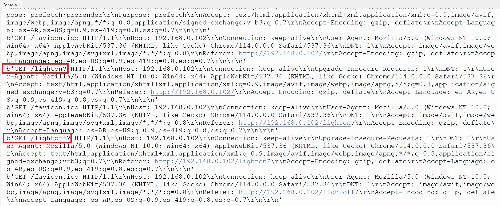  
*Figura 07 - Area de Shell al Ejecutar Botones en el Navegador Web*

Observarás que tienes */lighton?* y */lightoff?* en las solicitudes (GET/). ¡Estas se pueden utilizar para controlar el LED onboard de nuestra **RPico W**!. Incluso, estas mismas solicitudes las veremos en nuestro navegador web como se observa en la **Figura 08**.

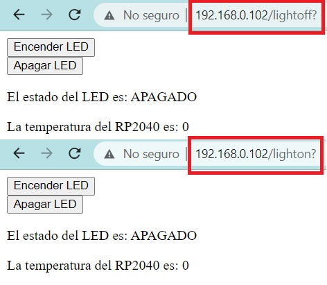  
*Figura 08 - Solicitudes en el Navegador Web*

Para manejar estas solicitudes de forma adecuada, procederemos dividiendo la cadena y obteniendo el primer elemento de dicha división. Si el primer elemento de la división es 'lighton?', encenderemos el LED. En caso de que sea 'lightoff?', lo apagaremos. En algunos casos, es posible que la cadena de solicitud no pueda ser dividida, por lo que resulta conveniente manejar esta situación utilizando un bloque 'try/except'. 

También debemos indicar al usuario de la página web cuál es el estado del LED. Para ello, incorporaremos para caso *state = 'APAGADO'* y *state = 'ENCENDIDO'*

Incorporamos esto en la función *serve()* de la siguiente manera:

```python
def serve(connection):
    state = 'APAGADO'
    LED_onboard.value(0)
    temperature = 0
    while True:
        client = connection.accept()[0]
        request = client.recv(1024)
        request = str(request)
        print(request)
        #Comandar LED onboard
        try:
            request = request.split()[1]
        except IndexError:
            pass
        if request == '/lighton?':
            LED_onboard.value(1)
            state = 'ENCENDIDO'
        elif request =='/lightoff?':
            LED_onboard.value(0)
            state = 'APAGADO'
        
        html = webpage(temperature, state)
        client.send(html)
        client.close()
```

Y ahora, al ejecutar este nuevo código y dirigirnos al navegador web, al hacer clic en los botones, el LED incorporado debería encenderse y apagarse. Además, el texto que indica el estado del LED también debería actualizarse en nuestra página web. Hemos logrado comandar nuestro LED.

Nos resta ahora monitorear la temperatura del *RP2040*. Para ello, recordaremos parte de lo realizado en el *Ejemplo N°9* de la *Clase N°3*. 

Comenzaremos configurando el **ADC** correspondiente y definiremos el *factor de conversión* que utilizabamos anteriormente:

```python
sensor_temp = ADC(4)
factor_conversion = 3.3 / (65535)
```
Y después, realizaremos la lectura del sensor dentro del bucle *While True:* en la función *serve()*, de manera similar a como lo hicimos en la *Clase N°3*:

```python
lectura = sensor_temp.read_u16() * factor_conversion
temperature = 27 - (lectura - 0.706)/0.001721
```

El código completo con estas inclusiones se muestra a continuación (ver *Ejemplo20_PrimerProyectoIoT.py* en el repositorio):

```python
import network
import socket 
from machine import Pin, ADC
from utime import sleep

ssid = 'CAMBIA POR TU SSID'
password = 'TU PASSWORD'

LED_onboard = Pin("LED", Pin.OUT)

sensor_temp = ADC(4)
factor_conversion = 3.3 / (65535)

def connect():
    red = network.WLAN(network.STA_IF)
    red.active(True)
    red.connect(ssid,password)
    while red.isconnected() == False :
        print("Estableciendo conexión..")
        sleep(1)
    
    ip = red.ifconfig()[0]
    print("Conexión Establecida")
    print(red.ifconfig())
    return ip


def open_socket(ip):
    address = (ip,80)
    connection = socket.socket()   
    connection.bind(address)
    connection.listen(1)
    print(connection)
    return connection
    
def webpage(temperature, state):
    html = f"""
        <!DOCTYPE html>
        <html>
        <body>
        <form action="./lighton">
        <input type="submit" value="Encender LED" />
        </form>
        <form action="./lightoff">
        <input type="submit" value="Apagar LED" />
        </form>
        <p>El estado del LED es: {state}</p>
        <p>La temperatura del RP2040 es: {temperature}</p>
        </body>
        </html>
    """
    return str(html)

def serve(connection):
    state = 'APAGADO'
    LED_onboard.value(0)
    temperature = 0
    while True:
        client = connection.accept()[0]
        request = client.recv(1024)
        request = str(request)
        print(request)
        #Comandar LED onboard
        try:
            request = request.split()[1]
        except IndexError:
            pass
        if request == '/lighton?':
            LED_onboard.value(1)
            state = 'ENCENDIDO'
        elif request =='/lightoff?':
            LED_onboard.value(0)
            state = 'APAGADO'
        #Monitorear temperatura del RP2040
        lectura = sensor_temp.read_u16() * factor_conversion
        temperature = 27 - (lectura - 0.706)/0.001721
        
        html = webpage(temperature, state)
        client.send(html)
        client.close()

try:
    ip = connect()
    connection = open_socket(ip)
    serve(connection)
except KeyboardInterrupt :
    machine.reset()
```

Al ejecutar este código, veremos en la pantalla de nuestro navegador algo similar a lo que se muestra en la **Figura 09**. Si colocas tu mano sobre la **RPico W** para aumentar su temperatura y luego actualizas la página web en tu computadora, notarás el cambio en el nuevo valor que se muestra.

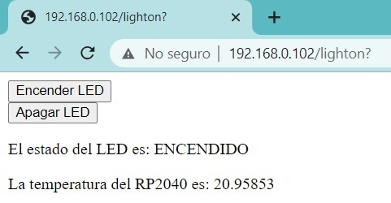  
*Figura 09 - Primer Proyecto IoT Funcionando*

Hemos logrado concretar nuestro primer proyecto de **IoT** utilizando la **RPico W**. Mediante la conexión a una red **WiFi**, la hemos convertido en un servidor web capaz de controlar salidas digitales, como el LED incorporado, y recibir datos de sensores, como el sensor de temperatura del *RP2040*. 

El abanico de posibilidades que se abre ahora es inmenso. Al combinar todo lo que hemos aprendido durante el curso, podemos controlar y monitorear una amplia variedad de dispositivos según nuestras necesidades y preferencias.

Pero esto no termina acá..

## 7.2 Nube IoT

La conexión de dispositivos a una red local, como la que acabamos de realizar, marca el primer paso hacia lo que conocemos como el **Internet de las Cosas**. En sus inicios, los **dispositivos IoT** se conectaban a través de redes locales, lo cual permitía la comunicación y el intercambio de información. Este avance fue el precursor de aplicaciones como el *hogar inteligente* (*smart home*), donde los electrodomésticos pueden ser controlados de forma remota y programados para operar de manera eficiente.

Sin embargo, la verdadera revolución se produjo con la aparición de lo que conocemos como la **Nube IoT** o, en inglés, el **IoT Cloud**.

El concepto de "nube" es familiar para muchos. Se refiere a una red extensa e interconectada de servidores potentes que brinda servicios de almacenamiento y administración de datos a empresas y personas. En el contexto del **IoT**, este concepto también tiene implicaciones similares.

A medida que se incorporaron más **dispositivos IoT** a la red local, se hizo evidente la necesidad de contar con una infraestructura escalable y flexible. La **Nube IoT** cumple precisamente esta función al proporcionar un entorno virtual donde los datos generados por los **dispositivos IoT** pueden almacenarse, procesarse y analizarse de manera eficiente. Esto alivia la carga de procesamiento y almacenamiento en los dispositivos individuales, además de permitir el acceso remoto a los datos desde cualquier lugar y en cualquier momento.

  
*Figura 10 - IoT Cloud*

La combinación entre el **IoT** y la nube, lo que llamamos **Nube IoT**, se produce de la siguiente manera:

1. *Almacenamiento de datos*: Los **dispositivos IoT** generan grandes volúmenes de datos y la nube proporciona un espacio de almacenamiento seguro y escalable para almacenar eficientemente estos datos.

2. *Procesamiento de datos*: La nube permite procesar y analizar los datos recopilados por los **dispositivos IoT**. Utilizando recursos informáticos en la nube, es posible realizar análisis complejos, aplicar algoritmos de aprendizaje automático (machine learning) y obtener información valiosa a partir de los datos recopilados.

3. *Escalabilidad*: La infraestructura de la nube permite escalar fácilmente la capacidad de almacenamiento y procesamiento de acuerdo con las necesidades del ecosistema **IoT**. Esto resulta especialmente útil cuando se manejan grandes volúmenes de datos o cuando se requiere un aumento repentino en la demanda de recursos.

4. Acceso remoto y control: La nube posibilita el acceso y control remoto de los **dispositivos IoT**. Los datos recopilados por los dispositivos pueden enviarse a la nube para su acceso y control desde cualquier ubicación con conexión a Internet.

En la industria actual, hay varias **nubes IoT** reconocidas y ampliamente utilizadas, destacando dos de las más populares: *Azure IoT* de *Microsoft* y *AWS IoT* de *Amazon Web Services (AWS)*. 

Estas dos plataformas ofrecen capacidades avanzadas el almacenamiento y el análisis de datos provenientes de **dispositivos IoT**, como así también de herramientas para el desarrollo de aplicaciones y soluciones relacionadas con la seguridad.

  
*Figura 11 - Nubes IoT más populares*

## 7.3 Plataforma IoT

A medida que nos sumergimos en el campo laboral del **IoT**, surge un concepto de suma importancia: la **plataforma IoT**. Es crucial destacar que **nube IoT** y **plataforma IoT** no son sinónimos, aunque están estrechamente relacionadas. La **nube IoT** se enfoca en el almacenamiento y procesamiento de datos generados por dispositivos conectados, mientras que la **plataforma IoT** brinda un entorno integral para la gestión y control de estos dispositivos.

A pesar de sus metas compartidas, cada una cumple un rol único en el ecosistema **IoT**. La **plataforma IoT** resulta esencial para el desarrollo de soluciones personalizadas y para aprovechar al máximo el potencial de **IoT** en el ámbito empresarial y de negocios, estableciendo una sólida conexión entre ambos.

  
*Figura 12 - Plataforma IoT*

La **nube IoT** ofrece una amplia gama de servicios, como almacenamiento, procesamiento y análisis de datos, destinados a los **dispositivos IoT**. Se trata de un entorno virtual altamente eficiente donde los datos generados por los **dispositivos IoT** pueden almacenarse y procesarse de manera óptima. Además, proporciona escalabilidad, seguridad y flexibilidad para gestionar grandes volúmenes de datos, permitiendo además el acceso remoto a través de Internet.

Por otro lado, una **plataforma IoT** es un conjunto integrado de software, herramientas y servicios que facilita el desarrollo, la implementación y la gestión de soluciones **IoT**. Esta plataforma sirve como base fundamental para conectar, administrar y controlar los **dispositivos IoT**, así como para recopilar, procesar y analizar los datos generados por ellos. Además, una **plataforma IoT** puede ofrecer características adicionales como visualización de datos, automatización e integración con otros sistemas.

Si bien la **nube IoT** desempeña un papel importante dentro de una **plataforma IoT**, al proporcionar la infraestructura necesaria para almacenar y procesar los datos generados por los **dispositivos IoT**, es esencial tener en cuenta que una **plataforma IoT** engloba otras funcionalidades y servicios necesarios para el desarrollo completo de soluciones **IoT**. La **nube IoT** se integra en la **plataforma IoT** como uno de sus componentes clave para almacenar y analizar datos, pero no es la única funcionalidad que ofrece una plataforma completa de **IoT**.

Existe un amplio abanico de **plataformas IoT** en la actualidad, cada una con sus especificaciones y características distintivas. En nuestro curso, utilizaremos [Cloud Studio](https://www.cloud.studio/plataforma-iot-lista-para-usar/).

  
*Figura 13 - Cloud Studio*

**Cloud Studio** ofrece una **plataforma IoT** lista para usar, diseñada para la rápida creación, gestión e implementación de soluciones **IoT**. 

## 7.4 Primeros pasos con Cloud Studio

Lo primero que te vamos a solicitar, es que nos envíes por el canal de **Discord** tu dirección de correo para poder crear una cuenta y que puedas acceder a la plataforma a través de este [enlace](https://gear.cloud.studio/gear/common/login). Serás redirigido a una página de inicio de sesión como la que se muestra a continuación:

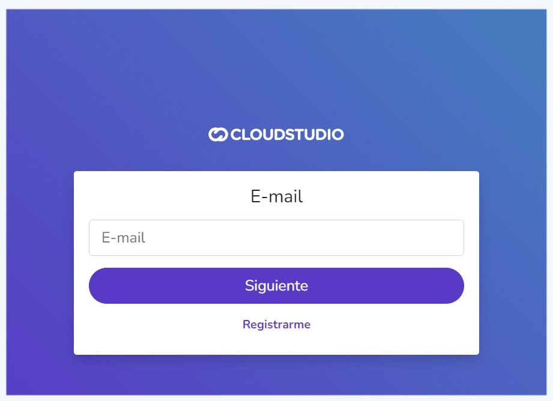  
*Figura 14 - Inicio de Sesión en Cloud Studio*

Una vez que ingreses los datos correspondientes, accederás a la interfaz principal de la plataforma. A continuación, ve a la esquina superior derecha y selecciona la opción "Nueva instalación". Esto abrirá una ventana similar a la que se muestra en la **Figura 15**, donde deberás elegir la opción "Curso de Electrónica para IoT de Humai".

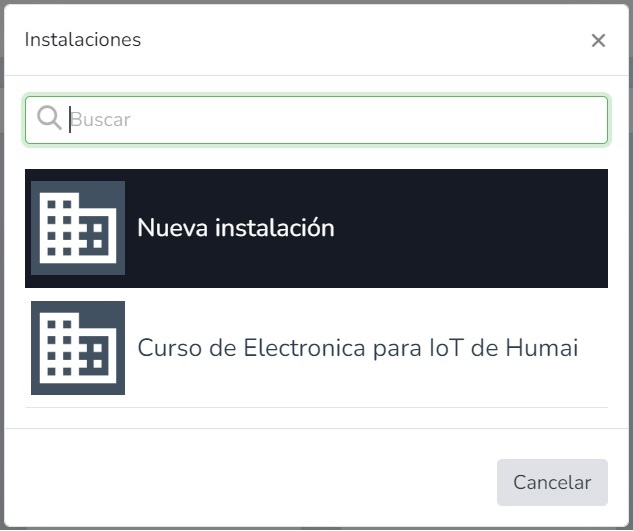  
*Figura 15 - Instalaciones*

Una vez completado este proceso, tendrás todas las herramientas necesarias para comenzar a enviar datos a la plataforma **Cloud Studio**. Esta plataforma te permite acceder a gráficos con valores históricos y actuales de la variable que deseas monitorear.

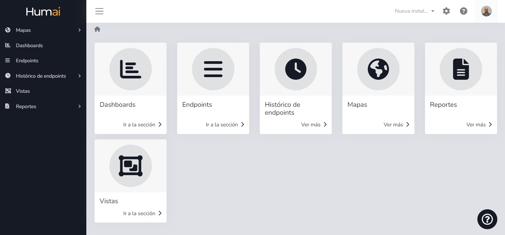  
*Figura 16 - Plataforma de Cloud Studio*

En la próxima clase, realizaremos un ejemplo detallado de cómo transmitir datos a la plataforma. También veremos el enunciado del trabajo final integrador, el cual integrará esto último y todo lo que hemos aprendido durante el curso.

¡Hasta la próxima clase!