# Clase N°8: Trabajo Final Integrador - Monitoreo de Temperatura y Presión Atmosférica

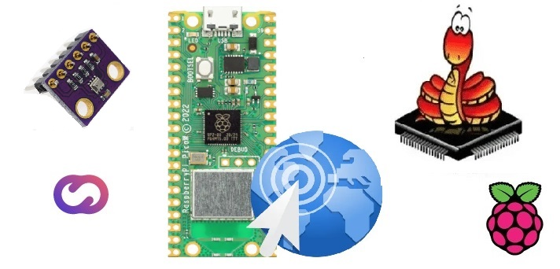  
*Figura 01 - Presentación TFI*

Concluida la etapa donde hemos incorporado los conceptos más importantes para trabajar con nuestra **RPico W**, y con el objetivo de fortalecer los conocimientos adquiridos y promover que lleven a cabo sus propios proyectos, realizaremos un *Trabajo Final Integrador* (*TFI*) que combine las distintas herramientas que hemos aprendido durante el curso.

La propuesta del *TFI* consiste en abordar un problema concreto relacionado con el **IoT**: monitorear dos variables físicas, como la temperatura y la presión atmosférica, mostrar los valores correspondientes en un display, emitir una señal de alerta cuando se alcance un valor específico y crear un dashboard en **CloudStudio** que registre toda la información.

Para lograrlo, desde el curso se propone utilizar el *sensor de temperatura y presión BMP280*, brindando la libertad de elegir la estrategia para completar el *TFI*. Además, en caso de no disponer del *BMP280*, se aceptan otros sensores de variables atmosféricas, como el *DHT11* y *DHT22*.

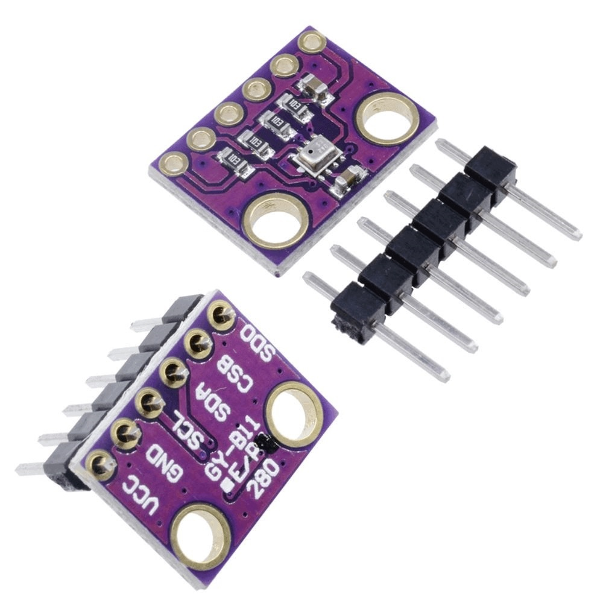  
*Figura 02 - Sensor De Temperatura y Presión BMP280*

Se mencionó brevemente este sensor en la *Clase N°1*, pero en esta clase profundizaremos en su información, y aprenderemos cómo implementarlo en nuestra **RPico W** para crear nuestra propia *estación meteorológica*.

Por otro lado, también mostraremos cómo crear un tablero en **Cloud Studio**, para que posteriormente puedan crear uno propio con los datos recopilados del *BMP280*.

Empecemos!

## 8.1 Sensores de variables meteorológicas

Si deseamos crear una *estación meteorológica*, es fundamental disponer de sensores que nos suministren la información climática necesaria, como temperatura, humedad, presión, radiación, velocidad y dirección del viento, entre otros.

En el mercado, existe una amplia gama de sensores que permiten llevar a cabo esta tarea. Estos sensores pueden medir individualmente una variable específica o ser capaces de medir varias variables al mismo tiempo, como temperatura y humedad, temperatura y presión, o incluso temperatura, presión y humedad.

Entre todos los modelos disponibles en la actualidad, nos centraremos específicamente en aquellos que sean compatibles con nuestra **RPico W**. Cuando hablamos de *compatibilidad*, nos referimos a los sensores que pueden proporcionarnos la información recolectada en un *tipo de dato* interpretable por nuestra **RPico W**, como así también a los requisitos de alimentación necesarios para su correcto funcionamiento.

Es fundamental tener presente que un sensor es un dispositivo diseñado para detectar magnitudes físicas y generar una respuesta en forma de señal eléctrica, la cual se expresa típicamente en términos de voltaje. Los *sensores analógicos* producen una señal analógica que está directamente relacionada con lo que perciben, mientras que los *sensores digitales* generan una señal digital basada en lo que captan en su entrada. Esto se ilustra en la **Figura 03**.

  
*Figura 03 - Señal de Salida de los Sensores*

En la *Clase N°3*, mencionamos un *sensor analógico* de temperatura muy conocido, el [LM35](https://www.ti.com/lit/ds/symlink/lm35.pdf). También empleamos el sensor de temperatura interno del *RP2040*, que es otro ejemplo de sensor *analógico*. Observamos el proceso de lectura del valor medido y las conversiones necesarias. Es importante resaltar que siempre utilizamos las **entradas analógicas** de nuestra **RPico W**, las cuales están conectadas a los **ADCs** de nuestra placa.

  
*Figura 04 - LM35*

Por otro lado, también podemos emplear un *sensor digital* como lo son el [DHT11](https://www.mouser.com/datasheet/2/758/DHT11-Technical-Data-Sheet-Translated-Version-1143054.pdf), o su variante más costosa y con mejores prestaciones, el [DHT22](https://www.sparkfun.com/datasheets/Sensors/Temperature/DHT22.pdf).

  
*Figura 05 - Sensor DHT11 y DHT22*

Estos sensores, además de medir la temperatura y la humedad relativa del ambiente, nos proporcionan una *salida digital*, volviéndolos más fáciles de implementar, ya que no necesitamos recurrir a las **entradas analógicas** de nuestro microcontrolador para realizar la lectura del valor medido. Además, son muy populares gracias a sus buenas prestaciones, bajo costo y fácil implementación.

Ambos modelos poseen en su estructura un conjunto de sensores de temperatura y humedad que ofrecen una salida en *formato digital*. La transmisión de las mediciones a otros circuitos, como nuestra **RPico W**, se realiza mediante una *interfaz serie*. Recordemos, esto implica que todos los datos se envían secuencialmente a través de una misma señal, uno detrás del otro.

Sin embargo, ninguno de los dos sensores utiliza un *protocolo de comunicación estándar* como **I2C** o **SPI** para la transmisión de datos. En su lugar, implementan *su propio protocolo de comunicación*, que está detallado en la hoja de datos correspondiente. Afortunadamente, este protocolo es sencillo y se puede implementar fácilmente utilizando los pines digitales de nuestra **RPico W** junto con las librerías adecuadas de **MicroPython** desarrollados para estos sensores.

No obstante, en la práctica es más común encontrar sensores que emplean *protocolos de comunicación estándar* como
los que fueron explicados en la *Clase N°4*: **I2C**, **SPI**, o ambos, brindando la posibilidad de elegir el protocolo deseado. Un ejemplo de este tipo de sensores es el *módulo sensor de presión barométrica BMP280* que utilizaremos en este *TFI*.

De hecho, el [BMP280](https://www.bosch-sensortec.com/media/boschsensortec/downloads/datasheets/bst-bmp280-ds001.pdf) es una versión mejorada de su predecesor, el [BMP180](https://media.digikey.com/pdf/Data%20Sheets/Bosch/BMP180.pdf). Además de ofrecer mejoras en sus prestaciones, una diferencia significativa es la compatibilidad del **BMP280** con los protocolos de comunicación **I2C** y **SPI**. Esto brinda una mayor flexibilidad en las opciones de comunicación. En contraste, el **BMP180** solo es compatible con el protocolo **I2C**.

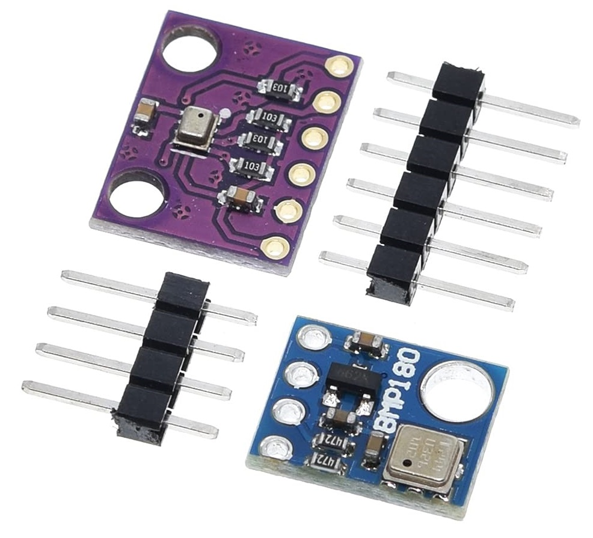  
*Figura 06 - BMP280 y BMP180*

Las diferencias más significativas entre ambos sensores se destacan en la **Figura 07**. Se observa que el **BMP280** presenta mejoras en términos de resolución, la mencionada compatibilidad con el protocolo **SPI** y un tamaño más compacto en comparación con el **BMP180**. También se aprecia que ambos modelos pueden alimentarse con el *3V3(OUT)* de nuestra **RPico W**.

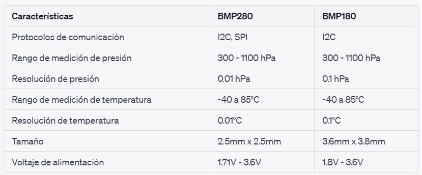  
*Figura 07 - Diferencias entre BMP180 y BMP280*

Por último, si deseamos mencionar un sensor que es capaz de medir tres variables, podemos hacer referencia al [BME280](https://www.bosch-sensortec.com/media/boschsensortec/downloads/datasheets/bst-bme280-ds002.pdf).Este sensor es capaz de medir la presión atmosférica, la temperatura y la humedad relativa de forma simultánea.

La elección del sensor dependerá de diversos factores, entre los cuales se encuentran las necesidades específicas del proyecto y el presupuesto disponible.

## 8.2 Módulo sensor BMP280: pinout y conexión 

Hemos revisado las principales especificaciones del **BMP280**, por lo tanto, ahora procederemos a conocer las características del *módulo sensor BMP280*. Es importante recordar que cuando nos referimos a un "módulo", en este caso, el "módulo sensor", estamos hablando del propio componente que se encuentra en una placa junto con los componentes externos adicionales necesarios para su conexión con un microcontrolador.

Si tomamos el módulo en nuestras manos, podremos observar en la serigrafía de la placa la designación de cada pin, lo que comúnmente llamamos *pinout* y que se muestra también en la **Figura 08**.

  
*Figura 08 - Pinout BMP280*

Independientemente del *protocolo de comunicación* que utilicemos, es importante conectar los pines de alimentación *VCC* y *GND* del módulo sensor a los pines *3V3(OUT)* y *GND* de nuestra **RPico W** respectivamente. Por otro lado, la conexión de los cuatro pines restantes dependerá específicamente del *protocolo de comunicación* que utilicemos.

En el caso de utilizar **SPI**; *SCL* es la señal de clock *SCK*, mientras que *CSB* es la señal de selección de esclavo *CS*. Y como el módulo actúa como esclavo, *SDA* será la señal de *MOSI* y *SDO* será la señal de *MISO*. Por otro lado, si empleamos **I2C**, *SCL* representa la señal de clock *SCK* y SDA representa la señal de datos. Todo esto se resume en la **Figura 09**.

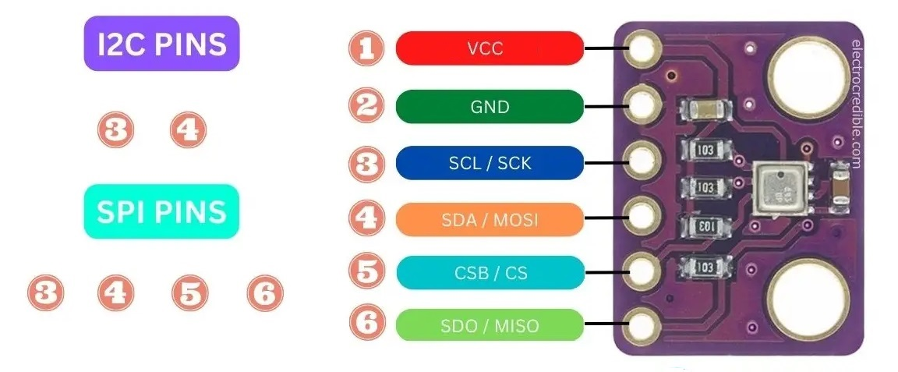  
*Figura 09 - Protocolos BMP280*

En nuestro caso, utilizaremos **I2C** para transmitir los datos desde el *módulo sensor BMP280* hacia la **RPico W**. Recordemos que la placa posee dos buses **I2C** (*I2C0* e *I2C1*), y pueden usarse uno o ambos, y que son varios los pines físicos disponibles para ello, como se muestra en la **Figura 10**.

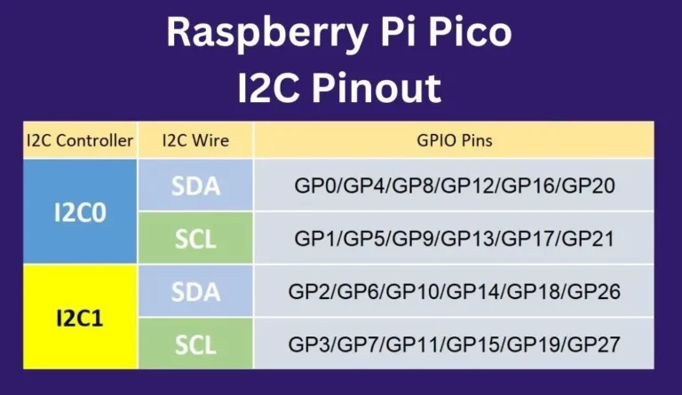  
*Figura 10 - Pines I2C disponibles en la RPico*

Puntualmente, utilizaremos el bus *I2C0*, y los pines *GP0* y *GP1* de la **RPico W** para conectarlos a los correspondientes *SDA* y *SCL* del módulo.

Pero, como mencionamos en la *Clase N°4*, es importante tener en cuenta que cada componente que conectamos al bus **I2C** tiene una dirección única. Cada mensaje u orden que transmitimos a través del bus lleva anexa esta dirección para indicar cuál de los muchos posibles dispositivos es el receptor del mensaje. Por lo tanto, es necesario conocer o determinar la dirección del dispositivo a partir de su hoja de datos, o también podríamos utilizar el método *scan()* que estudiamos también en la *Clase N°4*.

Si nos dirigimos a la hoja de datos del [BMP280](https://www.bosch-sensortec.com/media/boschsensortec/downloads/datasheets/bst-bmp280-ds001.pdf), puntualmente en la sección *I2C interface*, veremos que la dirección del dispositivo sigue un formato de número binario de 7 bits: 111011x.

Los 6 bits más significativos (MSB) de la dirección del dispositivo son fijos, mientras que el último bit es modificable por el valor del pin *SDO*. Si conectas el pin *SDO* a *GND*, la dirección de esclavo será 1110110 (0x76). Si conectas el pin SDO a *3V3(OUT)*, la dirección de esclavo será 1110111 (0x77), que coincide con la dirección **I2C** del **BMP180**. Es importante tener en cuenta que el pin *SDO* no debe dejarse sin conexión, ya que esto no definirá la dirección **I2C** del dispositivo.

En nuestro caso, vamos a emplear la dirección 0x76, por lo que conectaremos *SDO* a *GND*.

Otro dato importante que nos proporciona la hoja de datos, es que el pin *CSB* debe estar conectado a *3V3(OUT)* para seleccionar la interfaz **I2C**. 

El resultado final de esta conexión se muestra en la **Figura 11**.

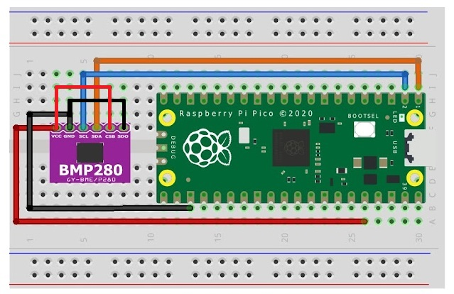  
*Figura 11 - Esquema De Conexión BMP280*

Si has realizado las conexiones de forma correcta, al ejecutar el código *Ejemplo12_ObtenerDirecciónI2C.py* deberías ver el mismo mensaje que se muestra en la **Figura 12**.

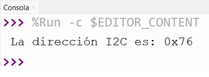  
*Figura 12 - Comprobación dirección I2C*

## 8.3 Módulo sensor BMP280: instalación de librería

A continuación, procederemos a descargar la librería particular del sensor **BMP280** para **MicroPython**, utilizando el mismo método que empleamos para la librería del display LCD en la *Clase N°4*.

Para ello, debemos dirigirnos al siguiente repositorio [MicroPython-BMP280](https://github.com/dafvid/micropython-bmp280), y luego descargar la librería como se muestra en la **Figura 13**, haciendo clic en *Code* y luego en *Download ZIP*.

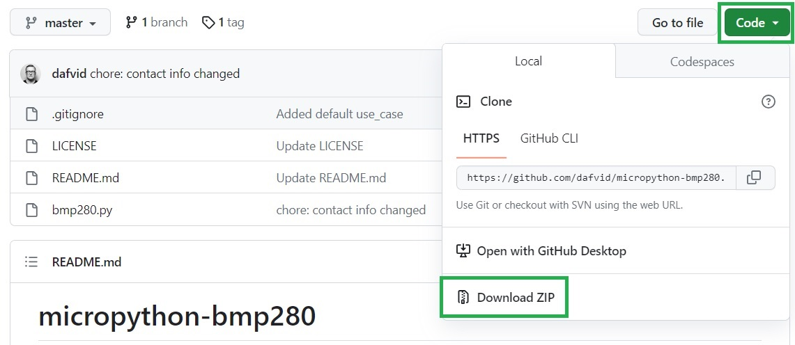  
*Figura 13 - Descarga librería MicroPython-BMP280*

Una vez descargada y descomprimida la librería, encontrarás cuatro archivos, uno de los cuales tiene la extensión *.py*. Para utilizar correctamente la librería, debes transferir el archivo *bmp280.py* al *Sistema de Archivos* de la **RPico W**. Puedes hacer esto fácilmente utilizando **Thonny** con la placa conectada.

Primero nos dirigimos a *Visualización* y luego a *Archivos*. En el panel que se abrirá a la izquierda de nuestra pantalla, buscamos la dirección donde están los archivos descargados. Una vez allí, hacemos click derecho en *bmp280.py* y seleccionamos *Subir a/* como se aprecia en la **Figura 14**.

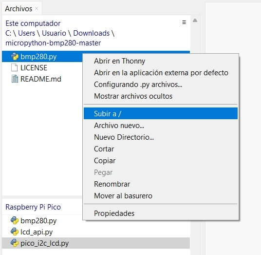  
*Figura 14 - Cargar librería del BMP280 a la RPico*

Si esto fue realizado de forma correcta, debemos encontrar el archivo *bmp280.py* en la pestaña inferior *Raspberry Pi Pico* como se muestra en la **Figura 14**.

Para utilizar esta librería, debemos importarla de la siguiente manera:

```python
from BMP280 import *
```

## 8.4 Módulo sensor BMP280: lectura de valores

Ahora vamos a explorar el proceso de lectura de los valores proporcionados por el *módulo del sensor BMP280* utilizando la librería *BMP280.py*. En este caso, utilizaremos la configuración de conexión mostrada en la **Figura 11**, con el pin *SDO* conectado a *GND*. Por supuesto, tienen la libertad de utilizar los pines que prefieran.

Y ahora a programar. Comencemos por conectar la **RPico W** a nuestra computadora, ejecutar **Thonny** y hacer clic en el área de Script para cargar las librerías habituales, incorporando ahora la librería *BMP280.py*:

```python
from machine import Pin, I2C
from utime import sleep
from bmp280 import *
```

Luego debemos definir el **bus I2C** que utilizaremos de nuestra **RPico W**. Para ello, repetimos lo hecho anteriormente en la *Clase N°4*, partiendo de las siguientes definiciones:

```python
scl = Pin(1)
sda = Pin(0)
freq = 400000
```

Esto nos permite especificar los pines que utilizaremos para la comunicación, recordando que solo precisamos de dos señales en el **protocolo I2C**. Y por último establecemos velocidad de transmisión, en este caso, en su máximo posible de 400[kHz] (400000 [Hz]).

Y luego construimos el objeto *i2c* de la siguiente manera:

```python
bus = I2C(0,sda=sda,scl=scl,freq=freq)
```

El primer argumento indica el bus **I2C** de la **RPico W** que utilizaremos; *I2C0*. El segundo y tercer argumento deben ser un objeto pin, que especifique cuál de ellos se utilizara para *SCL* (GP1) y *SDA* (GP0) respectivamente. Y el cuarto argumento, debe ser un número entero que establezca la velocidad máxima para *SCL*.

A continuación, procederemos a crear un objeto "bmp280" para poder leer los datos provenientes de nuestro sensor. Como parámetro, debemos proporcionarle la información correspondiente al **bus I2C** y la dirección **I2C** establecida para el **BMP**.

```python
bmp = BMP280(bus, addr = 0x76)
```
Y ahora, para acceder a los valores que provienen del *módulo sensor BMP280*, debemos emplear *.temperature* y *.pressure*, que nos devolverán la temperatura en *Grados Celsius* y la presión atmosférica en *Pascal* respectivamente. Almacenaremos estos valores en dos variables, quedando todo de la siguiente manera:

```python
temperature = bmp.temperature
pressure = bmp.pressure
```

Agregaremos un bucle *while True* que permita realizar esto de forma continua:

```python
while True:
    temperature = bmp.temperature
    pressure = bmp.pressure
```

Para finalizar, se imprimen los valores obtenidos en la consola, utilizando la función *print()*. Dentro de ella, colocaremos entre comillas la cadena de caracteres que indique la magnitud que estamos midiendo, acompañada del valor correspondiente. Además, añadiremos un retraso para facilitar la lectura en la consola.

```python
    print('Temperatura: ',temperature,' °C')
    print('Presión: ',pressure,' Pa')
    print() # Renglón en blanco
    sleep(2)
```

El código completo queda de la siguiente manera (ver *Ejemplo21_LecturaBMP280* en el repositorio)

```python
from machine import Pin, I2C
from utime import sleep
from bmp280 import *

scl = Pin(1)
sda = Pin(0)
freq = 100000

bus = I2C(0,sda=sda,scl=scl,freq=freq)

bmp = BMP280(bus, addr = 0x76)

while True:
    temperature = bmp.temperature
    pressure = bmp.pressure
    print('Temperatura: ',temperature,' °C')
    print('Presión: ',pressure,' Pa')
    print() # Renglón en blanco
    sleep(2)
```
Cuando ejecutes el código, verás un mensaje como el de la **Figura 14** en tu consola.

  
*Figura 15 - Lectura sensor BMP280*

Puedes verificar el correcto funcionamiento realizando cambios en las condiciones del entorno cercano al sensor, siempre teniendo el cuidado necesario para no dañar ningún componente. Por ejemplo, acerca la boca de un termo que contenga agua caliente y notarás que el vapor que se libera modificará ambos valores del sensor.

## 8.5 TFI - Actividad N°1: Visualizar datos medidos en el display LCD1602

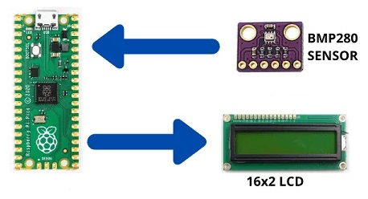  
*Figura 16 - TFI - Actividad N°1*

Ahora les toca a ustedes...

Como primera actividad, deben incorporar el *display LCD1602* al circuito anterior, y visualizar allí los datos de temperatura y presión. Recuerden que disponen de 16 caracteres por renglón.

Importante: El símbolo de grados "°" es un caracter especial y se escribe en el display mediante la instrucción *lcd.putstr(chr(223))*.

## 8.6 TFI - Actividad N°2: Actuar

  
*Figura 17 - TFI - Actividad N°2*

En la segunda actividad, agregarán una función de alarma a su pequeña *estación meteorológica*, la cual se activará cuando se cumpla una determinada condición. Para lograr esto, deben añadir un componente adicional al circuito de la Actividad N°1, ya sea un *LED* para una alarma lumínica o el *módulo buzzer* para una alarma sonora. La elección de qué tipo de alarma implementar queda a su criterio.

La condición a cumplir es que se accione cuando la temperatura sea superior a 40[°C].

¡Manos a la obra!

## 8.7 Ejemplo de creación de un tablero en CloudStudio: monitoreo de la temperatura del RP2040

En la clase anterior, presentamos **Cloud Studio**, una **plataforma IoT** que cuenta con todos los recursos necesarios para ofrecer una solución integral a los profesionales que trabajan en el ámbito de **IoT**. Esta plataforma se centra en simplificar la gestión de **dispositivos IoT**, así como en la creación de notificaciones y alarmas, y en la elaboración de paneles de visualización para mostrar información en tiempo real sobre el rendimiento y estado de los **dispositivos IoT**.

Realizaremos un ejemplo práctico para ilustrar esto. Comenzaremos enviando datos a la plataforma **Cloud Studio** a través del protocolo **HTTP**. Esto nos permitirá generar gráficos que representen los valores históricos y actuales de la variable que deseamos monitorear.

A modo de ejemplo, y siguiendo la dinámica que hemos utilizado a lo largo del curso, trabajaremos en el monitoreo de la temperatura del *RP2040* en nuestra **RPico W**.

En **MicroPython**, la librería *urequests* es utilizada para realizar solicitudes HTTP a través de internet. Esta librería permite a dispositivos que utilizan **MicroPython**, como la **RPico W**, interactuar con servicios web y acceder a recursos remotos, como **Cloud Studio** en este caso.

La librería *urequests* simplifica el proceso de envío de solicitudes GET, POST, PUT o DELETE a URLs específicas, así como el manejo de respuestas y datos recibidos. Al utilizar *urequests*, los dispositivos con recursos limitados pueden aprovechar la funcionalidad de comunicación con servicios web de manera eficiente y efectiva.

Para comenzar, importaremos la librería *urequests* junto con otras librerías necesarias para nuestro código:

```python
import network
import urequests as req
from machine import Pin, ADC
from utime import sleep
```

Incluiremos ahora las líneas de código necesarias para establecer la conexión de la **RPico W** a una red **WiFi** (ver *Ejemplo18_ConexionARedWiFi.py* en el repositorio). Para organizar los pasos de manera eficiente, siguiendo el enfoque utilizado en la clase anterior, definiremos una función llamada *connect()* para manejar la conexión a la red **WiFi**, e implementaremos una estructura de manejo de excepciones *try/except* para gestionar posibles errores (ver *Ejemplo20_PrimerProyectoIoT.py* en el repositorio).

También incluiremos la configuración del **ADC** para el sensor de temperatura, junto con el *factor de conversión* que hemos estado utilizando a lo largo del curso. Posteriormente, agregaremos las líneas de código necesarias para realizar la lectura efectiva del sensor.


```python
import network
import urequests as req
from machine import Pin, ADC
from utime import sleep

ssid = 'CAMBIA POR TU SSID'
password = 'TU PASSWORD'

sensor_temp = ADC(4)
factor_conversion = 3.3 / (65535)

def connect():
    red = network.WLAN(network.STA_IF)
    red.active(True)
    red.connect(ssid,password)
    while red.isconnected() == False :
        print("Estableciendo conexión..")
        sleep(1)
    
    ip = red.ifconfig()[0]
    print("Conexión Establecida")
    print(red.ifconfig())
    return ip

try:
    ip = connect()
except KeyboardInterrupt:
    machine.reset()
```

Ahora procederemos a integrar nuestro código con la plataforma **Cloud Studio**. Para ello, comenzaremos por utilizar los datos que te proporcionamos por correo y que son fundamentales para interactuar con una **plataforma IoT** y acceder a sus servicios: el *access_token* y los *endpointID*.

El *access_token* es una credencial de seguridad que se utiliza para autenticar y autorizar el acceso a la **plataforma IoT**. Por otro lado, los *endpoints* son las direcciones a través de las cuales le podemos enviar solicitudes a la API de la **plataforma IoT**. Estos endpoints se representan como URLs específicas que indican la ubicación de un servicio o recurso en la plataforma.

En este caso, para monitorear la temperatura del *RP2040* de nuestra **RPico W**, definiremos lo siguiente:

```python
# Esto se obtiene de la wiki de Cloud Studio
temperature_url = 'https://gear.cloud.studio/services/gear/DeviceIntegrationService.svc/UpdateTemperatureSensorStatus'

access_token = 'COLOCA TU ACCESS TOKEN'

internal_temperature = 'COLOCA EL ENDPOINT ID CORRESPONDIENTE AL SENSOR INTERNO DE TEMPERATURA'
```

A continuación, crearemos el *payload*, que representa el conjunto de datos que se envían en una solicitud **HTTP**. En este caso, se estructurará de la siguiente manera:

```python
payload_temperature = {
	'accessToken': access_token, # Se repite en todos los payloads que realicemos
	'endpointID': internal_temperature, # Es un numero entero y se modifica de acuerdo al sensor que utilicemos
	'temperatureCelsius': 30 # Valor inicial aleatorio
}
```

Y ahora definiremos una función *enviar_datos()* que realice efectivamente la tranmisión de los datos a la plataforma **Cloud Studio**:

```python
def enviar_datos(ip):
    while True:
        # Realizo la lectura correspondiente
        lectura = sensor_temp.read_u16() * factor_conversion
        temperature = 27 - (lectura - 0.706) / 0.001721
        
        # La agrega el dato al payload
        payload_temperature['temperatureCelsius'] = temperature
        print('Tomando temperatura del sensor interno', payload_temperature['temperatureCelsius'])
        
        # Le envío al servidor y aguardo la respuesta del servidor (200)
        response = req.post(temperature_url, json = payload_temperature)
        print('Respuesta del servidor: ', response.status_code)
        response.close()
        sleep(1)
```

Además, incorporaremos la función *enviar_datos()* dentro de la estructura de manejo de excepciones *try/except* para gestionar posibles errores.

```python
try:
    ip = connect()
    enviar_datos(ip)
except KeyboardInterrupt:
    machine.reset()
```

El código completo queda de la siguiente manera (ver *Ejemplo22_EnvíoDeDatosaCloudStudio.py* en el repositorio):

```python
import network
import urequests as req	
from machine import Pin, ADC
from utime import sleep

ssid = 'CAMBIA POR TU SSID'
password = 'TU PASSWORD'

sensor_temp = ADC(4)
factor_conversion = 3.3 / (65535)

# Esto se obtiene de la wiki de Cloud Studio
temperature_url = 'https://gear.cloud.studio/services/gear/DeviceIntegrationService.svc/UpdateTemperatureSensorStatus'

access_token = 'COLOCA TU ACCESS TOKEN'

internal_temperature = 'COLOCA EL ENDPOINT ID CORRESPONDIENTE AL SENSOR INTERNO DE TEMPERATURA'

payload_temperature = {
	'accessToken': access_token, # Se repite en todos los payloads que realicemos
	'endpointID': internal_temperature, # Es un numero entero y se modifica de acuerdo al sensor que utilicemos
	'temperatureCelsius': 30 # Valor inicial aleatorio
}

def connect():
    red = network.WLAN(network.STA_IF)
    red.active(True)
    red.connect(ssid,password)
    while red.isconnected() == False :
        print("Estableciendo conexión..")
        sleep(1)
    
    ip = red.ifconfig()[0]
    print("Conexión Establecida")
    print(red.ifconfig())
    return ip

def enviar_datos(ip):
    while True:
        # Realizo la lectura correspondiente
        lectura = sensor_temp.read_u16() * factor_conversion
        temperature = 27 - (lectura - 0.706) / 0.001721
        
        # La agrega el dato al payload
        payload_temperature['temperatureCelsius'] = temperature
        print('Tomando temperatura del sensor interno', payload_temperature['temperatureCelsius'])
        
        # Le envío al servidor y aguardo la respuesta del servidor (200)
        response = req.post(temperature_url, json = payload_temperature)
        print('Respuesta del servidor: ', response.status_code)
        response.close()
        sleep(1)
        
try:
    ip = connect()
    enviar_datos(ip)
except KeyboardInterrupt:
    machine.reset()
```

Si el dato se envió correctamente, deberíamos ver el código HTTP *200* en tu consola, como se muestra en la **Figura 18**. Esto confirma una comunicación adecuada con la plataforma.

  
*Figura 18 - Comunicación efectiva de los datos a Cloud Studio*

Concluido este paso, estaremos listos para dirigirnos a **Cloud Studio** y comenzar a trabajar con los dashboards. Como se mencionó en la clase anterior, debes [iniciar sesión](https://gear.cloud.studio/gear/monitor/) con las credenciales que te hemos proporcionado por correo electrónico.

Una vez que hayas completado este proceso, contarás con todas las herramientas necesarias para comenzar a enviar datos a la plataforma **Cloud Studio**. Para este *TFI*, utilizaremos unos tableros que hemos preparado para que puedas comenzar a enviar tus datos. Para acceder a ellos, dirígete a la parte izquierda de la pantalla principal y selecciona la opción "Dashboards", tal como se muestra en la **Figura 19**.

  
*Figura 19 - Opción Dashboards en Cloud Studio*

Encontrarás un tablero que consta de 6 widgets de dos tipos distintos (valor en tiempo real y registro histórico de valores), diseñados para hacer un seguimiento de tres variables diferentes: *Temperatura interna*, *Temperatura del sensor BMP280* y *Presión del sensor BMP280*.

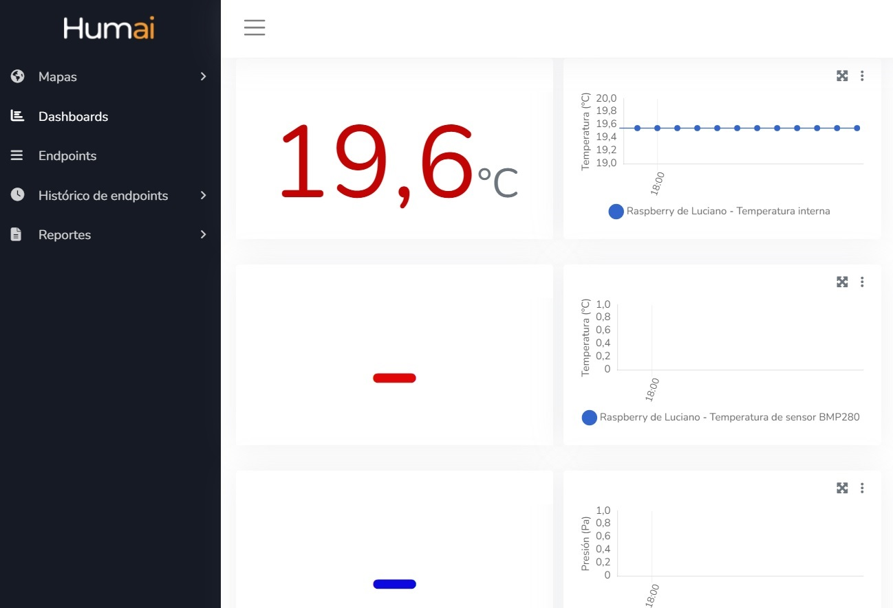  
*Figura 20 - Dashboards preparados para el TFI*

Para realizar esto, deberás incluir tu *access_token* y los *endpointID* correspondientes como se explicó anteriormente. 

El *access_token* te será proporcionado por correo electrónico junto con los *endpointID* específicos de cada variable. 

Ejecuta el código *Ejemplo22_EnvíoDeDatosaCloudStudio.py* utilizando tu *access_token* y el *endpoint* correspondiente al sensor de temperatura interna. De esta manera, comenzarás a visualizar los datos recolectados en los dos widgets superiores, tal como se muestra en la **Figura 20**.
 
## 8.8 TFI - Actividad N°3: Comunicar los datos del BMP280 a CloudStudio 

  
*Figura 21 - TFI - Actividad N°3*

Como tercera y última actividad, tendrás que ser capaz de enviar los datos recolectados por el *módulo sensor BMP280* a la plataforma **Cloud Studio**, de manera que los seis widgets del tablero estén monitoreando información. Recuerden utilizar los *endpoints* correspondientes para cada caso y generar los *payloads* adecuados para cada uno.

En este caso, para monitorear la presión del *modulo sensor BMP280* conectado a nuestra **RPico W**, definiremos lo siguiente:

```python
# Esto se obtiene de la wiki de Cloud Studio
pressure_url = 'https://gear.cloud.studio/services/gear/DeviceIntegrationService.svc/UpdatePressureSensorStatus'

access_token = 'COLOCA TU ACCESS TOKEN'

sensor_pressure = 'COLOCA EL ENDPOINT ID CORRESPONDIENTE AL SENSOR DE PRESION'
```

A continuación, crearemos el *payload*, que representa el conjunto de datos que se envían en una solicitud **HTTP**. En este caso, se estructurará de la siguiente manera:

```python
payload_pressure = {
	'accessToken': access_token, # Se repite en todos los payloads que realicemos
	'endpointID': sensor_pressure, # Es un numero entero y se modifica de acuerdo al sensor que utilicemos
	'pressurePascals': 101300 # Valor inicial aleatorio
}
```

## 8.9 Condiciones de entrega del TFI

Para poder aprobar el *TFI*, la entrega debe contener todo lo realizado para resolver las actividades N°1, N°2 y N°3. Esto incluye:

1. Foto del circuito implementado.
2. Código completo realizado.
3. Un video corto que demuestre el correcto funcionamiento de la *estación meteorológica*, donde se aprecie la visualización de los datos, el accionamiento de la alarma cuando se alcanza la condición fijada y el correcto funcionamiento del tablero realizado.

Fecha máxima de entrega: 28/07/23. Se atienden consultas de forma permanente por el canal de Discord. 