# Clase N°1: Introducción

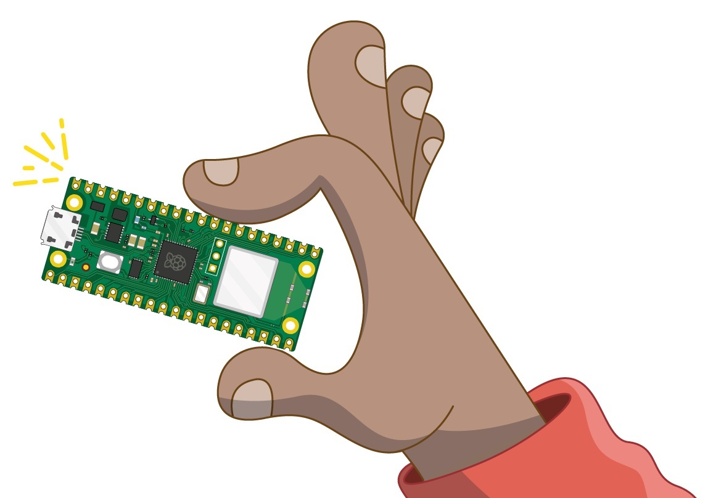  
*Figura 01 - Presentación*

¡Hola! ¡Bienvenidos! Este curso ha sido realizado para todos aquellos que deseen realizar su primer acercamiento al mundo de los **sistemas embebidos** y a **Internet de las cosas** (*IoT*, por sus siglas en inglés, *Internet of Things*), utilizando para ello la **Raspberry Pi Pico W** cómo placa de desarrollo y **MicroPython** como lenguaje de programación.

Está orientado para los alumnos que realizaron el curso *"Introducción a la programación con Python"* o que poseen conocimientos básicos en dicho lenguaje.  

No se requieren conocimientos básicos de electrónica, ya que se introducen los conceptos necesarios a medida que se desarrolla el curso, de tal manera que puedan ser comprendidos por todos.

Mediante un enfoque práctico van a aprender a instalar, utilizar y programar la placa de desarrollo **Raspberry Pi Pico W**, desde la puesta en marcha hasta la construcción de proyectos propios.

En esta primera clase, conoceremos los conceptos básicos acerca de **sistemas embebidos** e **IoT**, y la relación entre ellos. También, descubriremos las características de nuestra **Raspberry Pi Pico W** y haremos un recorrido por los componentes electrónicos que utilizaremos a lo largo del curso. Y por último, aprenderemos a instalar **MicroPython** y **Thonny** para poder programar nuestra placa.

Empecemos!

## 1.1 Sistemas embebidos e IoT. Primeras definiciones.

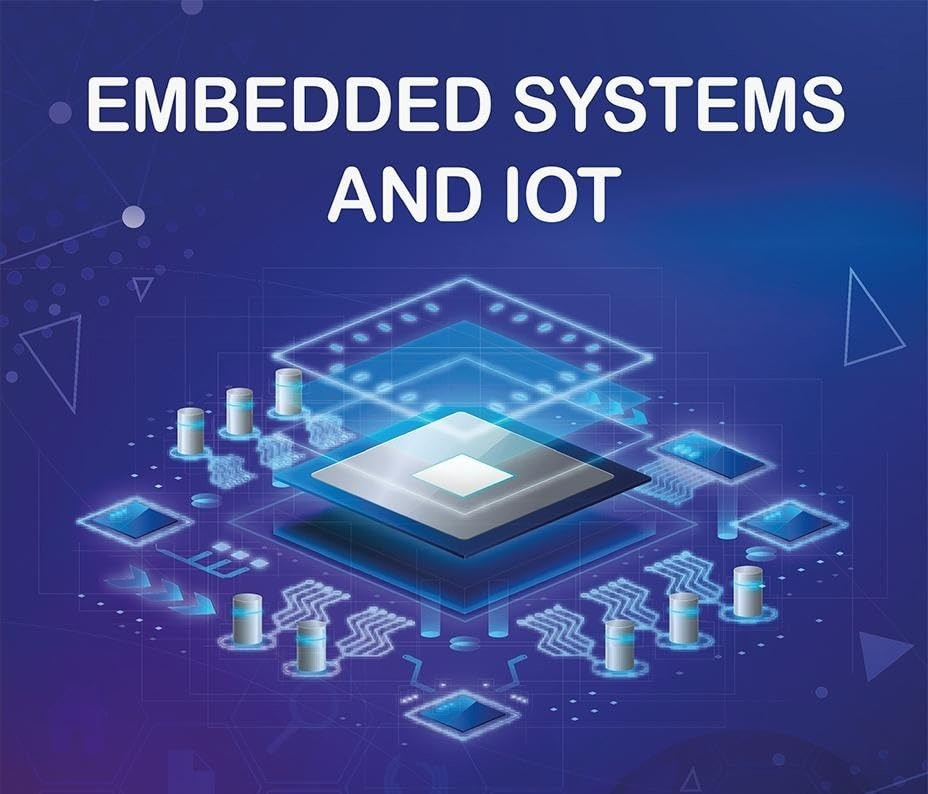  
*Figura 02 - Sistemas Embebidos e IoT*

Comenzaremos este curso hablando sobre dos temas que tuvieron su origen separado uno de otro, pero que en la actualidad es muy difícil concebir uno sin incluir al otro; estamos hablando de **sistemas embebidos** y de **Internet de las Cosas**. 

Los **sistemas embebidos** son dispositivos electrónicos de tamaño muy reducido y construidos con materiales resistentes, que son capaces de realizar tareas en tiempo real, con el objetivo de cubrir necesidades específicas como control de movimiento y medición de variables, entre otras funciones que iremos charlando a lo largo del curso.

Al contrario de lo que ocurre con las computadoras convencionales que están diseñados para cubrir una amplia gama de necesidades, los **sistemas embebidos** se diseñan para cubrir *necesidades específicas*.

De forma general, un **sistema embebido** está compuesto por un microprocesador o un microcontrolador programable, capaz de realizar y ejecutar las funciones asignadas y grabadas en su memoria a través un software. Para ello, es necesario que cuenten con una cierta cantidad de memoria, ya sea una memoria RAM o ROM, para almacenar las instrucciones. Y también cuentan con puertos de entradas y salidas para manejar la comunicación con el exterior, y que son capaces de soportar la conexión de distintos sensores y actuadores. 

Estas son las únicas características que tienen en común los **sistemas embebidos**, pero cada uno de ellos en *particular* presenta *sus propias características* o *especificaciones*, debido a la variedad de aplicaciones y marcas que existen actualmente.

Por su parte, a los dispositivos electrónicos comercialmente disponibles que cuentan con estos componentes (un microcontrolador o un microprocesador, memoria y puertos de entrada y salida) situados sobre una *placa de circuito impreso* (o *PCB*, por sus siglas en inglés, *Circuit Printed Board*), y que son adecuados para crear todo tipo de proyectos, es lo que llamamos *placa de desarrollo*. En nuestro caso, es la **Raspberry Pi Pico W**.

Originalmente, los **sistemas embebidos** solo contaban con recursos limitados en cuestión de comunicación que solo permitían interactuar con el entorno cercano. Con el paso de los años, ha sido posible dotar de *comunicación inalámbrica* a los **sistemas embebidos**, y con esto, de conexión a internet. Por lo tanto, los **sistemas embebidos** ahora forman parte de un ecosistema aún mayor como es el **Internet de las cosas**.

El **Internet de las Cosas** es un concepto relativamente nuevo, pero que ha ido creciendo rápidamente en los últimos años, y se refiere *a todos los dispositivos electrónicos que están conectados a internet y que son capaces de comunicarse entre ellos e intercambiar información*. 

  
*Figura 03 - IoT y Raspberry Pi*

Al inicio, el **Internet de las Cosas** no era concebido como una red donde los dispositivos se comunicarán entre ellos sin necesidad de un humano de por medio, ya que, aunque la comunicación era entre dispositivos, había un humano de por medio notificando o instruyendo al dispositivo sobre qué hacer. Hoy en día, la incorporación de los **sistemas embebidos** al **Internet de las Cosas** ha permitido que *los dispositivos sean capaces de compartir e intercambiar información sin la necesidad de un humano*.

Debido a esto, los *protocolos de comunicación* han sufrido una revolución para el **Internet de las Cosas** como así también para los **sistemas embebidos**, ya que estos, además de permitir la comunicación de forma segura entre dispositivos que se encuentran en el ecosistema **IoT**, deben ser ligeros para que puedan ser implementados en **sistemas embebidos**.

En este curso, trabajaremos con la placa de desarrollo **Raspberry Pi Pico W**, y su unión con el **Internet de las Cosas**, y veremos cómo los *protocolos de comunicación* juegan un papel clave dentro de todo esto.

## 1.2 ¿Qué son *Raspberry Pi Pico* y *Raspberry Pi Pico W* ?

Sin dudas, han escuchado hablar de *Raspberry Pi*. Junto con *Arduino*, constituyen las dos plataformas de desarrollo de proyectos electrónicos más conocidas del mercado. Si bien el objetivo del curso no es ahondar en las diferencias, similitudes, ventajas y desventajas de ambas plataformas, si es necesario mencionar que ambas se benefician de la importante comunidad de desarrolladores que publican sus proyectos.

*Raspberry Pi* es ampliamente conocida por sus *Computadoras de Placa Única* (o *SBC*, por sus siglas en inglés, *Single-Board Computer*). A lo largo de los años, han lanzado varios modelos de su equipo inicial *Raspberry Pi* (A, B, 2B, 3B+, 4B, Zero, entre otros). Todos ellos basados en distintos modelos de un *SOC* (*System On a Chip*, *sistema en un chip*) desarrollado por la firma *Broadcom*.

La lista de los productos disponibles se encuentra detallada en el siguiente link [Raspberry Pi Foundations Products](https://www.raspberrypi.com/products/). Donde se destaca su *SBC* más potente (y cara por supuesto...): *Raspberry Pi 4B* que utiliza como *SOC* el *Broadcom BCM2711B0*, cuyo CPU es un *ARM Cortex-A72* de 64 bits con cuatro núcleos a 1,5[GHz].

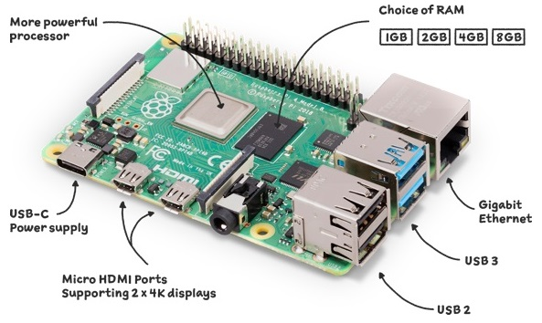  
*Figura 04 - Raspberry Pi 4B*
 
Pero a principios de 2021, *Raspberry Pi* sorprendió al mercado al lanzar su placa más pequeña; la ***Raspberry Pi Pico***. Con la particularidad adicional que está basado en un *SOC* desarrollado por ellos; el *RP2040*.
 
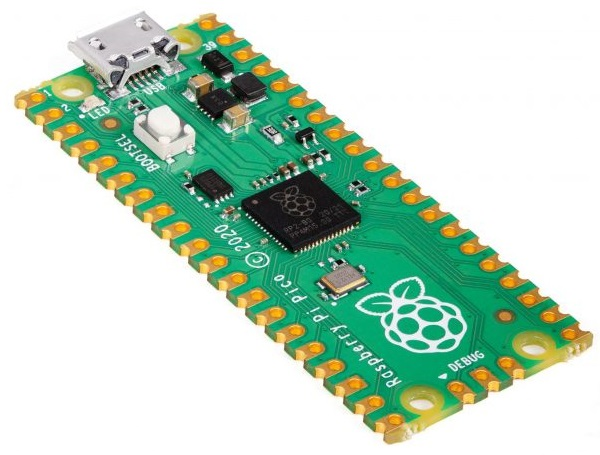  
*Figura 05 - Raspberry Pi Pico*
 
La ***Raspberry Pi Pico*** es un cambio radical con respecto a las *Pi* anteriores, porque no es un miniordenador que ejecuta un sistema operativo basado en Linux, sino que es una *Placa de Desarrollo Basada en Microcontrolador* (*Microcontroller Based Development Board*), por lo cual carece de cualquier tipo de puerto de conexión (Ethernet, HDMI, etc.) y de conectividad inalámbrica (Wi-Fi o Bluetooth). En lugar de ello, incluye un conjunto de pines que nos permite trabajar sobre el *RP2040*, y solo cuenta con un puerto micro-USB que nos permite conectarla a nuestra PC para programarla.

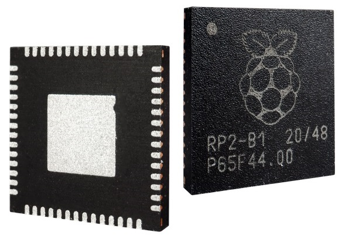  
*Figura 06 - RP2040*
 
Las placas de *Raspberry Pi* siempre se han destacado por su facilidad de uso, lo que les ha ganado un lugar importante en el mercado. La misma filosofía se extiende a la *Pico*, que cuenta con herramientas de programación muy sencillas, y tiene soporte oficial para **MicroPython**, la versión optimizada para poder ejecutarse en microcontroladores del lenguaje de programación *Python*.

  
*Figura 07 - Logo MicroPython*

Estas características, sumado a su muy bajo costo (U$S 4), la convierten en una excelente opción para aquellos que deseen adentrarse en el mundo de la *Informática Física*, ya que permite un sinfín de aplicaciones que integren sensores, actuadores, displays y otros módulos; ya sean para desarrollo de proyectos maker, recreativos y hasta profesionales.

Sin embargo, es evidente que presenta una limitación importante al momento de llevar a cabo determinados proyectos: no ofrece conectividad Wi-Fi. Es por ello, que en junio de 2022, *Raspberry Pi* lanza el modelo **Raspberry Pi Pico W**, que presenta los mismos atributos que el **Raspberry Pi Pico** pero incorpora Wi-Fi a la placa.

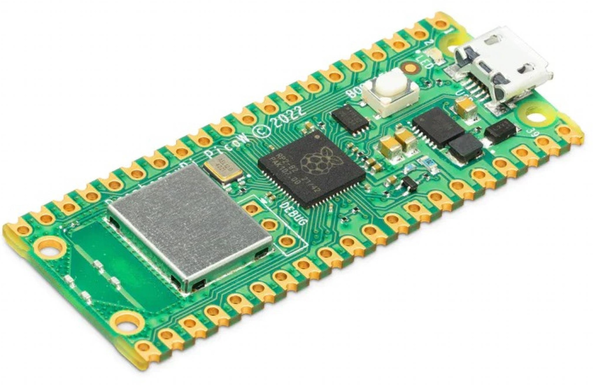  
*Figura 08 - Raspberry Pi Pico W*

La conectividad Wi-Fi es posible gracias a la incorporación del chip *CYW43439* de la firma *Infineon* (el encapsulado gris de la **Figura 08**) y una antena que se encuentra integrada al PCB. A nivel de programación, el funcionamiento es el mismo que la **Raspberry Pi Pico**, pero esta nueva característica amplía el abanico de aplicaciones y desarrollos que podemos realizar, pero fundamentalmente convierte a la **Raspberry Pi Pico W** en una placa ideal para integrarse a proyectos vinculados a **Internet de las Cosas** debido a su tamaño, precio (U$S 6), bajo consumo de energía y compatibilidad con Wi-Fi.

## 1.3 ¿Qué puedo hacer con Raspberry Pi Pico W (RPico W)?

  
*Figura 09 - Ilustración RPico W*

La **Raspberry Pi Pico W**, además de abrirle las puertas a muchos principiantes al mundo de la electrónica y los **sistemas embebidos**, debido a que se trata de una plataforma de desarrollo amigable e intuitiva, es de gran utilidad también para los profesionales experimentados. 

Es importante aclarar que la **RPico W** no está diseñada para reemplazar a las versiones anteriormente mencionadas de *Raspberry Pi*, que es una clase diferente de dispositivo como ya fue especificado. La mayor diferencia de la **RPico W** con respecto a todas las demás es que no estamos ante una "mini PC", sino ante un microcontrolador. Esta pequeña placa no cuenta con un sistema operativo que la gobierne: simplemente ejecuta las instrucciones que le pidamos, que proceden de un ordenador desde el cual las lanzamos (como una PC u otra *Raspberry Pi*) o que residen en la propia memoria de la placa.

Con esas especificaciones, queda claro que las prestaciones son mucho más limitadas que las de las modernas *Raspberry Pi 4B*, y es que de hecho su orientación es también muy distinta: la idea es aprovecharla para proyectos vinculados al control de operaciones domésticas e industriales, como así también para tareas relacionadas a **IoT**.

Deteniéndonos puntualmente en la amplia variedad de proyectos vinculados a **Internet de las cosas**, podemos mencionar:

1. *Monitorización del clima*: La **RPico W** permite recopilar datos de sensores de temperatura, humedad y presión atmosférica y enviarlos a una plataforma de **IoT** en la nube para su análisis y visualización.

2. *Control de luces y electrodomésticos*: Podemos controlar dispositivos domésticos como luces, enchufes inteligentes y sistemas de aire acondicionado.

3. *Seguimiento de mascotas*: Podemos crear un collar inteligente que pueda rastrear la ubicación de nuestra mascota, supervisar su actividad física y enviar alertas a nuestro teléfono si se aleja demasiado.

4. *Sistema de seguridad en el hogar*: Permite diseñar un sistema de seguridad en el hogar que pueda detectar la presencia de intrusos y enviar alertas a nuestro teléfono.

Estos son solo algunos ejemplos de proyectos que se pueden realizar con la **RPico W**. En este curso, haremos un recorrido por las principales características de esta placa, realizando la conexión de distintos dispositivos, con el objetivo de exponer su potencialidad. Además, existen muchos proyectos para la **RPico W** en internet, ya que considerando su precio, su desempeño y velocidad, es sin duda una opción muy interesante para todo tipo de aplicaciones. 

## 1.4 Conociendo nuestra Raspberry Pi Pico W

  
*Figura 10 - Conociendo la RPico W*

### 1.4.1 Especificaciones

Los diversos componentes y las características de una placa electrónica conforman lo que se conoce como *Especificaciones*, las cuales nos proporcionan información útil a la hora de comenzar a trabajar con nuestra placa. Estas especificaciones pueden parecer confusas al principio y son de carácter muy técnico, pero no es necesario que las comprendas por completo para utilizar la *RPico W*.

Como ya fue mencionado, *RPico W* está basado en un *SOC* desarrollado por *Raspberry Pi Foundations*; el *RP2040*. Este cuenta con un CPU denominado *ARM Cortex M0+* de 32 bits con doble núcleo a 133[MHz] con una SRAM de 264[kB] integrada. La información completa y detallada de este microcontrolador se encuentra publicada aquí: [RP2040 Datasheet](https://datasheets.raspberrypi.com/rp2040/rp2040-datasheet.pdf)

Un resumen de las especificaciones que más nos interesan para este curso es el siguiente:

1. Microcontrolador RP2040
2. SRAM de 264[kB]
3. Memoria FLASH externa de 2[MB]
4. Puerto micro-USB 1.1 (que sirve de alimentación y para cargar nuestros programas)
5. Pinout de 40 pines:  
    5.1. 26 Pines GPIO (*General Purpose Input/Output*)  
    5.2. 2 Pines SPI (*Serial Peripheral Interface *)  
    5.3. 2 Pines I2C (*Inter-Integrated Circuit*)  
    5.4. 2 Pines UART (*Universal Asynchronous Receiver-Transmitter*)  
    5.5. 3 Pines ADC de 12 bits (*Analogue-to-Digital Converter*)  
    5.6. 16 Pines PWM (*Pulse-Width Modulation*)  
    5.7. 8 Pines PIO (*Programmable Input/Output*)
6. Chip *Infineon CYW43439* para conectividad inalámbrica Wi-Fi 802.11 b/g/n
    
Para mayor detalle, la documentación completa de la **RPico W** se encuentra en el siguiente link: [Raspberry Pi Pico W Datasheet](https://datasheets.raspberrypi.com/picow/pico-w-datasheet.pdf)

Este modelo mantiene la compatibilidad de pines con la *RPico* (modelo sin conectividad inalámbrica), por lo que la asignación externa de pines no cambia, algo que resulta muy importante si deseamos migrar proyectos de una placa a otra.

### 1.4.2 Partes

En la **Figura 11** se muestra la **RPico W** como se ve desde arriba (lo que se denomina *Top Layer*). Veremos a los laterales unas secciones de color dorado, que llamamos *pines*, y son los encargados de proporcionar la conexión de nuestro microcontrolador *RP2040* al mundo exterior.

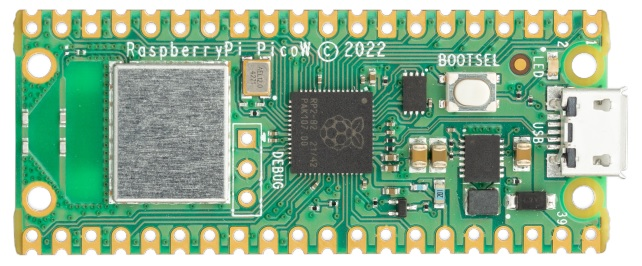  
*Figura 11 - Top Layer RPico W*

Estos pines, que se muestran con detalle en la **Figura 12**, son muy similares a los pines que encontramos en cualquier *Raspberry Pi* tradicional, con la diferencia que estos ya cuentan con unos pines metálicos soldados. En la **RPico W** esto no ocurre y tiene su porqué. Si miramos los bordes de los pines, veremos unos pequeños cortes circulares o muescas, que conforman lo que se conoce como "*castellated holes*". El objetivo es permitir que la **RPico W** se pueda colocar encima de otras placas de circuito impreso mediante soldadura, sin necesidad de colocar pines metálicos físicos, lo que ayuda a mantener baja la altura y hace que el proyecto terminado sea más pequeño. Si compramos un dispositivo u otra placa lista para usar junto con la **RPico W**, es muy probable que utilicemos estos cortes.

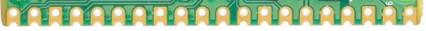  
*Figura 12 - Castellated Holes RPico W*

En la **Figura 13** se muestra a modo de ejemplo, y con otra placa que no es la **RPico W**, como se realiza este proceso.

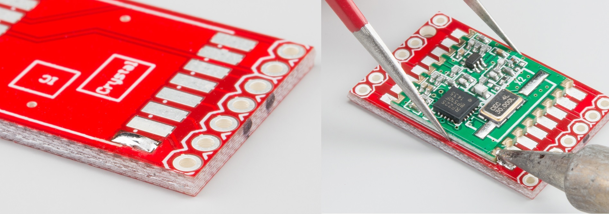
*Figura 13 - How To Solder Castellated Holes*

Pero en este curso, usaremos los orificios que se encuentran justo hacia adentro de esos cortes circulares para soldar unos pines macho de 2,54[mm] (el mismo que utilizan las *Raspberry Pi* tradicionales). Al soldarlos hacia abajo, podemos colocar nuestra **RPico W** en una protoboard, haciendo que podamos conectarla y desconectarla, facilitándonos los distintos proyectos que llevemos a cabo.

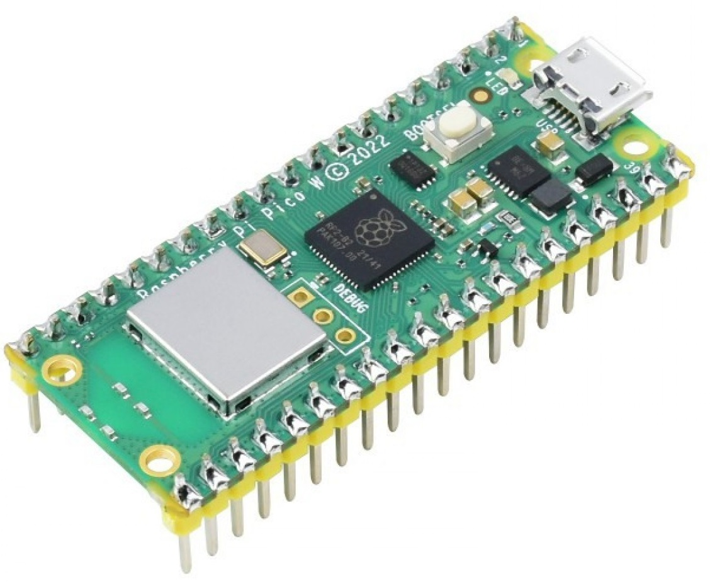  
*Figura 14 - RPico W Con Pines Soldados*

Si continuamos recorriendo nuestra placa, encontraremos el *RP2040* en el centro como se ilustra en la **Figura 15**, el puerto micro-USB en la parte superior con un led a su izquierda, y levemente abajo encontraremos un pulsador denominado BOOTSEL (abreviatura de *BOOT SELECTION*, *selección de arranque*). Este permite cambiar nuestra **RPico W** entre dos modos de inicio cuando se enciende por primera vez. Usaremos el *BOOTSEL* más adelante, cuando preparemos nuestra placa para programar con **MicroPython** (**Figura 16**).

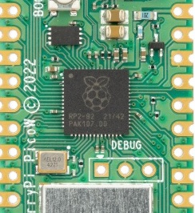  
*Figura 15 - RP2040 en la RPico W*

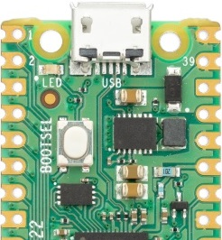  
*Figura 16 - Parte Superior RPico W*

En la parte media de la **RPico W**, levemente por debajo del *RP2040*, encontraremos tres agujeros acompañados de la palabra "DEBUG" encima como se muestra en la **Figura 17**. Estos están diseñados para depurar, o encontrar errores, en programas que se ejecutan en la **RPico W**, usando una herramienta especial llamada "Depurador". No abordaremos este tema en el curso, pero pueden encontrarlo útil a medida que escriban programas más complejos.

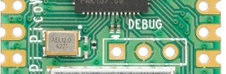  
*Figura 17 - Parte Media de la RPico W*

Y por último, en la parte inferior de la placa, encontraremos el Chip *Infineon CYW43439* para conectividad Wi-Fi y la antena necesaria para ello, impresa en la misma placa (lo que se denomina *On-Board Antenna*).

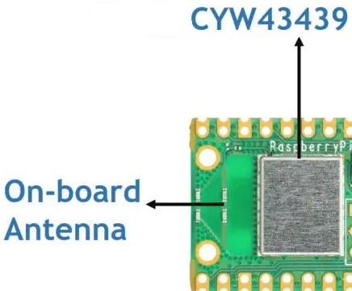  
*Figura 18 - Parte inferior de la RPico W*

Si giramos nuestra **RPico W**, veremos que está escrita. Esto se conoce como *Capa de serigrafía* (*Silk-screen Layer*) y etiqueta cada uno de los pines con su función principal. Verás cosas como *GP0*, *GND*, etc., que se utilizan como referencia. Pero no podremos verla cuando la **RPico W** se inserte en la protoboard, por lo que nos guiaremos con el *pinout* que veremos en la sección siguiente.

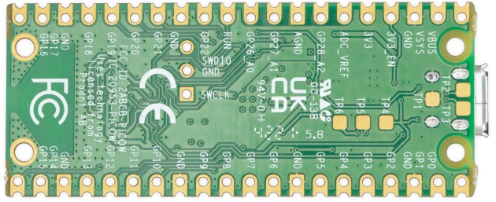  
*Figura 19 - Bottom Layer RPico W*

Por último, notarás que hay cuatro agujeros más grandes que no componen el pinout de la **RPico W**, son en realidad orificios de montaje. Están diseñados para conectar nuestra placa de forma permanente usando tornillos, pernos y/o hasta incluso carcazas plásticas.

### 1.4.3 Pinout

Ya mencionamos que la **RPico W** se comunica con el hardware que le conectemos (sensores, actuadores, displays, etc.) a través de una serie de pines (40 en total) que denominamos *pinout* y que se detalla en la **Figura 20**.

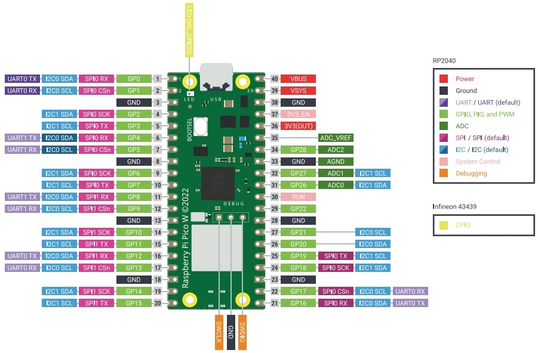  
*Figura 20 - Pinout RPico W*

La mayoría de estos pines funcionan como *Pines de Entrada/Salida de Propósito General* (o *GPIO*, por sus siglas en inglés, *General Purpose Input/Output*), lo que significa que pueden programarse para actuar como entrada o salida (algo que veremos con detalle en la siguiente clase). Podemos identificar estos pines con la sigla *GP* y contabilizan un total de 26. 

Además, visualizarán pines que son de alimentación como *VBUS*, *VSYS* y *3V3(OUT)*; otros que funcionan como tierra eléctrica para nuestras conexiones denotados como *GND*, y un pin de habilitación identificado como *3V3_EN*.

La **RPico W** expone 26 de los 30 pines *GPIO* que posee el *RP2040*, enrutándolos a través de los pines que posee en sus laterales. No todos los pines disponibles en el *RP2040* se muestran en los pines de la **RPico W**, razón por la cual hay una brecha en la numeración entre el pin *GP22* y el *GP26*. 

Algo a destacar, y que veremos con detalle más adelante, es que los pines *GP0* a *GP22* son sólo digitales, mientras que los pines *GP26*, *GP27* y *GP28* se pueden usar como *GPIO* digitales o como entradas de *Convertidor Analógico a Digital* (o *ADC*, por sus siglas en inglés,*Analogue-to-Digital Converter*).

Los pines *GP23*, *GP24*, *GP25* y *GP29* se utilizan para funciones internas de la placa y no son accesibles al usuario.

La mayoría de los pines *GP* también ofrecen una funcionalidad secundaria (seleccionable desde software), para los dispositivos que requieren protocolos de comunicación *SPI*, *I2C* o *UART* para su funcionamiento. Estas funciones adicionales, se visualizan también en la **Figura 20** y las iremos activando durante el desarrollo del curso.

### 1.4.4 Comercialización

**Raspberry Pi Pico** y **Raspberry Pi Pico W** componen lo que se denomina *Raspberry Pi Pico family* y se comercializan de forma individual en un empaquetado plástico antiestático proveniente de un reel de 480 unidades.

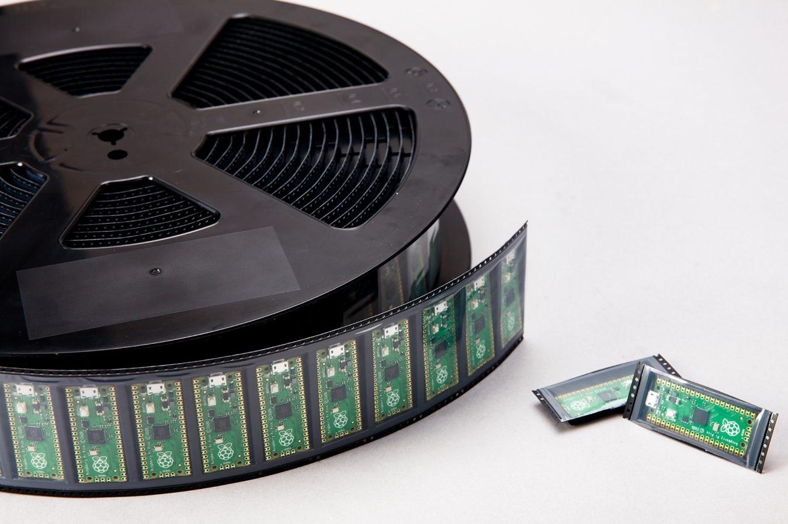  
*Figura 21 - RPico family reel*

Actualmente, además de los mencionados, se comercializan también los modelos **Raspberry Pi Pico H** y **Raspberry Pi Pico WH**, con precios de U$S5 y U$S7 respectivamente. La única diferencia de ellos radica en que el modelo *H* ya está equipado con 40 pines macho pre-soldados y un conector *JTAG* de 3 pines para el "DEBUG".

  
*Figura 22 - RPico family*

## 1.5 Descripción de los materiales a utilizar

La **RPico W** es solo una de las partes que utilizaremos durante el curso, el resto de ellas son componentes electrónicos que controlaremos desde los pines *GP* de nuestra placa. Existen cientos de componentes disponibles, pero la mayoría de los proyectos que se llevan a cabo con **sistemas embebidos** incluyen los que pedimos para este curso. A continuación realizaremos un repaso de ellos.

### 1.5.1 Placa de prueba o Protoboard

Nos facilita considerablemente los proyectos que llevemos a cabo. En lugar de tener un montón de componentes separados que deben conectarse con cables, una protoboard nos permite insertar y retirar componentes fácilmente, y conectarlos a través de pistas de metal que están ocultas debajo de su superficie. A los costados veremos unas secciones que están marcadas con color rojo y celeste, estás se utilizan para la distribución de la energía a lo largo de la protoboard.

  
*Figura 23 - Protoboard*

### 1.5.2 Cable Dupont Macho-Macho(M2M) y Macho-Hembra(M2F) 

Es un cable con un conector en cada punta que se utiliza generalmente para interconectar entre sí los componentes que se encuentran en una protoboard. Están disponibles en tres versiones dependiendo del cabezal que posea en cada extremo: *Macho-Macho(M2M)*, *Macho-Hembra(M2F)* y *Hembra-Hembra(H-H)*. Dependiendo del tipo de proyecto que estemos realizando, es probable que necesitemos los tres tipos de cables Dupont, pero en este curso solo utilizaremos dos tipos de ellos.

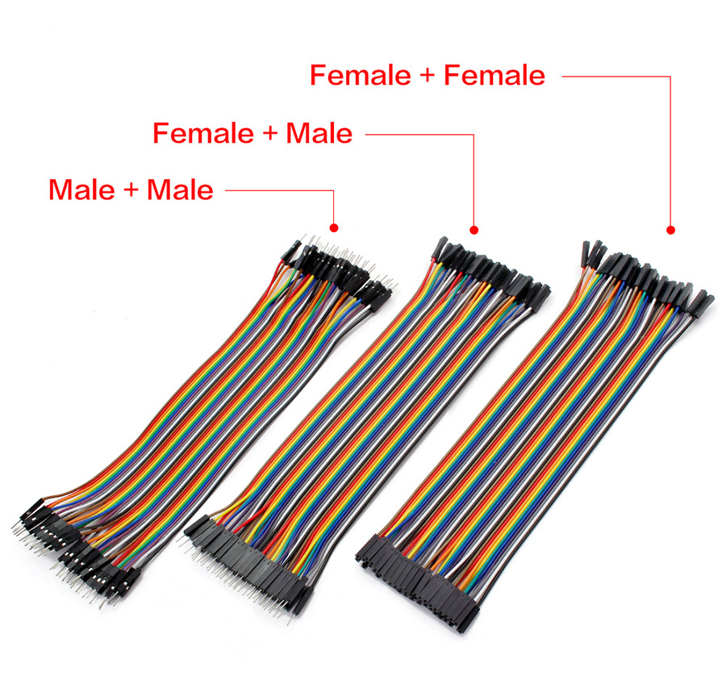  
*Figura 24 - Cable Dupont*

### 1.5.3 Diodo Emisor de Luz (LED) 

Es un dispositivo de salida, que enciende una luz de un color determinado cuando lo energizamos desde nuestra **RPico W**. Están disponibles en una amplia gama de formas, colores, tamaños e intensidad lumínica. En el curso utilizaremos LEDs de 5[mm], siendo este el tamaño del diámetro exterior del mismo, y el más común de todos los disponibles.

  
*Figura 25 - Led 5mm*

### 1.5.4 Resistencia de 470[ohm]

Son componentes que limitan el flujo de corriente eléctrica y están disponibles en diferentes valores usando una unidad de medida llamada *ohmios*. Cuanto mayor sea el número de ohmios, más resistencia proporcionará. En nuestro curso las utilizaremos principalmente para evitar que los LEDs consuman demasiada corriente y se dañen.

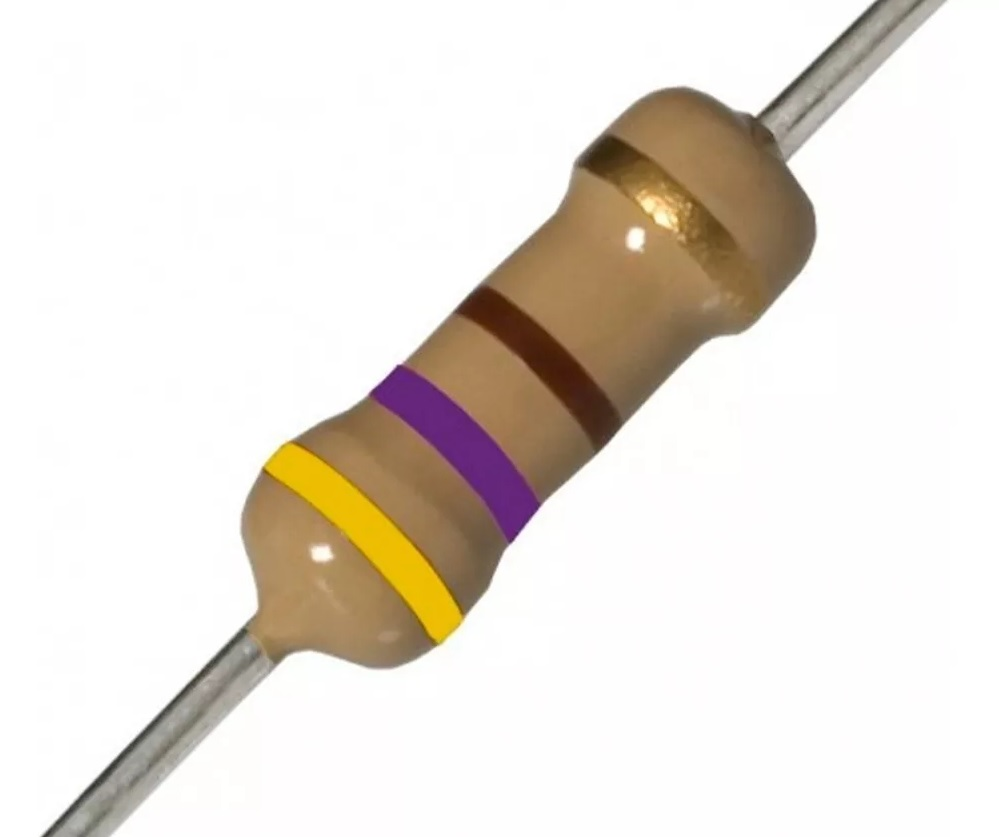  
*Figura 26 - Resistencia 470 ohm*

### 1.5.5 Pulsador táctil Normal Abierto

Es un dispositivo de entrada que se utiliza para controlar el flujo de corriente eléctrica. El pulsador solo se abre o se cierra cuando el usuario lo presiona y lo mantiene presionado. Al soltarlo vuelve a su posición inicial.
Dependiendo de su posición inicial o de reposo, los pulsadores se clasifican en Normal Abierto (*NA*) o Normal Cerrado (*NC*). El pulsador *NA* es aquél que sin pulsarlo no deja pasar la corriente, mientras que el pulsador *NC* si permite el paso de corriente en su posición de reposo.
    
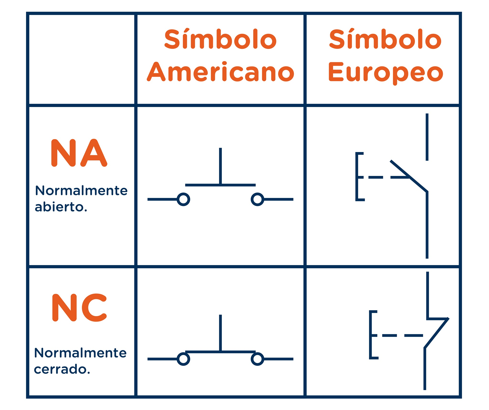  
*Figura 27 - Pulsador NA y NC*

Están disponibles en una amplia gama de modelos y tamaños, pero en este curso trabajaremos con aquellos cuyas dimensiones nos permitan colocarlo en nuestra protoboard.

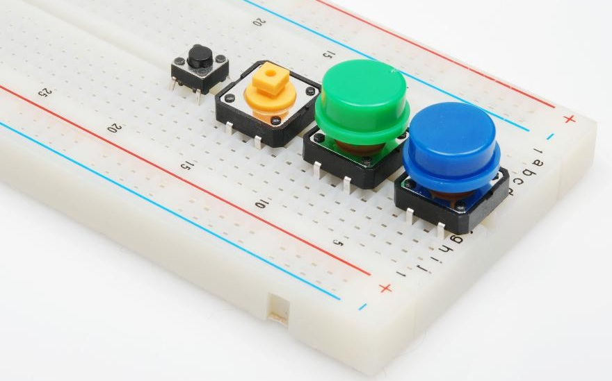  
*Figura 28 - Pulsadores para Protoboard*

### 1.5.6 Buzzer piezoeléctrico activo

O simplemente *buzzer* o *zumbador*, es otro dispositivo de salida que utilizaremos. Sin embargo, mientras que un *LED* genera luz, un buzzer produce un ruido al ser energizado, puntualmente, un zumbido. Dentro de su carcasa plástica hay un par de placas de metal; cuando se encienden, estas placas vibran entre sí para producir el zumbido. 
Hay dos tipos de zumbadores: activos y pasivos. En este curso utilizaremos un zumbador activo. Además, están disponibles en una amplia gama de formas, tamaños e intensidad sonora.

  
*Figura 29 - Buzzer PiezoEléctrico Activo*

### 1.5.7 Potenciómetro de 10[kOhmios]

Es otro dispositivo de entrada que puede trabajar de dos formas distintas dependiendo de cómo conectemos las tres patas que posee. Con dos de sus tres patas conectadas, actúa como una resistencia variable, un tipo de resistencia que se puede ajustar en cualquier momento girando la perilla que posee. Por otro lado, con las tres patas correctamente cableadas, se convierte en un *divisor de voltaje* y emite desde 0[Voltios] hasta la entrada de voltaje completo que tengamos conectado, según la posición de la perilla.

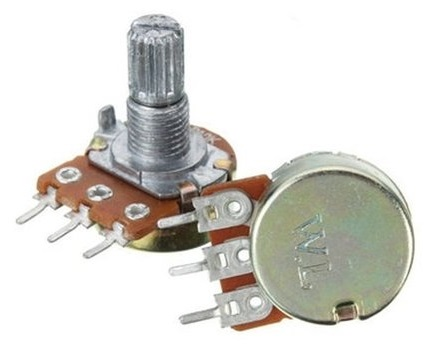  
*Figura 30 - Potenciómetro*

### 1.5.8 Display LCD 1602 con módulo I2C 

Es otro dispositivo de salida que se comunica con la **RPico W** a través de un protocolo de comunicación denominado *I2C* (*Inter-Integrated Circuit*) utilizando un bus de cuatro cables. Este bus le permite a nuestra **RPico W** controlar el panel de visualización, enviando todo tipo de caracteres alfanuméricos. 
Se comercializan en distintos tamaños, colores y formas. Uno de los más utilizados es el modelo *1602*, que permite visualizar 16 caracteres alfanuméricos por renglón (en este caso, en los dos que dispone).

  
*Figura 31 - Display LCD 1602 Con Módulo I2C*

### 1.5.9 Sensor de presión y temperatura BMP280 

Como su nombre indica, integra en un solo dispositivo sensores de presión atmosférica y temperatura, siendo ambos de gran precisión y bajo consumo de energía. Además, puede comunicarse con la **RPico W** a través del protocolo *I2C* mencionado anteriormente, como así también por otro protocolo denominado *SPI* (*Serial Peripheral Interface*).

  
*Figura 32 - Sensor de presión y temperatura BMP280*

## 1.6 Fundamentos de MicroPython. Instalación del firmware en nuestra Raspberry Pi Pico W

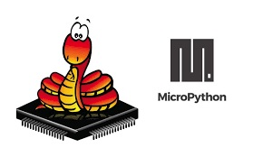  
*Figura 33 - Fundamentos de MicroPyhton*

Como sabemos, el lenguaje de programación *Python* fue desarrollado para sistemas informáticos como computadoras de escritorio, notebooks y servidores. Sin embargo, las *placas de desarrollo basadas en microcontrolador* como la **RPico W** son más pequeñas y con menos recursos, lo que significa que no pueden ejecutar el mismo lenguaje *Python* que sus contrapartes más grandes. Como resultado de esto nace **MicroPython**, un lenguaje interpretado basado en *Python*, desarrollado *Damien George* y lanzado por primera vez en 2014. 
**MicroPython** es una implementación sencilla y eficiente del lenguaje de programación *Python 3* que incluye un pequeño subconjunto de la biblioteca estándar de *Python* y está optimizado para ejecutarse en microcontroladores.
Además de implementar una selección de las principales bibliotecas de *Python*, **MicroPython** incluye módulos propios para acceder a hardware de bajo nivel.

[MicroPython](https://micropython.org/) se esfuerza por ser lo más compatible posible con *Python*, de modo que si ya conoces *Python*, ya conoces **MicroPython**. Por otro lado, cuanto más aprendas sobre **MicroPython**, mejor te volverás en *Python*.

  
*Figura 34 - MicroPython En RPico W*

Ahora solo nos resta realizar una cosa antes de comenzar a realizar nuestros proyectos: instalar **MicroPython** en nuestra **RPico W**.

Para ello, comenzamos por enchufar un cable micro-USB al puerto micro-USB de nuestra **RPico W**. 

  
*Figura 35 - Conexión cable micro-USB a RPico W*

Luego, mientras mantienes presionado el pulsador *BOOTSEL*, conecta el otro extremo del cable micro-USB a uno de los puertos USB de tu computadora. 

  
*Figura 36 - Conexión cable micro-USB a la PC*

Cuenta hasta tres y luego suelta el pulsador. Unos instantes después, deberías ver a tu **RPico W** aparecer en tu computadora como si se tratase de una unidad extraíble con el nombre *RPI-RP2*.

En el administrador de archivos de nuestro sistema operativo, veremos dos archivos que están alojados en nuestra **RPico W** como se muestra en la **Figura 37**: *INDEX.HTM* e *INFO_UF2.TXT*. El segundo archivo simplemente contiene información de fabricación de nuestra **RPico W**, y el primer archivo, *INDEX.HTM*, es el que nos interesa. Nos dirigimos hacia él y hacemos doble clic.

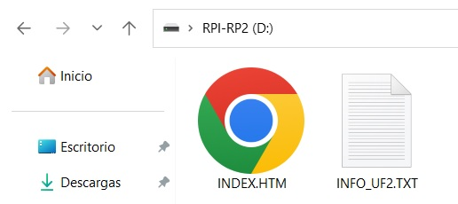  
*Figura 37 - Archivos INDEX.HTM e INFO_UF2.TXT en RPico W*

El archivo nos redirige a la sección de la página oficial de *Raspberry Pi* que contiene toda la documentación acerca de los equipos y accesorios que comercializa, como se ve en la **Figura 38**. A continuación, hacemos clic en la pestaña **MicroPython** para abrir esta sección específica en nuestro navegador. 

  
*Figura 38 - Raspberry Pi Official Documentation*

Una vez allí (**Figura 39**), debemos dirigirnos al texto *Download the correct MicroPython UF2 file for your board:* y hacer en clic en el link *Raspberry Pi Pico W* para descargar el firmware de **MicroPython**. Este pequeño archivo permitirá ejecutar la última versión disponible de **MicroPython** en nuestra **RPico W**.

  
*Figura 39 - Raspberry Pi Pico W Official Firmware*

Luego debemos abrir la carpeta *Descargas* de nuestro sistema operativo y localizar el archivo que acabamos de descargar con la extensión *uf2*. Hacemos clic en él, lo arrastramos y lo soltamos en el administrador de archivos de nuestra **RPico W** como se ve en la **Figura 40**.

  
*Figura 40 - Arrastre Del Firmware De MicroPython A RPico*

Después de unos segundos, verás que tu **RPico W** ha desaparecido de tu administrador de archivos (y también puede aparecer una advertencia de que se eliminó una unidad sin expulsarla): no te preocupes, ¡se supone que eso sucedería!
Cuando arrastraste el archivo *uf2* a tu **RPico W**, le dijiste que actualizara el firmware de **MicroPython** en su almacenamiento interno. Para hacer eso, tu **RPico W** sale del modo especial en el que lo pusiste con el pulsador *BOOTSEL* y carga el nuevo firmware, lo que significa que tu **RPico W** ahora está ejecutando **MicroPython**.

¡Ahora si todo está listo para comenzar con **MicroPython** en tu **RPico W**!

## 1.7 Thonny IDE Python: instalación, características e interfaz. 

Antes de que puedas comenzar a programar tu **RPico W**, debemos instalar y configurar lo que conocemos como *Entorno de Desarrollo Integrado* (*IDE*, *Integrated Development Environment*). Para nuestro curso utilizaremos un *IDE* muy popular para *Python* y **MicroPython**, divulgado ampliamente por *Raspberry Pi Foundations*: **Thonny**. 

**Thonny** fue desarrollado por la *Universidad de Tartu* en Estonia, y cuenta con las herramientas que los usuarios necesitan para programar. Además, cuenta con una interfaz simple y fácil de entender, lo cual es muy adecuado para principiantes.

La instalación de **Thonny** es muy sencilla. Dado que *Python 3.10* ya está integrado en él, simplemente necesitamos un ejecutable. Para ello, nos dirigimos a la página oficial de [Thonny](https://thonny.org/) y seleccionamos en la esquina superior derecha de la página el paquete de instalación a descargar según el sistema operativo que utilicemos (**Figura 41**).
Después de descargar el paquete de instalación, hacer doble clic y seguir las instrucciones en pantalla para instalarlo.

  
*Figura 41 - Instalación De Thonny*

Concluida la instalación, ejecuta **Thonny** y te encontrarás con una interfaz como la que se muestra en la **Figura 42**.

  
*Figura 42 - Interfaz De Thonny*

La interfaz principal de **Thonny** es simple y puede dividirse en las siguientes cuatro partes:

1. Barra de herramientas: ofrece acceso rápido a través de íconos a las funciones de programa más utilizadas como *Nuevo Programa*, *Abrir Fichero*, *Guardar*, *Ejecutar el script actual*, etc.

2. Área de Script: donde se escriben los programas en **MicroPython**. Se divide en un área principal para el código y un pequeño margen lateral para mostrar los números de línea.

3. Shell: permite ejecutar comandos de la consola y también proporciona información sobre la ejecución de los programas.

4. Intérprete: muestra y permite cambiar el intérprete de *Python*, es decir, la versión de *Python* utilizada para ejecutar nuestros programas. Aquí debemos hacer clic, y seleccionar *MicroPython (Raspberry Pi Pico)* (**Figura 43**). 

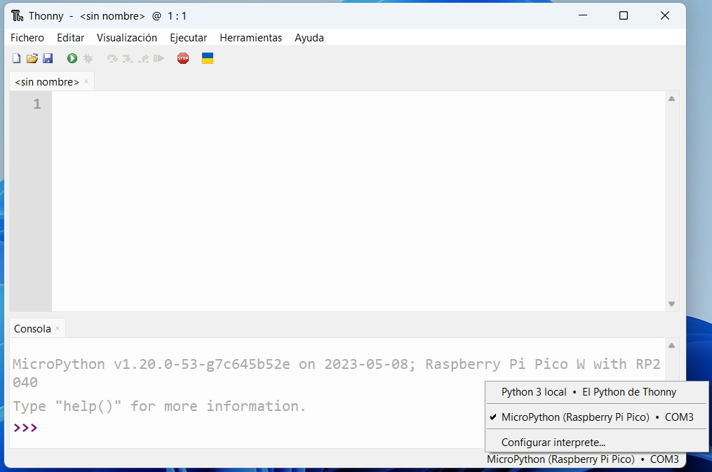  
*Figura 43 - Interprete de Thonny*

¡Ahora si ya tenemos todo preparado para comenzar a realizar nuestros proyectos!