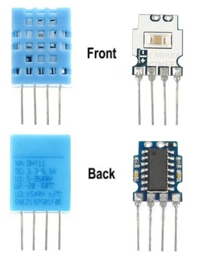

# Trabajo Final Integrador (TFI): Monitoreo de Temperatura y Humedad Relativa

  
*Figura 01 - Presentación TFI*

Concluida la etapa donde hemos incorporado los conceptos más importantes para trabajar con nuestra **RPico W**, y con el objetivo de fortalecer los conocimientos adquiridos y promover que lleven a cabo sus propios proyectos, realizaremos un *Trabajo Final Integrador* (*TFI*) que combine las distintas herramientas que hemos aprendido durante el curso.

La propuesta del *TFI* consiste en monitorear dos variables físicas: temperatura y humedad relativa. Los valores correspondientes se mostrarán en un display, y se emitirá una señal de alerta cuando se alcance un valor específico. Por último, los datos se almacenarán en un archivo de texto, creando así un pequeño *Data logger* de variables meteorológicas.

Para ello, desde el curso se propone la utilización del *sensor de temperatura y humedad relativa DHT11* o su variante más costosa, el *DHT22*, otorgando libertad de elección respecto a la estrategia a utilizar para concretar el *TFI*.

  
*Figura 02 - Sensor DHT11 y DHT22*

Hablamos brevemente de este sensor en la primera clase, pero ahora profundizaremos en sus características y veremos cómo se implementa y programa en la **RPico W** para crear nuestra propia estación meteorológica.

Empecemos!

## 6.1 Sensores DHT11 y DHT22: Características 

Si deseamos crear una *estación meteorológica*, es fundamental disponer de sensores que nos suministren la información climática necesaria, como temperatura, humedad, presión, radiación UV, velocidad y dirección del viento, entre otros.

Estos sensores pueden medir de forma individual una variable específica o ser capaces de medir múltiples variables simultáneamente, como temperatura y humedad, temperatura y presión, o incluso temperatura, presión y humedad.

Entre la amplia variedad de modelos disponibles en la actualidad, nos enfocaremos específicamente en aquellos que sean compatibles con nuestra **RPico W**. Cuando hablamos de *compatibilidad*, nos referimos a los sensores que pueden proporcionarnos la información recolectada en un *tipo de dato* interpretable por nuestra **RPico W**, como así también a los requisitos de alimentación necesarios para su correcto funcionamiento.

Recordemos que un sensor es un dispositivo diseñado para detectar magnitudes físicas y generar una respuesta en forma de señal eléctrica, la cual se expresa generalmente en términos de voltaje. Como se muestra en la **Figura 03**, los *sensores analógicos* producen una *señal analógica* que está directamente relacionada con lo que perciben, mientras que los *sensores digitales* generan una *señal digital* basada en lo que captan en su entrada.

  
*Figura 03 - Señal de Salida de los Sensores*

En la *Clase N°3*, mencionamos un *sensor analógico* de temperatura muy conocido, el [LM35](https://www.ti.com/lit/ds/symlink/lm35.pdf). También empleamos el sensor de temperatura interno del *RP2040*, que es otro ejemplo de *sensor analógico*. Observamos el proceso de lectura del valor medido y las conversiones necesarias. Es importante resaltar que siempre utilizamos las *entradas analógicas* de nuestra **RPico W**, las cuales están conectadas a los **ADCs** del *RP2040*.

  
*Figura 04 - LM35*

Sin embargo, para este *TFI* emplearemos un *sensor digital* como el *DHT11* o su variante más costosa, el *DHT22*. Estos sensores, además de medir la temperatura y la humedad relativa del ambiente, proporcionan una *salida digital*, lo que facilita su implementación. Esto se debe a que no es necesario utilizar las *entradas analógicas* del microcontrolador para leer los valores medidos. Además, estos sensores son muy populares debido a sus buenas prestaciones y bajo costo.

Si bien ambos sensores lucen físicamente similares (varían en tamaño y color), y tienen la misma identificación de pines, poseen características diferentes que deben consultarse en las hojas de datos correspondientes: [DHT11 Humidity & Temperature Sensor](https://www.mouser.com/datasheet/2/758/DHT11-Technical-Data-Sheet-Translated-Version-1143054.pdf) y [DHT22 Humidity & Temperature Sensor](https://www.sparkfun.com/datasheets/Sensors/Temperature/DHT22.pdf). De todas ellas, las diferencias más significativas se enumeran en la **Figura 05**.

  
*Figura 05 - Diferencias DHT11 y DHT22*

Como se observa, el tiempo de respuesta (es decir, el tiempo que tarda el sensor en ofrecer una lectura válida de la variable que está midiendo) es menor en el *DHT11*. Sin embargo, el *DHT22* tiene rangos de medida más amplios y mejor resolución, a cambio de ser algo más caro. También observamos que ambos modelos pueden alimentarse con los pines de la **RPico W**: *VBUS* si se desea usar 5[Voltios] o *3V3(OUT)* si se desea usar 3,3[Voltios].

La elección entre uno u otro modelo dependerá del tipo de proyecto que deseemos llevar a cabo. En nuestro caso, la elección del *DHT11* es suficiente.

## 6.2 Sensores DHT11 y DHT22: Pinout y conexión 

En ambos sensores, los pines tienen el mismo orden y función (**Figura 06**). Si miramos los sensores de frente y enumeramos los pines de izquierda a derecha, el primer pin es *VCC*, que conectaremos a los 5 [voltios] o 3,3 [voltios] de la **RPico W**. En el otro extremo tenemos el pin 4, que es el *GND*, y lo conectaremos a un pin *GND* de la **RPico W**. El pin 2 (*DATA*) es el que nos entregará la información de la temperatura y la humedad, y debe estar conectado a una **entrada digital** de la **RPico W**. Finalmente, el pin 3 (*NC*) no se utiliza, ya que no posee conexión eléctrica de ningún tipo.  

  
*Figura 06 - Pinout DHT11 y DHT22*

Revisando las hojas de datos, observamos que en ambos modelos se debe colocar una resistencia entre el pin *VCC* y el pin *DATA*, cuyo valor debe estar entre 4700 [ohmios] y 10000 [ohmios], para que la lectura se realice sin problemas. El valor de la resistencia depende de la longitud del cable que conecta el sensor con la **RPico W**, siendo 5000 [ohmios] el valor recomendado para una longitud de cable de hasta 20 [metros]. Esta configuración para una **entrada digital** ya la hemos visto en la Clase N°2: se trata de una *Resistencia Pull-Up* (**Figura 07**).

  
*Figura 07 - Esquema de Conexión DHT11 y DHT22*

Debido a que el *DHT11* y el *DHT22* poseen el mismo pinout, **las conexiones que realicemos para uno son equivalentes para el otro**. Un ejemplo de conexión se muestra en la **Figura 08**. Como se puede ver, la alimentación del sensor se toma del pin *3V3* (pin físico 36) y *GND* (pin físico 38), mientras que los datos se leen usando el pin *GP15* como entrada (pin físico 20).

  
*Figura 08 - Conexión DHT22*

Recordemos que la **RPico** W incluye una resistencia programable integrada conectada a cada pin *GPIO*, que puede configurarse como resistencia *Pull-Down* o *Pull-Up* de acuerdo a nuestras necesidades. Esto nos ahorra la conexión de una resistencia física externa, reduciendo así la cantidad de elementos en nuestro circuito. Además, por defecto, todos los pines están en *flotante*, por lo que debemos indicar explícitamente la configuración escogida en la función *Pin()*. Si no se especifica la configuración del pin como entrada, será necesario colocar la *Resistencia Pull-Up* externa, tal como se indicó en la **Figura 07**.

Por otro lado, también es posible adquirir el *módulo sensor DHT11 (o DHT22)*. De forma similar a como ocurre con los *módulos buzzer*, este módulo sensor incorpora el *DHT11* en una pequeña placa impresa, junto con la *Resistencia Pull-Up* mencionada (generalmente de 5100 [ohmios]) y un pequeño capacitor que actúa como filtro eléctrico para mitigar señales eléctricas externas no deseadas. Algunos modelos del *módulo sensor DHT11* también cuentan con un pequeño LED que se enciende al alimentar el módulo, con su correspondiente *resistencia limitadora de corriente* (generalmente de 1000 [ohmios]).

  
*Figura 09 - Modelos Del Módulo Sensor DHT11*

En cualquiera de los modelos del *módulo sensor DHT11 (o DHT22)* que tengamos, notaremos que el *Pin NC* de la **Figura 06** ya no está presente, y que solo expone los pines necesarios para su funcionamiento, como se aprecia en la **Figura 10**: *VCC* o *+*, *DATA* o *OUT*, y *GND* o *-*. De igual manera, siempre debemos prestar atención a la serigrafía impresa para no confundirnos al momento de realizar las conexiones correspondientes.

  
*Figura 10 - Pinout Módulo Sensor DHT11*

Un ejemplo de conexión del *módulo sensor DHT11 (o DHT22)* a nuestra **RPico W** se muestra en la **Figura 11**. Como se puede observar, la alimentación del sensor está tomada del pin *3V3* (pin físico 36) y *GND* (pin físico 38), mientras que los datos se leen usando el pin *GP28* como entrada (pin físico 34).

  
*Figura 11 - Conexión Módulo Sensor DHT11*

## 6.3 Sensores DHT11 y DHT22: Estructura interna y transmisión de datos

Los sensores *DHT11* y *DHT22* están diseñados con componentes específicos para la medición de la temperatura y la humedad del aire ambiente. En su estructura interna, ambos incorporan un sensor de humedad capacitivo, que detecta los cambios en la capacitancia en función de la humedad ambiental, y un termistor de coeficiente de temperatura negativo (NTC), que mide la temperatura ambiente mediante la variación de su resistencia eléctrica en respuesta a los cambios de temperatura.

Además, ambos sensores están equipados con un **Convertidor Analógico a Digital (ADC)**, que se encarga de convertir las **señales analógicas** provenientes del sensor de humedad capacitivo y del termistor en **señales digitales**. Estas **señales digitales**, son luego transmitidas a través de un **protocolo de comunicación**, permitiendo que un microcontrolador pueda interpretar los datos de temperatura y humedad de manera efectiva.

  
*Figura 12 - Estructura Interna del DHT11*

La entrega de la medición a otros circuitos, como nuestra **RPico W**, se realiza mediante un **protocolo de comunicación serie**. Recordemos que esto implica que todos los datos se transmiten por una misma señal, uno detrás del otro.

Sin embargo, ninguno de los dos sensores utiliza un **protocolo de comunicación serie estándar** como **I2C** o **SPI** para la transmisión de datos. En su lugar, implementan su propio protocolo para comunicarse con otros dispositivos a través de un solo pin de datos, detallado en los datasheets correspondientes. Afortunadamente, se trata de un protocolo simple que puede implementarse sin problemas utilizando los pines digitales de nuestra **RPico W**.

--> ACÁ
En resumen, podemos decir que, una vez realizado el proceso de conversión de analógico a digital, se establece un proceso de comunicación y sincronización entre la *RPico* y el sensor, en el cual este último envía una trama de datos de 40 bits (5 bytes) correspondientes a la información de humedad y temperatura como se muestra en la Figura 13.

  
*Figura 13 - Formato de datos DHT11*

Como vemos, estos datos se interpretan de la siguiente manera:

1. El primer byte que recibimos es la *parte entera* de la *humedad relativa*.
2. El segundo byte es la *parte decimal* de la *humedad relativa*. En el caso que utilicemos el *DHT11*, este dato es siempre 0, ya que como describimos en la Figura 04, la resolución es del 1%. 
3. El tercer byte es la *parte entera* de la temperatura.
4. El cuarto byte es la *parte decimal* de la temperatura. En el caso que utilicemos el *DHT11*, este dato es siempre 0, ya que como describimos en la Figura 04, la resolución es de 1°C 
5. El quinto byte es la suma de verificación o *checksum*, resultante de sumar todos los bytes anteriores.

Este último byte se utiliza para corroborar que no existan datos corruptos en una transmisión de datos. Si la información recibida es correcta, al sumar los cuatro primeros grupos de bytes, el resultado debe ser igual al quinto byte. Tomemos como ejemplo la Figura 12, donde nuestra *RPico* ha recibido una trama como la ilustrada allí.

  
*Figura 13 - Ejemplo Trama de Datos DHT11*

Como dijimos, sumando los cuatro primeros grupos de bytes, debemos obtener el quinto. Si nos centramos en la trama de la Figura 12, comprobaremos que el dato recibido es correcto, ya que:

$\text{8 bits humedad + 8 bits humedad + 8 bits temperatura + 8 bits temperatura = 8 bits de checksum}$  
$0011 0101 + 0000 0000 + 0001 1000 + 0000 0000 = 0100 1101$

Al recibir la trama de datos, la *RPico* se encargará de sumar los cuatro primeros grupos de bytes. Si el resultado es igual al byte de *checksum* recibido, tomará los datos como válidos. Caso contrario, los descartará y esperará una nueva trama. 

Si volvemos a la hoja de datos, además de la trama, observaremos también, que todo el proceso de transmisión implica respetar unos tiempos determinados de inicio y finalización de comunicación entre el el microcontrolador y el sensor. Como estarán deduciendo, llevar a cabo la programación desde cero de todo el proceso implicaría mucho trabajo. 

Por suerte, la versión actual de **MicroPython** ya cuenta con librerías para este sensor, algo que nos permite ahorrar mucho tiempo de programación. Si queremos comprobar esto, nos situamos en la consola de Thonny con la *RPico* conectada y escribimos la instrucción *help("modules")* y veremos la librería *dht* correspondiente.

  
*Figura 14 - Librería dht en MicroPython*

## 6.4 TFI - Parte I: Puesta en marcha y lectura de valores

En esta primera parte del *TFI* veremos como se lleva a cabo la lectura de los valores arrojados por el *módulo sensor DHT11*, utilizando para ello, la librería *dht*. Utilizaremos en este caso, la conexión realizada en la Figura 10. Por supuesto, ustedes pueden emplear los pines correspondientes que deseen.

Y ahora a programar. Comencemos por conectar la *RPico* a nuestra computadora, ejecutar *Thonny* y hacer clic en el área de Script para cargar las librerías habituales, incorporando ahora la librería *dht*. Pero, como esta última está diseñada para los dos modelos del sensor DHT, importaremos únicamente la parte que posee todo lo necesario para manipular el *dht11*, quedando entonces:

```python
from machine import Pin
from utime import sleep
from dht import DHT11
```

Luego, debemos definir un objeto *dht* para poder leer los datos que provienen de nuestro sensor. En él, debemos indicar que pin utilizaremos como *entrada digital* (en nuestro caso, el *GP28*). Recordemos que no es necesario activar la *Resistencia Pull_Up* interna de nuestra *RPico*, ya que estamos utilizando el *módulo sensor DHT11*, y este ya cuenta con una *Resistencia Pull_Up* física incorporada:

```python
dht11_sensor = DHT11(Pin(28, Pin.IN))
```
Y ahora, para iniciar la transmisión de los valores que provienen del *DHT11*, debemos utilizar el método *measure()*. Luego, los métodos *temperature()* y *humidity()*, nos devolverán respectivamente la temperatura en grados Celsius y la humedad relativa en porcentaje. Almacenaremos estos valores en dos variables, quedando todo de la siguiente manera:

```python
dht11_sensor.measure()
temp = dht11_sensor.temperature()
hum = dht11_sensor.humidity()
```

Y ahora, debemos agregar un bucle que permita realizar esto de forma continua. Pero recordemos que el *DHT11* tiene un tiempo de respuesta de 1 segundo como se indicó en la Figura 04, entonces para respetar ese tiempo, agregaremos un delay levemente superior para garantizar la correcta lectura de los datos como se muestra a continuación: 

```python
while True:
    sleep(2)
    dht11_sensor.measure()
    temp = dht11_sensor.temperature()
    hum = dht11_sensor.humidity()
```

Para finalizar, se imprimen los valores obtenidos en la consola, utilizando la función *print()*. Dentro de ella, colocaremos entre comillas la cadena de caracteres que indique la magnitud que estamos midiendo, acompañada del valor correspondiente:

```python
    print('Temperatura: ',temp,'°C')
    print('Humedad Relativa: ',hum,'%')
    print() # Renglón en blanco 
```
Cuando ejecutes el código (ver *Ejemplo16_TFI_LecturaDHT11.py* en el repositorio), verás un mensaje como el de la Figura 14.

  
*Figura 15 - Lectura sensor DHT11*

Puedes comprobar el correcto funcionamiento cambiando las condiciones del espacio próximo al sensor, siempre con el debido cuidado de no dañar ningún componente. Por ejemplo, acerca la boca de un termo con agua caliente en su interior, y notarás que el vapor que sale modificará ambos valores.

## 6.5 TFI - Parte II: Visualizar datos medidos (Actividad N°1)

  
*Figura 16 - TFI - Parte II*

Ahora les toca a ustedes...

Como primera actividad, deben incorporar el *display LCD1602* al circuito que realizaron en la Parte I, y visualizar allí los datos de temperatura y humedad relativa. Recuerden que disponen de 16 caracteres por renglón. El resultado debe ser como el de la Figura 16.

  
*Figura 17 - TFI - Parte II - Ejemplo*

Importante: El símbolo de grados "°" es un caracter especial y se escribe en el display mediante la instrucción *lcd.putstr(chr(223))*.

## 6.7 TFI - Parte III: Actuar (Actividad N°2)

En la segunda actividad, agregarán una función de alarma a su pequeña *estación meteorológica*, la cual se activará cuando se cumpla una determinada condición. Para lograr esto, deben añadir un componente adicional al circuito de la Actividad N°1, ya sea un *LED* para una alarma lumínica o el *módulo buzzer* para una alarma sonora. La elección de qué tipo de alarma implementar queda a su criterio.

La condición a cumplir es que se accione cuando la temperatura sea superior a 40[°C].

¡Manos a la obra!

## 6.8 TFI - Parte IV: Almacenar (Actividad N°3)

Por último, a su pequeña *estación meteorológica* le incorporarán una señal de alarma, que se accione cuando ocurra una determinada condición. Para ello, al circuito de la Actividad N°1, deben sumarle una alarma lumínica (*LED*) o sonora (*Zumbador*), queda a elección de ustedes cual implementar. 

La condición a cumplir es que se accione cuando la humedad relativa sea superior al 70%.

¡Manos a la obra!

## 6.9 Condiciones de entrega del TFI

Para poder aprobar el *TFI*, la entrega debe contener todo lo realizado para resolver las actividades solicitadas, esto incluye:

1. Foto del circuito implementado
2. Código completo realizado
3. Un video corto que demuestre el correcto funcionamiento de la *estación meteorológica*, donde se aprecie la visualización de los datos y el accionamiento de la alarma cuando se alcanza la condición fijada.

Fecha máxima de entrega: XX/XX/24. Se atienden consultas de forma permanente por el canal de Discord #electrónica . Mail de entrega: savoieluciano@gmail.com